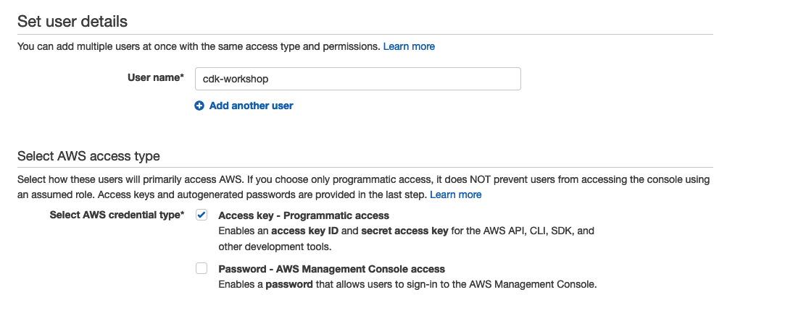

+++
title = "AWS Account"
weight = 200
+++

To deploy our app, you'll need access to an AWS account. If you already have an
account and your system is configured with credentials of an administrator user,
you can [move to the next step](./300_nodejs.md).

{}
If you are using an existing account, either personal or
a company account, make sure you understand the implications and policy of
provisioning resources into this account.
{}

1. If you don't have an AWS account, you can [create a free account
   here](https://portal.aws.amazon.com/billing/signup).
2. Sign in to your new account
3. Go to the AWS IAM console and [create a new user](https://console.aws.amazon.com/iam/home?#/users$new).
4. Type a name for your user (e.g. `cdk-workshop`) and choose "Programmatic access".

    

5. Click **Next: Permissions** to continue to the next step.
6. Click **Attach existing policies directly** and choose **AdministratorAccess**.

    

7. Click **Next: Review**
8. Click **Create User**
9. In the next screen, you'll see your **Access key ID** and you will have the option
   to click **Show** to show the **Secret access key**. Keep this browser window open.

    

10. Open a terminal window and use `aws configure` to set up your environment.
    Type the __access key ID__ and __secret key__ and choose a default region
    (you can use `us-east-1`, `eu-west-1`, `us-west-2` for example). Preferably
    use a region that doesn't have any resources already deployed into it.

    ```s
    $ aws configure
    AWS Access Key ID: <type key ID here>
    AWS Secret Access Key: <type access key>
    Default region name: <choose region (e.g. "us-east-1")>
    ```