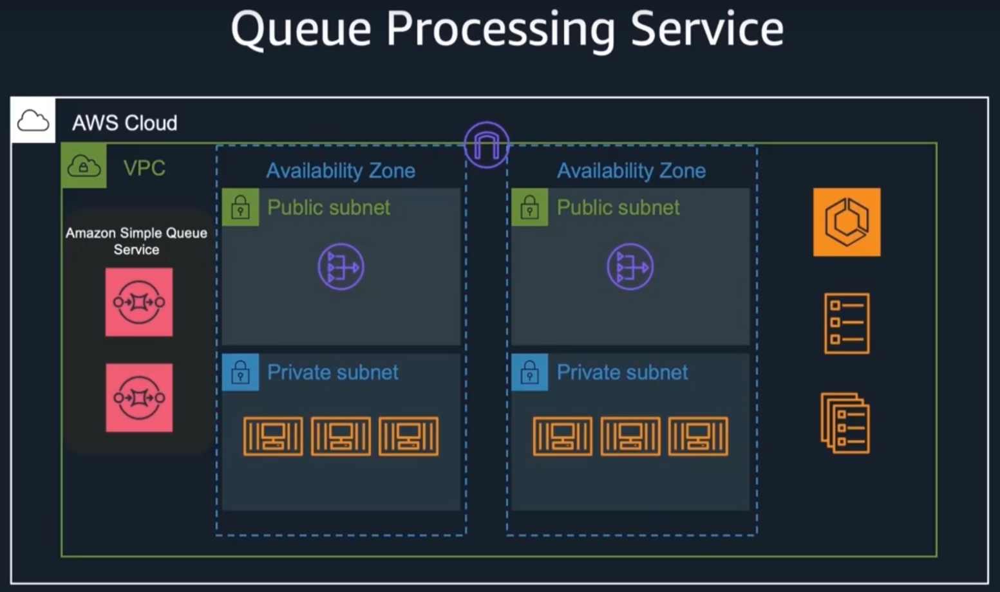

+++
title = "Use Case - Queue Processing Service"
weight = 2000
+++



Consider the scenario, where you write an ECS Fargate backed application that processes messages being written to an SQS queue and once the message is read from the queue, it is deleted from the queue. This is a serverless containerised application, a common pattern within web applications.

We also want to deploy this application as part of the pipeline we have deployed in the previous use case, using CI/CD best practices. To do this we will extend the pipeline to include a new stage that deploys this application.  

To design this solution from scratch in a well archtected, resilient manner would require creation of the network constructs (VPC, Subnets, NAT gateway, Internet gateway), ECS constructs (Service, task definitions, cluster definition, container image, auto scaling based on queue depth), SQS queue constructs (queue and dead letter queue setup) and handling the required IAM permissions, a lot of work for our little web app, most of which is undifferentiated infrastrcture. 

However we are going to use opinionated constructs from the ecs-patterns library. The documentation for these services can be found here [ECS](https://docs.aws.amazon.com/cdk/api/latest/docs/aws-ecs-readme.html) and [ECS patterns](https://docs.aws.amazon.com/cdk/api/latest/docs/aws-ecs-patterns-readme.html).

```
npm install @aws-cdk/aws-ecs-patterns
```

