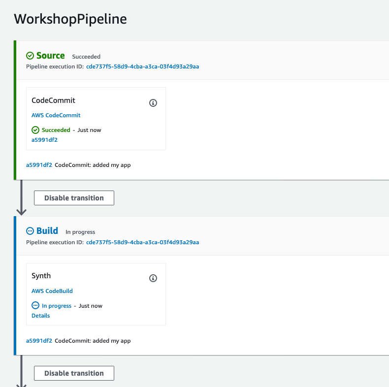
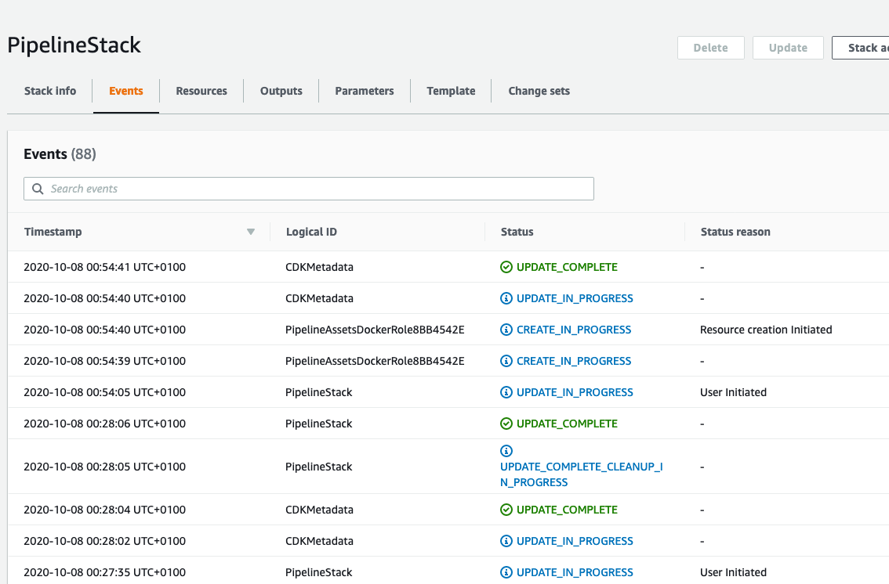
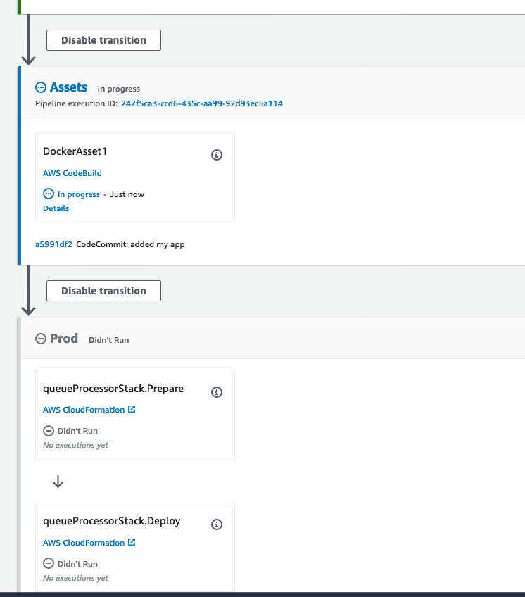
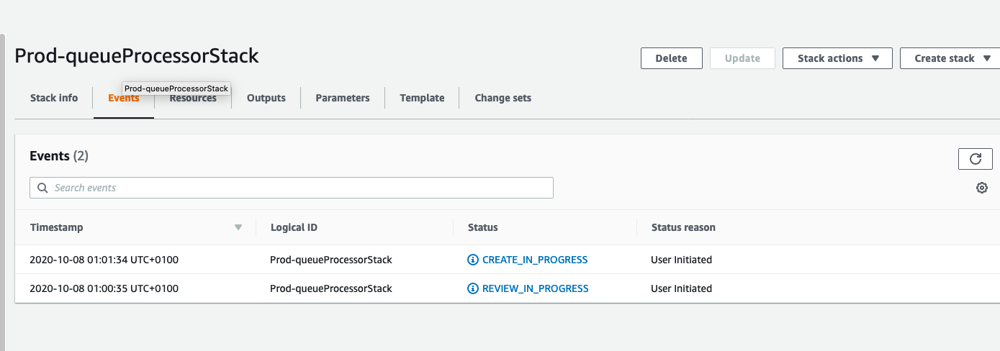
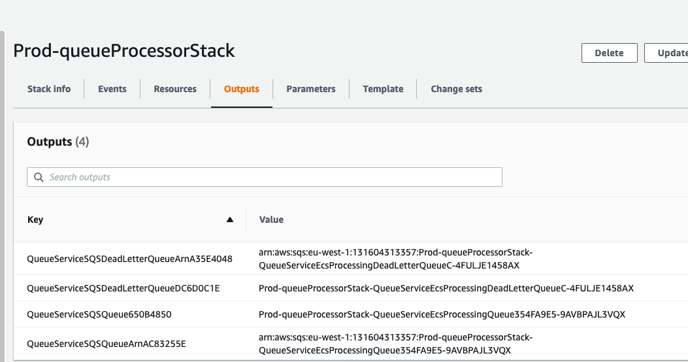
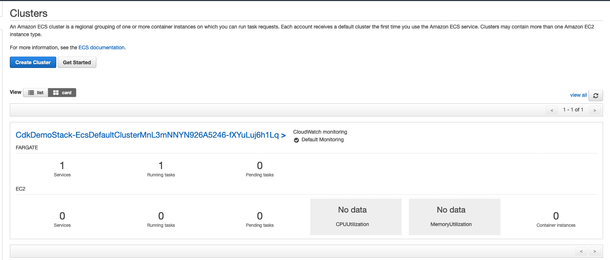

+++
title = "Deploying the Stack"
weight = 5000
+++

Since the stack is added as a new stage to the pipeline that we have already deployed in the previous use case, it’s sufficient to commit the changes to the code repo. And since CDK’s pipeline construct is self-mutating, it would infer the change i.e. addition of a new stage and amend the pipeline as required. Run these commands from the root of the project directory.

```bash
git add .
git commit -m "Added Queue processor application stage"
git push
```

This should trigger a re-deployment of the pipeline



And when it reaches the updatePipeline stage, the self-mutating functionality kicks in and you should notice cloudformation stack update in progress



And once the cloudformation stack update is complete, you will notice the addition of 2 new stages - Assets where CDK packages the docker container, and Prod where the queue processor stack is deployed



And as the queueProcesor stage starts executing in the pipeline, you will notice a new stack getting created in cloudformation for QueueProcessor. This is exactly the same stack that would be deployed if you were to deploy the queue processor application in a stand-alone manner via ‘cdk deploy’ without using pipelines



Wait until the stack reaches completion state. 

From the stack outputs, copy the name of the SQS queue, in the below screenshot this is Prod-queueProcessorStack-QueueServiceEcsProcessingQueue354FA9E5-9AVBPAJL3VQX



After the stack is deployed navigate to ECS. Wait until the cluster has provisioned a task successfully and the no of running tasks reflect 1

You will also be able to view the progress from Cloudformation console. Since this stack spins up the entire VPC artefact, please give some time for the stack to complete.




ECS Patterns has some useful design patterns for other common use cases like ALB access, NLB access etc. Please read through the CDK documentation for details on these patterns