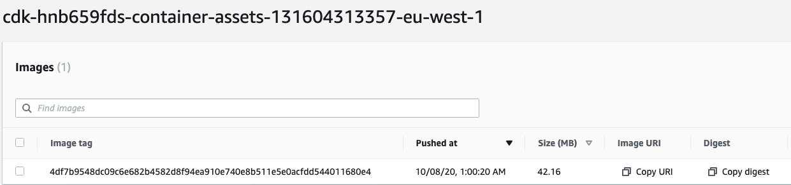
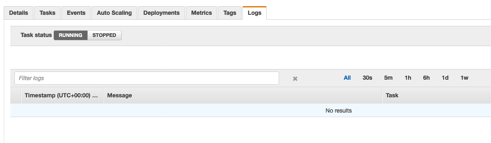
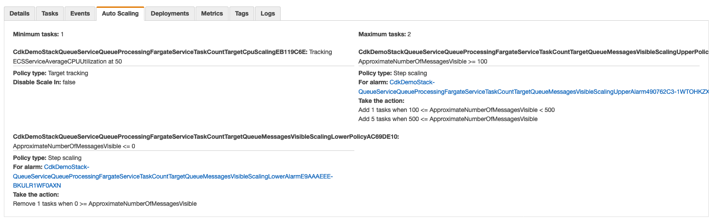
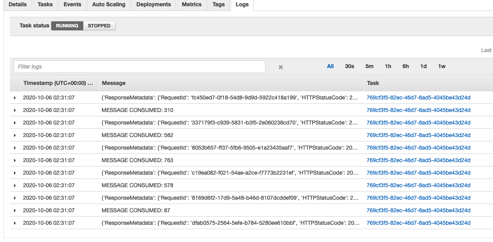
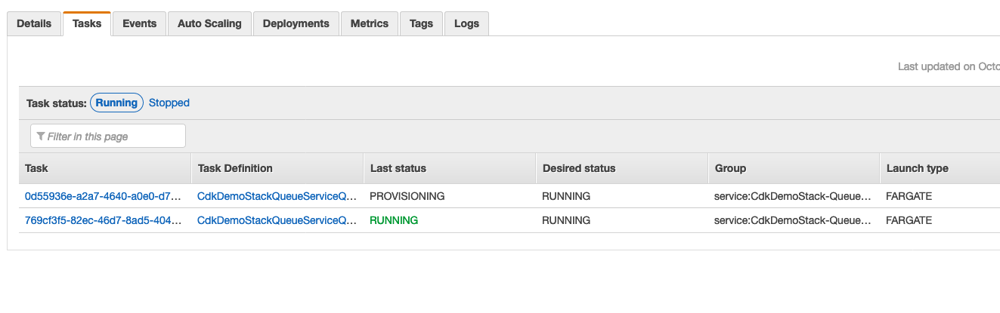
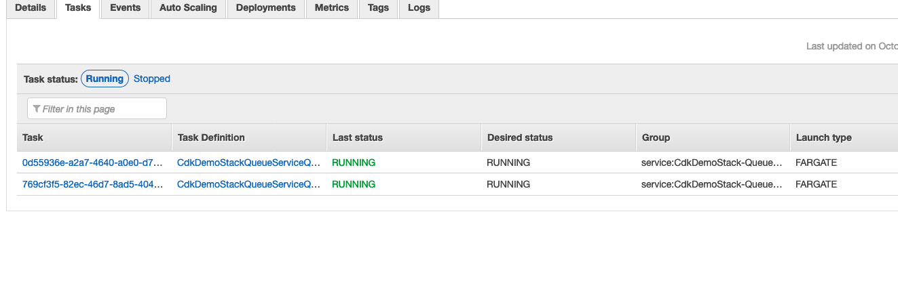
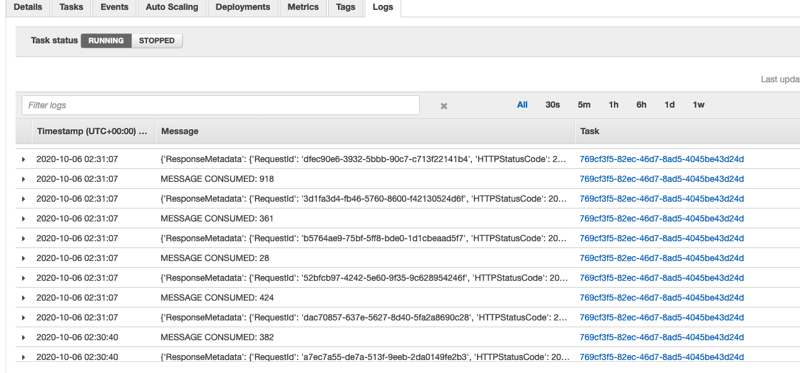
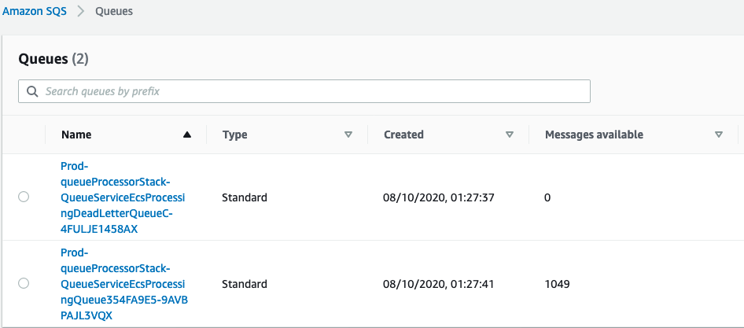

+++
title = "Validation"
weight = 6000
+++

Navigate to ECR service and you will find the docker image that the pipeline construct built for you and uploaded to the repo



Let us first validate with a single batch i.e. 100 messages to the SQS queue. Navigate to the ECS cluster page and then under services → queue processing service →  logs. This would reflect empty because we haven’t posted any messages to the queue yet



Also, under auto scaling , you will notice that the service is configured with a minimum of 1 task (from the desiredTaskCount value in the stack) and a maximum of 2 tasks(the pattern default value) along with step scaling and target tracking policies enabled (pattern defaults)



Navigate to Cloudwatch and notice that the corresponding alarms have also been created by the pattern. Depending on when you access this, the alarm states change

Now let’s start processing a single batch by running the following from the project root. First set the environment variable from the Cloud Formation outputs page under the `QueueProcessorStage-QueueProcessor` stack. The output will start with `QueueServiceSQSQueue`. Take the value for this output and set it as the queue name below. 

```bash
export QUEUE_NAME=<value copied from outputs above>
chmod +x Docker/queue_service.py
pip3 install boto3 --user
Docker/queue_service.py send
```

This will send 100 messages to the SQS queue and they should be processed by our ECS containers. Navigate to the service logs and do a refresh again. 




Given that we have only sent a single batch of 100 messages, the single task instance could handle the load and therefore the service did not scale up. Let us try triggering this behaviour by running a loop to send 3000 messages sequentially to the queue

```bash
for i in `seq 1 30`; do Docker/queue_service.py send; done
```

As the messages are being processed, you should now see the service auto scale to 2 tasks and the messages being processed. Run the above loop more than once if necessary to trigger the auto scaling behavior.





Navigate to SQS and you can see that the available messages counter keeps reducing as the application is processing the queue messages and deleting them once processed



Additionally, you could navigate to CloudWatch service and notice how the various alarms that the ECS pattern construct setup automatically shift status as the queue is getting processed


With these results we have validated that the ECS cluster is correctly processing all the SQS messages by auto scaling when necessary to handle the queue load proportional to queue depth.