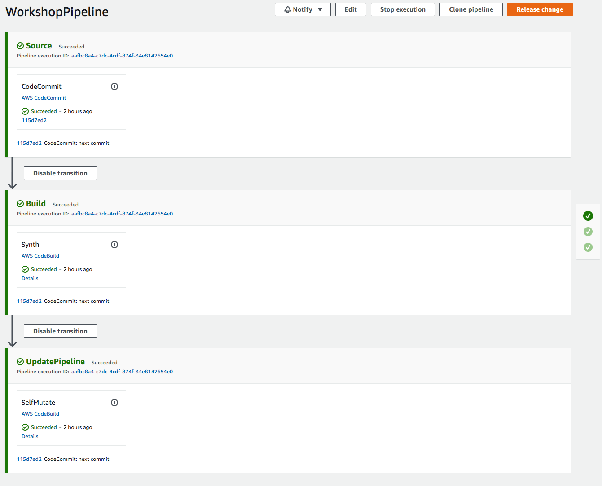

+++
title = "Create New Pipeline"
weight = 130
+++

## Define an Empty Pipeline
Now we are ready to define the basics of the pipeline.

Return to the file `lib/pipeline-stack.ts` and edit as follows:


import * as cdk from 'aws-cdk-lib';
import * as codecommit from 'aws-cdk-lib/aws-codecommit';
import { Construct } from 'constructs';
import {CodeBuildStep, CodePipeline, CodePipelineSource} from "aws-cdk-lib/pipelines";

export class WorkshopPipelineStack extends cdk.Stack {
    constructor(scope: Construct, id: string, props?: cdk.StackProps) {
        super(scope, id, props);

        // This creates a new CodeCommit repository called 'WorkshopRepo'
        const repo = new codecommit.Repository(this, 'WorkshopRepo', {
            repositoryName: "WorkshopRepo"
        });

        // The basic pipeline declaration. This sets the initial structure
        // of our pipeline
       const pipeline = new CodePipeline(this, 'Pipeline', {
            pipelineName: 'WorkshopPipeline',
            synth: new CodeBuildStep('SynthStep', {
                    input: CodePipelineSource.codeCommit(repo, 'main'),
                    installCommands: [
                        'npm install -g aws-cdk'
                    ],
                    commands: [
                        'npm ci',
                        'npm run build',
                        'npx cdk synth'
                    ]
                }
            )
        });
    }
}


### Component Breakdown
The above code does several things:

* `new CodePipeline(...)`: This initializes the pipeline with the required values. This will serve as the base component moving forward. Every pipeline requires at bare minimum:
    * `synth(...)`: The `synthAction` of the pipeline describes the commands necessary to install dependencies, build, and synth the CDK application from source. This should always end in a *synth* command, for NPM-based projects this is always `npx cdk synth`.
  * The `input` of the synth step specifies the repository where the CDK source code is stored.

## Deploy Pipeline and See Result
All that's left to get our pipeline up and running is to commit our changes and run one last cdk deploy.

```
git commit -am "MESSAGE" && git push
npx cdk deploy
```
{}
We use the `npx` command here instead of cdk directly. This command is used when you want
to use the local version of the cdk cli instead of your global version. More info on this
can be found on the [cdk toolkit docs](https://docs.aws.amazon.com/cdk/v2/guide/cli.html) page.
{}

CDK Pipelines auto-update for each commit in a source repo, so this is the *last time* we will need to execute this command!

Once deployment is finished, you can go to the [CodePipeline console](https://console.aws.amazon.com/codesuite/codepipeline/pipelines) and you will see a new pipeline! If you navigate to it, it should look like this:


