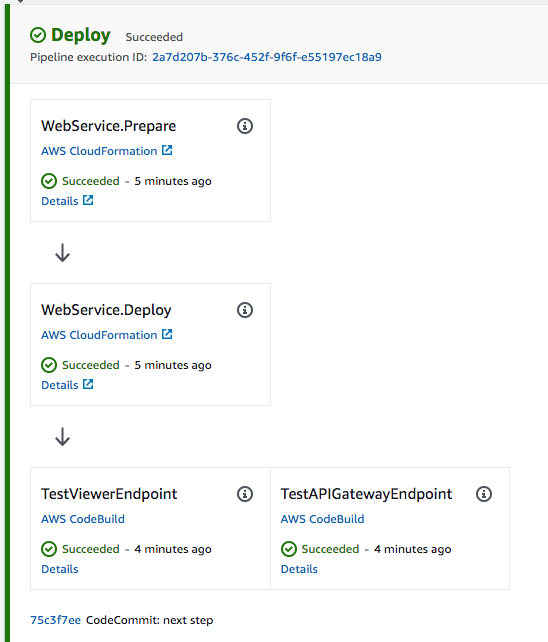

+++
title = "Polish Pipeline"
weight = 150
+++

## Get Endpoints
The first thing you may realize is that we have lost clear visibility into the endpoints of our application (the `TableViewer` and `APIGateway Endpoint`). Lets add a little bit of code to expose these more easily.

First edit `lib/cdk-workshop-stack.ts` to get these values and expose them up the tree:


import * as cdk from '@aws-cdk/core';
import * as lambda from '@aws-cdk/aws-lambda';
import * as apigw from '@aws-cdk/aws-apigateway';
import * as path from 'path';
import { HitCounter } from './hitcounter';
import { TableViewer } from 'cdk-dynamo-table-viewer';

export class CdkWorkshopStack extends cdk.Stack {
  public readonly hcViewerUrl: cdk.CfnOutput;
  public readonly hcEndpoint: cdk.CfnOutput;
  
  constructor(scope: cdk.Construct, is: string, props?: cdk.StackProps) {
    super(scope, is, props);

    const hello = new lambda.Function(this, 'HelloHandler', {
      runtime: lambda.Runtime.NODEJS_10_X,
      code: lambda.Code.asset(path.resolve(__dirname, '../lambda')),
      handler: 'hello.handler',
    });

    const helloWithCounter = new HitCounter(this, 'HelloHitCounter', {
      downstream: hello
    });

    // defines an API Gateway REST API resource backed by our "hello" function.
    const gateway = new apigw.LambdaRestApi(this, 'Endpoint', {
      handler: helloWithCounter.handler
    });

    const tv = new TableViewer(this, 'ViewHitCounter', {
      title: 'Hello Hits',
      table: helloWithCounter.table,
      sortBy: '-hits'
    });

    this.hcEndpoint = new cdk.CfnOutput(this, 'GatewayUrl', {
      value: gateway.url
    });

    this.hcViewerUrl = new cdk.CfnOutput(this, 'TableViewerUrl', {
      value: tv.endpoint
    });
  }
}


By adding publicly exposed outputs `hcViewerUrl` and `hcEnpoint` we expose the necessary endpoints to our HitCounter application. We are using the cdk/core construct `CfnOutput` to declare these as Cloudformation stack outputs (we will get to this in a minute).

Lets commit these changes to our repo (`git commit -am "MESSAGE" && git push`), and navigate to the [Cloudformation console](https://console.aws.amazon.com/cloudformation). You can see there are three stacks. 
- `CDKToolkit`: The first is the integrated CDK stack (you should always see this on provisioned accounts). You can ignore this
- `WorkshopPipelineStack`: This is the stack that outlines our pipeline, we will not be using this for now
- `Deploy-WebService`: Here is our application! Select this, and under details, select the `Outputs` tab. Here you should see 4 endpoints (two pairs of duplicate values). Two of them `EndpointXXXXXX` and `ViewerHitCounterViewerEndpointXXXXXXX` are generated by default by Cloudformation, and the other two are the outputs we declared ourselves.

If you click the `TableViewerUrl` value, you should see our pretty hitcounter table that we created in the initial workshop.

## Add Validation Test
Now we have our application deplyed, but no CD pipeline is complete without tests!

Lets start with a simple test to ping our endpoints to see if they are alive.
Return to `lib/pipeline-stack.ts` and add the following:


import * as cdk from '@aws-cdk/core';
import * as codepipeline from '@aws-cdk/aws-codepipeline';
import * as codepipeline_actions from '@aws-cdk/aws-codepipeline-actions';
import * as codecommit from '@aws-cdk/aws-codecommit';
import { WorkshopPipelineStage } from './pipeline-stage';
import { ShellScriptAction, SimpleSynthAction, CdkPipeline } from "@aws-cdk/pipelines";

export class WorkshopPipelineStack extends cdk.Stack {
    constructor(scope: cdk.Construct, id: string, props?: cdk.StackProps) {
        super(scope, id, props);

        // PIPELINE CODE HERE...

        const deploy = new WorkshopPipelineStage(this, 'Deploy');
        const deployStage = pipeline.addApplicationStage(deploy);
        deployStage.addActions(new ShellScriptAction({
            actionName: 'TestViewerEndpoint',
            useOutputs: {
                ENDPOINT_URL: //TBD
            },
            commands: [
                'curl -Ssf $ENDPOINT_URL'
            ]
        }));
        deployStage.addActions(new ShellScriptAction({
            actionName: 'TestAPIGatewayEndpoint',
            useOutputs: {
                ENDPOINT_URL: //TBD
            },
            commands: [
                'curl -Ssf $ENDPOINT_URL/',
                'curl -Ssf $ENDPOINT_URL/hello',
                'curl -Ssf $ENDPOINT_URL/test'
            ]
        }));
    }
}


First we import `ShellScriptAction` from CDKPipelines (this is a construct that simply executes one or more shell script commands). Then we add two actions to our deployment stage that test our tableviewer endpoint and our APIGateway endpoint respectively

> Note: We submit several curl requests to the APIGateway endpoint so that when we look at our tableviewer, there are several values already populated.

You may notice that we have not yet set the URLs of these endpoints. This is because they are not yet exposed to this stack!

With a slight modification to `lib/pipeline-stage.ts` we can expose these:


import { CdkWorkshopStack } from './cdk-workshop-stack';
import { Stage, CfnOutput, Construct, StageProps } from '@aws-cdk/core';

export class WorkshopPipelineStage extends Stage {
    public readonly hcViewerUrl: CfnOutput; 
    public readonly hcEndpoint: CfnOutput; 

    constructor(scope: Construct, id: string, props?: StageProps) {
        super(scope, id, props);

        const service = new CdkWorkshopStack(this, 'WebService');

        this.hcEndpoint = service.hcEndpoint;
        this.hcViewerUrl = service.hcViewerUrl;
    }
}


Now we can add those values to our actions in `lib/pipeline-stack.ts` by getting the `stackOutput` of our pipeline stack:

// CODE HERE...

deployStage.addActions(new ShellScriptAction({
    actionName: 'TestViewerEndpoint',
    useOutputs: {
        ENDPOINT_URL: pipeline.stackOutput(deploy.hcViewerUrl)
    },
    commands: [
        'curl -Ssf $ENDPOINT_URL'
    ]
}));
deployStage.addActions(new ShellScriptAction({
    actionName: 'TestAPIGatewayEndpoint',
    useOutputs: {
        ENDPOINT_URL: pipeline.stackOutput(deploy.hcEndpoint)
    },
    commands: [
        'curl -Ssf $ENDPOINT_URL/',
        'curl -Ssf $ENDPOINT_URL/hello',
        'curl -Ssf $ENDPOINT_URL/test'
    ]
}));


## Commit and View!
Commit those changes and navigate back to the [CodePipeline Console](https://console.aws.amazon.com/codesuite/codepipeline/pipelines) and you can now see that there are two test actions contained within the `Deploy` stage!

Conratulations! You have successfully created a CD pipeline for your application complete with tests and all! Feel free to explore the console to see the details of the stack created, or check out the [API Reference](https://docs.aws.amazon.com/cdk/api/latest/docs/aws-construct-library.html) section on CDK Pipelines and build one for your application.