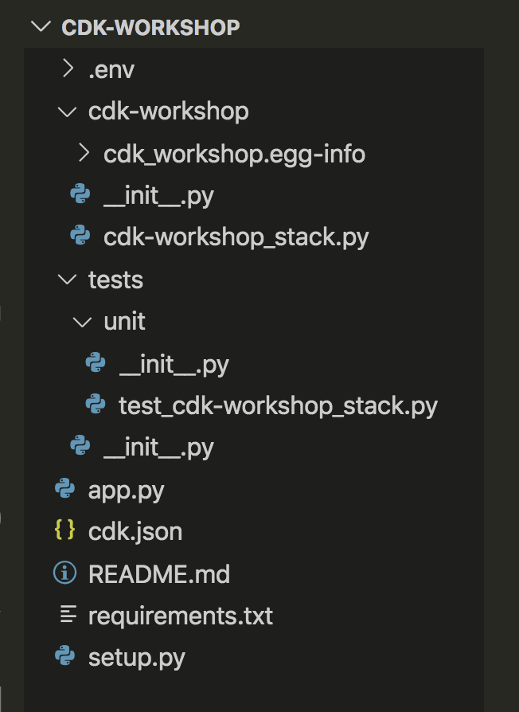

+++
title = "Project structure"
weight = 300
+++

## Open your IDE

Now's a good time to open the project in your favorite IDE and explore.

> If you use VSCode, you can just type `code .` within the project directory.

## Explore your project directory

You'll see something like this:



* .venv - The python virtual envirnment information discussed in the previous section.
* cdk_workshop — A Python module directory.
  * cdk_workshop.egg-info - Folder that contains build information relevant for the packaging on the project
  * cdk_workshop_stack.py—A custom CDK stack construct for use in your CDK application.
* tests — Contains all tests.
  * unit — Contains unit tests.
    * test_cdk_workshop.py—A trivial test of the custom CDK stack created in the cdk_workshop package. This is mainly to demonstrate how tests can be hooked up to the project.
* app.py — The “main” for this sample application.
* cdk.json — A configuration file for CDK that defines what executable CDK should run to generate the CDK construct tree.
* README.md — The introductory README for this project.
* requirements.txt—This file is used by pip to install all of the dependencies for your application. In this case, it contains only -e . This tells pip to install the requirements specified in setup.py. It also tells pip to run python setup.py develop to install the code in the cdk_workshop module so that it can be edited in place.
* setup.py — Defines how this Python package would be constructed and what the dependencies are.

## Your app's entry point

Let's have a quick look at `app.py`:

```python
#!/usr/bin/env python3

import aws_cdk as cdk

from cdk_workshop.cdk_workshop_stack import CdkWorkshopStack


app = cdk.App()
CdkWorkshopStack(app, "cdk-workshop")

app.synth()
```

This code loads and instantiates an instance of the `CdkWorkshopStack` class from
`cdk_workshop/cdk_workshop_stack.py` file. We won't need to look at this file anymore.

## The main stack

Open up `cdk_workshop/cdk_workshop_stack.py`. This is where the meat of our application
is:

```python
from constructs import Construct
from aws_cdk import (
    Duration,
    Stack,
    aws_sqs as sqs,
    aws_sns as sns,
    aws_sns_subscriptions as subs,
)

class CdkWorkshopStack(Stack):

    def __init__(self, scope: Construct, id: str, **kwargs) -> None:
        super().__init__(scope, id, **kwargs)

        queue = sqs.Queue(
            self, "CdkWorkshopQueue",
            visibility_timeout=Duration.seconds(300),
        )

        topic = sns.Topic(
            self, "CdkWorkshopTopic"
        )

        topic.add_subscription(subs.SqsSubscription(queue))
```

As you can see, our app was created with sample CDK stack
(`CdkWorkshopStack`).

The stack includes:

- SQS Queue (`sqs.Queue`)
- SNS Topic (`sns.Topic`)
- Subscribes the queue to receive any messages published to the topic (`topic.add_subscription`)
