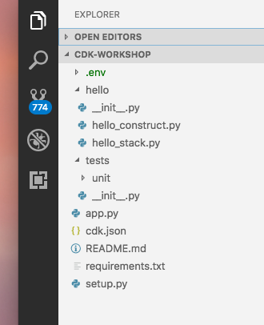

+++
title = "Project structure"
weight = 300
+++

## Open your IDE

Now's a good time to open the project in your favorite IDE and explore.

> If you use VSCode, you can just type `code .` within the project directory.

## Explore your project directory

You'll see something like this:




* README.md — The introductory README for this project.
* app.py — The “main” for this sample application.
* cdk.json — A configuration file for CDK that defines what executable CDK should run to generate the CDK construct tree.
* hello — A Python module directory.
  * hello_construct.py — A custom CDK construct defined for use in your CDK application.
  * hello_stack.py—A custom CDK stack construct for use in your CDK application.
* requirements.txt—This file is used by pip to install all of the dependencies for your application. In this case, it contains only -e . This tells pip to install the requirements specified in setup.py. It also tells pip to run python setup.py develop to install the code in the hello module so that it can be edited in place.
* setup.py — Defines how this Python package would be constructed and what the dependencies are.
* tests — Contains all tests.
  * unit — Contains unit tests.
    * test_hello_construct.py—A trivial test of the custom CDK construct created in the hello package. This is mainly to demonstrate how tests can be hooked up to the project.

## Your app's entry point

Let's have a quick look at `app.py`:

```python
#!/usr/bin/env python3

from aws_cdk import core

from hello.hello_stack import MyStack


app = core.App()
MyStack(app, "hello-cdk-1", env={'region': 'us-east-2'})
MyStack(app, "hello-cdk-2", env={'region': 'us-west-2'})

app.synth()
```

This code loads and instantiate the `MyStack` class from the
`hello/hello_stack.py` file. We won't need to look at this file anymore.

## The main stack

Open up `hello/hello_stack.ts`. This is where the meat of our application
is:

```python
from aws_cdk import (
    aws_iam as iam,
    aws_sqs as sqs,
    aws_sns as sns,
    aws_sns_subscriptions as subs,
    core
)

from hello_construct import HelloConstruct


class MyStack(core.Stack):

    def __init__(self, app: core.App, id: str, **kwargs) -> None:
        super().__init__(app, id, **kwargs)

        queue = sqs.Queue(
            self, "MyFirstQueue",
            visibility_timeout=core.Duration.seconds(300),
        )

        topic = sns.Topic(
            self, "MyFirstTopic",
            display_name="My First Topic"
        )

        topic.add_subscription(subs.SqsSubscription(queue))

        hello = HelloConstruct(self, "MyHelloConstruct", num_buckets=4)
        user = iam.User(self, "MyUser")
        hello.grant_read(user)
```

As you can see, our app was created with a sample CDK stack
(`HelloStack`).

The stack includes:

- SQS Queue (`new sqs.Queue`)
- SNS Topic (`new sns.Topic`)
- Subscribes the queue to receive any messages published to the topic (`topic.addSubscription`)
- HelloConstruct which is a custom construct defined in our app.  It creates a
  variable number of S3 buckets in our stack.
