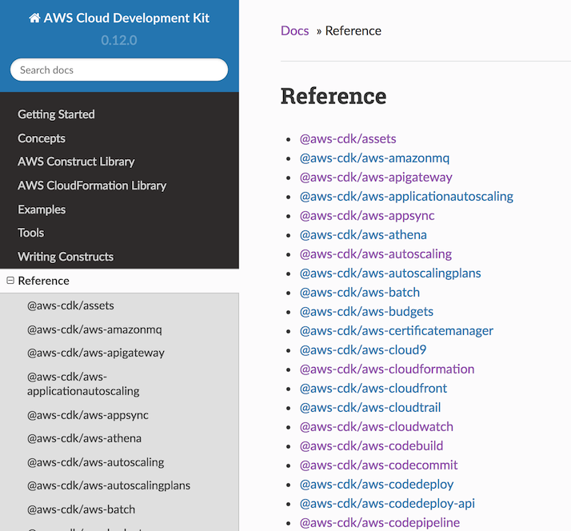
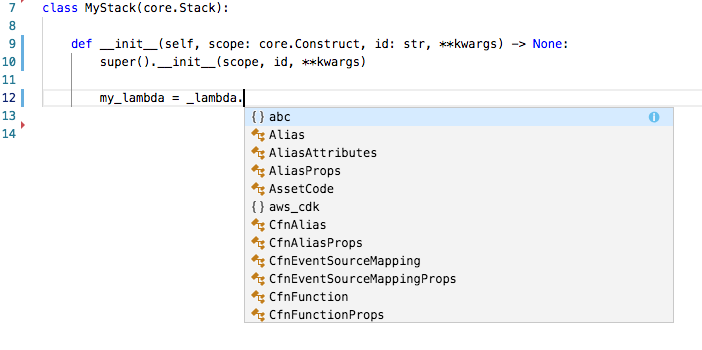
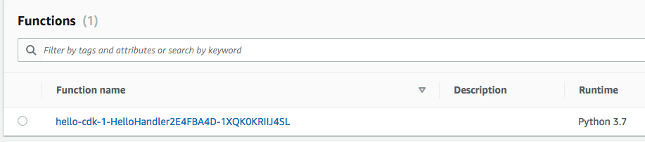
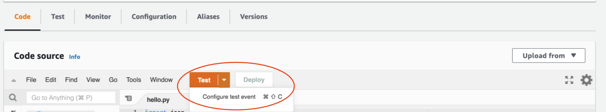
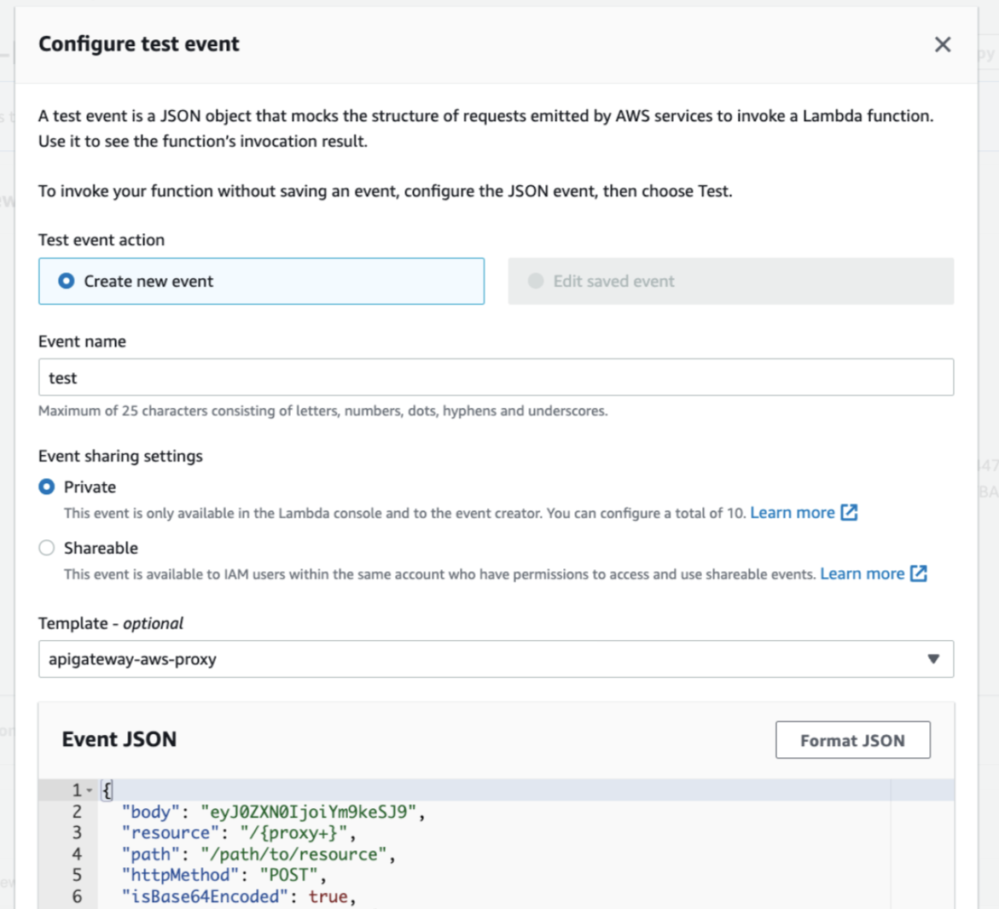
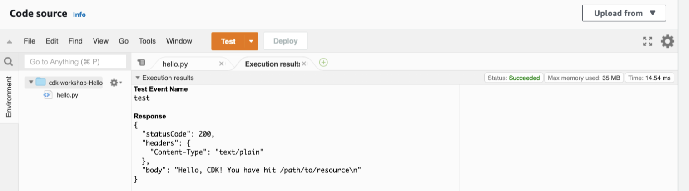

+++
title = "Hello Lambda"
weight = 200
+++

## Lambda handler code

We'll start with the AWS Lambda handler code.

1. Create a directory `lambda` in the root of your project tree (next to the `cdk_workshop` directory).
2. Add a file called `lambda/hello.py` with the following contents:

```python
import json

def handler(event, context):
    print('request: {}'.format(json.dumps(event)))
    return {
        'statusCode': 200,
        'headers': {
            'Content-Type': 'text/plain'
        },
        'body': 'Hello, CDK! You have hit {}\n'.format(event['path'])
    }
```

This is a simple Lambda function which returns the text __"Hello, CDK! You've
hit [url path]"__. The function's output also includes the HTTP status code and
HTTP headers. These are used by API Gateway to formulate the HTTP response to
the user.

{} This lambda is provided in Python. For more information on writing lambda functions in your language of choice, please refer to the AWS Lambda documentation [here](https://docs.aws.amazon.com/lambda/latest/dg/welcome.html) {}

## Install the AWS Lambda construct library

The AWS CDK is shipped with an extensive library of constructs called the __AWS
Construct Library__. The construct library is divided into __modules__, one for
each AWS service. For example, if you want to define an AWS Lambda function, we
will need to use the AWS Lambda construct library.

To discover and learn about AWS constructs, you can browse the [AWS Construct
Library reference](https://docs.aws.amazon.com/cdk/api/latest/docs/aws-construct-library.html).



Okay, let's use `pip install` to install the AWS Lambda
module and all it's dependencies into our project:

```sh
pip install aws-cdk.aws-lambda
```

## A few words about copying & pasting in this workshop

In this workshop, we highly recommended to type CDK code instead of copying &
pasting (there's usually not much to type). This way, you'll be able to fully
experience what it's like to use the CDK. It's especially cool to see your IDE
help you with auto-complete, inline documentation and type safety.



## Add an AWS Lambda Function to your stack

Add an `import` statement at the beginning of `cdk_workshop/cdk_workshop_stack.py`, and a
`lambda.Function` to your stack.



from aws_cdk import (
    core,
    aws_lambda as _lambda,
)

class CdkWorkshopStack(core.Stack):

    def __init__(self, scope: core.Construct, id: str, **kwargs) -> None:
        super().__init__(scope, id, **kwargs)

        # Defines an AWS Lambda resource
        my_lambda = _lambda.Function(
            self, 'HelloHandler',
            runtime=_lambda.Runtime.PYTHON_3_7,
            code=_lambda.Code.from_asset('lambda'),
            handler='hello.handler',
        )


A few things to notice:

- We are importing the `aws_lambda` module as `_lambda` because `lambda` is a
  built-in identifier in Python.
- Our function uses the Python 3.7 runtime
- The handler code is loaded from the `lambda` directory which we created
  earlier. Path is relative to where you execute `cdk` from, which is the
  project's root directory
- The name of the handler function is `hello.handler` ("hello" is the name of
  the file and "handler" is the function name)

## A word about constructs and constructors

As you can see, the class constructors of both `CdkWorkshopStack` and `lambda.Function`
(and many other classes in the CDK) have the signature `(scope, id,
**kwargs)`. This is because all of these classes are __constructs__.
Constructs are the basic building block of CDK apps. They represent abstract
"cloud components" which can be composed together into higher level
abstractions via scopes. Scopes can include constructs, which in turn can
include other constructs, etc.

Constructs are always created in the scope of another construct and must always
have an identifier which must be unique within the scope it's created.
Therefore, construct initializers (constructors) will always have the following
signature:

1. __`scope`__: the first argument is always the scope in which this construct
   is created. In almost all cases, you'll be defining constructs within the
   scope of _current_ construct, which means you'll usually just want to pass
   `self` for the first argument. Make a habit out of it.
2. __`id`__: the second argument is the __local identity__ of the construct.
   It's an ID that has to be unique amongst construct within the same scope. The
   CDK uses this identity to calculate the CloudFormation [Logical
   ID](https://docs.aws.amazon.com/AWSCloudFormation/latest/UserGuide/resources-section-structure.html)
   for each resource defined within this scope. *To read more about IDs in the
   CDK, see the* [CDK user manual](https://docs.aws.amazon.com/cdk/latest/guide/identifiers.html#identifiers_logical_ids).
3. __`kwargs`__: the last (sometimes optional) arguments is always a set of
   initialization arguments. Those are specific to each construct. For example,
   the `lambda.Function` construct accepts arguments like `runtime`, `code` and
   `handler`. You can explore the various options using your IDE's auto-complete
   or in the [online
   documentation](https://docs.aws.amazon.com/cdk/api/latest/docs/aws-lambda-readme.html).

## Diff

Save your code, and let's take a quick look at the diff before we deploy:

```sh
cdk diff
```

Output would look like this:

```log
The cdkworkshop stack uses assets, which are currently not accounted for in the diff output! See https://github.com/awslabs/aws-cdk/issues/395
IAM Statement Changes
┌───┬────────────────────────┬────────┬────────────────────────┬────────────────────────┬───────────┐
│   │ Resource               │ Effect │ Action                 │ Principal              │ Condition │
├───┼────────────────────────┼────────┼────────────────────────┼────────────────────────┼───────────┤
│ + │ ${HelloHandler/Service │ Allow  │ sts:AssumeRole         │ Service:lambda.amazona │           │
│   │ Role.Arn}              │        │                        │ ws.com                 │           │
└───┴────────────────────────┴────────┴────────────────────────┴────────────────────────┴───────────┘
IAM Policy Changes
┌───┬─────────────────────────────┬─────────────────────────────────────────────────────────────────┐
│   │ Resource                    │ Managed Policy ARN                                              │
├───┼─────────────────────────────┼─────────────────────────────────────────────────────────────────┤
│ + │ ${HelloHandler/ServiceRole} │ arn:${AWS::Partition}:iam::aws:policy/service-role/AWSLambdaBas │
│   │                             │ icExecutionRole                                                 │
└───┴─────────────────────────────┴─────────────────────────────────────────────────────────────────┘
(NOTE: There may be security-related changes not in this list. See http://bit.ly/cdk-2EhF7Np)

Parameters
[+] Parameter HelloHandler/Code/S3Bucket HelloHandlerCodeS3Bucket4359A483: {"Type":"String","Description":"S3 bucket for asset \"hello-cdk-1/HelloHandler/Code\""}
[+] Parameter HelloHandler/Code/S3VersionKey HelloHandlerCodeS3VersionKey07D12610: {"Type":"String","Description":"S3 key for asset version \"hello-cdk-1/HelloHandler/Code\""}
[+] Parameter HelloHandler/Code/ArtifactHash HelloHandlerCodeArtifactHash5DF4E4B6: {"Type":"String","Description":"Artifact hash for asset \"hello-cdk-1/HelloHandler/Code\""}

Resources
[+] AWS::IAM::Role HelloHandler/ServiceRole HelloHandlerServiceRole11EF7C63
[+] AWS::Lambda::Function HelloHandler HelloHandler2E4FBA4D
```

As you can see, this code synthesizes an __AWS::Lambda::Function__ resource. It
also synthesized a couple of [CloudFormation
parameters](https://docs.aws.amazon.com/cdk/latest/guide/get_cfn_param.html)
that are used by the toolkit to propagate the location of the handler code.

## Deploy

Let's deploy:

```sh
cdk deploy
```

You'll notice that `cdk deploy` not only deployed your CloudFormation stack, but
also archived and uploaded the `lambda` directory from your disk to the
bootstrap bucket.

## Testing our function

Let's go to the AWS Lambda Console and test our function.

1. Open the [AWS Lambda
   Console](https://console.aws.amazon.com/lambda/home#/functions) (make sure
   you are in the correct region).

    You should see our function:

    

2. Click on the function name to go to the console.

3. Click on the __Test__ button to open the __Configure test event__ dialog:

    

4. Select __Amazon API Gateway AWS Proxy__ from the __Event template__ list.

5. Enter `test` under __Event name__.

    

6. Hit __Create__.

7. Click __Test__ again and wait for the execution to complete.

8. Expand __Details__ in the __Execution result__ pane and you should see our expected output:

    

# 👏
