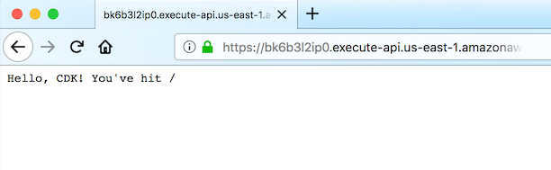

+++
title = "API Gateway"
weight = 300
+++

Next step is to add an API Gateway in front of our function. API Gateway will
expose a public HTTP endpoint that anyone on the internet can hit with an HTTP
client such as [curl](https://curl.haxx.se/) or a web browser.

We will use [Lambda proxy
integration](https://docs.aws.amazon.com/apigateway/latest/developerguide/api-gateway-create-api-as-simple-proxy-for-lambda.html)
mounted to the root of the API. This means that any request to any URL path will
be proxied directly to our Lambda function, and the response from the function
will be returned back to the user.

## Install the API Gateway construct library

```console
pip install aws-cdk.aws_apigateway
```

## Add a LambdaRestApi construct to your stack

Let's define an API endpoint and associate it with our Lambda function:


import cdk = require('@aws-cdk/core');
import lambda = require('@aws-cdk/aws-lambda');
import apigw = require('@aws-cdk/aws-apigateway');

export class CdkWorkshopStack extends cdk.Stack {
  constructor(scope: cdk.App, id: string, props?: cdk.StackProps) {
    super(scope, id, props);

    // defines an AWS Lambda resource
    const hello = new lambda.Function(this, 'HelloHandler', {
      runtime: lambda.Runtime.NODEJS_8_10,
      code: lambda.Code.asset('lambda'),
      handler: 'hello.handler'
    });

    // defines an API Gateway REST API resource backed by our "hello" function.
    new apigw.LambdaRestApi(this, 'Endpoint', {
      handler: hello
    });

  }
}


That's it. This is all you need to do in order to define an API Gateway which
proxies all requests to an AWS Lambda function.

## cdk diff

Let's see what's going to happen when we deploy this:

```console
cdk diff hello-cdk-1
```

Output should look like this:

```
The hello-cdk-1 stack uses assets, which are currently not accounted for in the diff output! See https://github.com/awslabs/aws-cdk/issues/395
IAM Statement Changes
┌───┬────────────────────┬────────┬────────────────────┬────────────────────┬───────────────────────┐
│   │ Resource           │ Effect │ Action             │ Principal          │ Condition             │
├───┼────────────────────┼────────┼────────────────────┼────────────────────┼───────────────────────┤
│ + │ ${Endpoint/CloudWa │ Allow  │ sts:AssumeRole     │ Service:apigateway │                       │
│   │ tchRole.Arn}       │        │                    │ .${AWS::URLSuffix} │                       │
├───┼────────────────────┼────────┼────────────────────┼────────────────────┼───────────────────────┤
│ + │ ${HelloHandler.Arn │ Allow  │ lambda:InvokeFunct │ Service:apigateway │ "ArnLike": {          │
│   │ }                  │        │ ion                │ .amazonaws.com     │   "AWS:SourceArn": "a │
│   │                    │        │                    │                    │ rn:${AWS::Partition}: │
│   │                    │        │                    │                    │ execute-api:us-east-2 │
│   │                    │        │                    │                    │ :${AWS::AccountId}:${ │
│   │                    │        │                    │                    │ Endpoint}/${EndpointD │
│   │                    │        │                    │                    │ eploymentStageprodB78 │
│   │                    │        │                    │                    │ BEEA0}/*/"            │
│   │                    │        │                    │                    │ }                     │
│ + │ ${HelloHandler.Arn │ Allow  │ lambda:InvokeFunct │ Service:apigateway │ "ArnLike": {          │
│   │ }                  │        │ ion                │ .amazonaws.com     │   "AWS:SourceArn": "a │
│   │                    │        │                    │                    │ rn:${AWS::Partition}: │
│   │                    │        │                    │                    │ execute-api:us-east-2 │
│   │                    │        │                    │                    │ :${AWS::AccountId}:${ │
│   │                    │        │                    │                    │ Endpoint}/test-invoke │
│   │                    │        │                    │                    │ -stage/*/"            │
│   │                    │        │                    │                    │ }                     │
│ + │ ${HelloHandler.Arn │ Allow  │ lambda:InvokeFunct │ Service:apigateway │ "ArnLike": {          │
│   │ }                  │        │ ion                │ .amazonaws.com     │   "AWS:SourceArn": "a │
│   │                    │        │                    │                    │ rn:${AWS::Partition}: │
│   │                    │        │                    │                    │ execute-api:us-east-2 │
│   │                    │        │                    │                    │ :${AWS::AccountId}:${ │
│   │                    │        │                    │                    │ Endpoint}/${EndpointD │
│   │                    │        │                    │                    │ eploymentStageprodB78 │
│   │                    │        │                    │                    │ BEEA0}/*/{proxy+}"    │
│   │                    │        │                    │                    │ }                     │
│ + │ ${HelloHandler.Arn │ Allow  │ lambda:InvokeFunct │ Service:apigateway │ "ArnLike": {          │
│   │ }                  │        │ ion                │ .amazonaws.com     │   "AWS:SourceArn": "a │
│   │                    │        │                    │                    │ rn:${AWS::Partition}: │
│   │                    │        │                    │                    │ execute-api:us-east-2 │
│   │                    │        │                    │                    │ :${AWS::AccountId}:${ │
│   │                    │        │                    │                    │ Endpoint}/test-invoke │
│   │                    │        │                    │                    │ -stage/*/{proxy+}"    │
│   │                    │        │                    │                    │ }                     │
└───┴────────────────────┴────────┴────────────────────┴────────────────────┴───────────────────────┘
IAM Policy Changes
┌───┬────────────────────────────┬──────────────────────────────────────────────────────────────────┐
│   │ Resource                   │ Managed Policy ARN                                               │
├───┼────────────────────────────┼──────────────────────────────────────────────────────────────────┤
│ + │ ${Endpoint/CloudWatchRole} │ arn:${AWS::Partition}:iam::aws:policy/service-role/AmazonAPIGate │
│   │                            │ wayPushToCloudWatchLogs                                          │
└───┴────────────────────────────┴──────────────────────────────────────────────────────────────────┘
(NOTE: There may be security-related changes not in this list. See http://bit.ly/cdk-2EhF7Np)

Resources
[+] AWS::Lambda::Permission HelloHandler/ApiPermission.ANY.. HelloHandlerApiPermissionANYAC4E141E 
[+] AWS::Lambda::Permission HelloHandler/ApiPermission.Test.ANY.. HelloHandlerApiPermissionTestANYDDD56D72 
[+] AWS::Lambda::Permission HelloHandler/ApiPermission.ANY..{proxy+} HelloHandlerApiPermissionANYproxy90E90CD6 
[+] AWS::Lambda::Permission HelloHandler/ApiPermission.Test.ANY..{proxy+} HelloHandlerApiPermissionTestANYproxy9803526C 
[+] AWS::ApiGateway::RestApi Endpoint EndpointEEF1FD8F 
[+] AWS::ApiGateway::Deployment Endpoint/Deployment EndpointDeployment318525DAb462c597ccb914d9fc1c10f664ed81ca 
[+] AWS::ApiGateway::Stage Endpoint/DeploymentStage.prod EndpointDeploymentStageprodB78BEEA0 
[+] AWS::IAM::Role Endpoint/CloudWatchRole EndpointCloudWatchRoleC3C64E0F 
[+] AWS::ApiGateway::Account Endpoint/Account EndpointAccountB8304247 
[+] AWS::ApiGateway::Resource Endpoint/Default/{proxy+} Endpointproxy39E2174E 
[+] AWS::ApiGateway::Method Endpoint/Default/{proxy+}/ANY EndpointproxyANYC09721C5 
[+] AWS::ApiGateway::Method Endpoint/Default/ANY EndpointANY485C938B 

Outputs
[+] Output Endpoint/Endpoint Endpoint8024A810: {"Value":{"Fn::Join":["",["https://",{"Ref":"EndpointEEF1FD8F"},".execute-api.us-east-2.",{"Ref":"AWS::URLSuffix"},"/",{"Ref":"EndpointDeploymentStageprodB78BEEA0"},"/"]]}}
```

That's nice. This one line of code added 12 new resources to our stack.

## cdk deploy

Okay, ready to deploy?

```console
cdk deploy hello-cdk-1
```

## Stack outputs

When deployment is complete, you'll notice this line:

```
CdkWorkshopStack.Endpoint8024A810 = https://xxxxxxxxxx.execute-api.us-east-1.amazonaws.com/prod/
```

This is a [stack output](https://docs.aws.amazon.com/AWSCloudFormation/latest/UserGuide/stacks.html) that's
automatically added by the API Gateway construct and includes the URL of the API Gateway endpoint.

## Testing your app

Let's try to hit this endpoint with `curl`. Copy the URL and execute (your
prefix and region will likely be different).

{}
If you don't have [curl](https://curl.haxx.se/) installed, you can always use
your favorite web browser to hit this URL.
{}

```console
curl https://xxxxxxxxxx.execute-api.us-east-1.amazonaws.com/prod/
```

Output should look like this:

```
Hello, CDK! You've hit /
```

You can also use your web browser for this:



If this is the output you received, your app works!

## What if it didn't work?

If you received a 5xx error from API Gateway, it is likely one of two issues:

1. The response your function returned is not what API Gateway expects. Go back
   and make sure your handler returns a response that includes a `statusCode`,
   `body` and `header` fields (see [Write handler runtime
   code](./200-lambda.html)).
2. Your function failed for some reason. To debug this, you can quickly jump to [this section](../40-hit-counter/500-logs.html)
   to learn how to view your Lambda logs.

---

Good job! In the next chapter, we'll write our own reusable construct.
