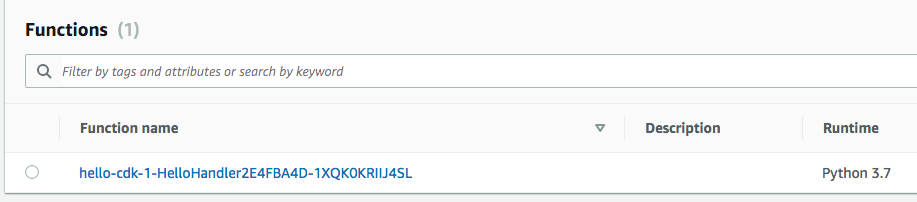

+++
title = "CDK Watch"
weight = 300
+++

## Faster personal deployments

{} This section is not necessary to complete the workshop, but we
recommend that you take the time to see how `cdk deploy --hotswap` and `cdk watch` 
can speed up your personal deployments.
{}

It's great that we have a working lambda! But what if we want to tweak the lambda
code to get it just right? Let's say that we have now decided that we want our
lambda function to respond with `"Good Morning, CDK!"` instead of `"Hello, CDK"`.

So far, it seems like the only tool we have at our disposal to update our stack is
`cdk deploy`. But `cdk deploy` takes time; it has to deploy your CloudFormation
stack and upload the `lambda` directory from your disk to the boostrap bucket. If
we're just changing our lambda code, we don't actually need to update the
CloudFormation stack, so that part of `cdk deploy` is wasted effort.

We really only need to update our lambda code. It would be great if we had
some other mechanism for doing only that...

## Timing `cdk deploy`

First, let's time how long it takes to run `cdk deploy`. It will help us baseline
how long a full CloudFormation deployment takes. To do this, we are going to change
the code inside `lambda/hello.py`:


import json

def handler(event, context):
    print('request: {}'.format(json.dumps(event)))
    return {
        'statusCode': 200,
        'headers': {
            'Content-Type': 'text/plain'
        },
        'body': 'Good Morning, CDK! You have hit {}\n'.format(event['path'])
    }


Then, we can run `cdk deploy`:

```
cdk deploy
```

The output will look something like this:

```
✨  Synthesis time: 6s

CdkWorkshopStack: deploying...
CdkWorkshopStack: creating CloudFormation changeset...


 ✅  CdkWorkshopStack

✨  Deployment time: 66.82s

Stack ARN:
arn:aws:cloudformation:REGION:ACCOUNT-ID:stack/CdkWorkshopStack/STACK-ID

✨  Total time: 72.82s
```

The exact time will vary but we should get a pretty good idea of how long a normal
deployment takes!

## Hotswap deployments

{} This command deliberately introduces drift in CloudFormation 
stacks in order to speed up deployments. For this reason, only use it for 
development purposes. Never use hotswap for your production deployments!
{}

We can speed up that deployment time with `cdk deploy --hotswap`, which will
assess whether a hotswap deployment can be performed instead of a CloudFormation
deployment. If possible, the CDK CLI will use AWS service APIs to directly make
the changes; otherwise it will fall back to performing a full CloudFormation
deployment.

Here, we will use `cdk deploy --hotswap` to deploy a hotswappable change to your 
AWS Lambda asset code.

## Timing `cdk deploy --hotswap`

Let's change the lambda code in `lambda/hello.py` another time:


import json

def handler(event, context):
    print('request: {}'.format(json.dumps(event)))
    return {
        'statusCode': 200,
        'headers': {
            'Content-Type': 'text/plain'
        },
        'body': 'Good Afternoon, CDK! You have hit {}\n'.format(event['path'])
    }


Now, let's run `cdk deploy --hotswap`:

```
cdk deploy --hotswap
```

The output will look something like this:

```
✨  Synthesis time: 6.44s

⚠️ The --hotswap flag deliberately introduces CloudFormation drift to speed up deployments
⚠️ It should only be used for development - never use it for your production Stacks!

CdkWorkshopStack: deploying...
✨ hotswapping resources:
   ✨ Lambda Function 'CdkWorkshopStack-HelloHandler2E4FBA4D-tEZTcXqG8YYe'
✨ Lambda Function 'CdkWorkshopStack-HelloHandler2E4FBA4D-tEZTcXqG8YYe' hotswapped!

 ✅  CdkWorkshopStack

✨  Deployment time: 3.07s

Stack ARN:
arn:aws:cloudformation:REGION:ACCOUNT-ID:stack/CdkWorkshopStack/STACK-ID

✨  Total time: 9.51s
```

Wow, deploying a hotswapped change took 3 seconds, while a full deployment took 67 seconds! 
But take a look and read the warning message thoroughly - it's important!

```
⚠️ The --hotswap flag deliberately introduces CloudFormation drift to speed up deployments
⚠️ It should only be used for development - never use it for your production Stacks!
```

## Did the code actually change?

Wow that was fast. Did the code actually change? Let's go to the AWS Lambda Console and
double check!

1. Open the [AWS Lambda
   Console](https://console.aws.amazon.com/lambda/home#/functions) (make sure
   you are in the correct region).

    You should see our function:

    

2. Click on the function name to go to the console.

3. The code should be loaded onto the screen. Did your change show up?

    

## CDK Watch

We can do better than calling `cdk deploy` or `cdk deploy --hotswap` each time.
`cdk watch` is similar to `cdk deploy` except that instead of being a one-shot
operation, it monitors your code and assets for changes and attempts to perform a 
deployment automatically when a change is detected. By default, `cdk watch` will 
use the `--hotswap` flag, which inspects the changes and determines if those 
changes can be hotswapped. Calling `cdk watch --no-hotswap` will disable the 
hotswap behavior.

Once we set it up, we can use `cdk watch` to detect both hotswappable changes and
changes that require full CloudFormation deployment.

## Looking at your `cdk.json` file

When the `cdk watch` command runs, the files that it observes are determined by the
`"watch"` setting in the `cdk.json` file. It has two sub-keys, `"include"` and
`"exclude"`, each of which can be either a single string or an array of strings.
Each entry is interpreted as a path relative to the location of the `cdk.json`
file. Globs, both `*` and `**`, are allowed to be used.

Your `cdk.json` file should look similar to this:

```json
{
  "app": "python3 app.py",
  "watch": {
    "include": [
      "**"
    ],
    "exclude": [
      "README.md",
      "cdk*.json",
      "requirements*.txt",
      "source.bat",
      "**/__init__.py",
      "python/__pycache__",
      "tests"
    ]
  },
  "context": {
    // ...
  }
}

```

As you can see, the sample app comes with a suggested `"watch"` setting. We don't
need to change anything for our use case, but if you did want `cdk watch` to watch
other files, you can change the settings here.

You're all set to start watching!

## Timing `cdk watch`

First, call `cdk watch`: 

```
cdk watch
```

This will trigger an initial deployment and immediately begin observing the files
we've specified in `cdk.json`.

Let's change our lambda asset code in `lambda/hello.py` one more time:


import json

def handler(event, context):
    print('request: {}'.format(json.dumps(event)))
    return {
        'statusCode': 200,
        'headers': {
            'Content-Type': 'text/plain'
        },
        'body': 'Good Night, CDK! You have hit {}\n'.format(event['path'])
    }


Once you save the changes to your Lambda code file, `cdk watch` will recognize that
your file has changed and trigger a new deployment. In this case, it will recognize
that we can hotswap the lambda asset code, so it will bypass a CloudFormation
deployment and deploy directly to the Lambda service instead.

How fast did deployment take?

```
Detected change to 'lambda/hello.py' (type: change). Triggering 'cdk deploy'

✨  Synthesis time: 5.57s

⚠️ The --hotswap flag deliberately introduces CloudFormation drift to speed up deployments
⚠️ It should only be used for development - never use it for your production Stacks!

CdkWorkshopStack: deploying...
✨ hotswapping resources:
   ✨ Lambda Function 'CdkWorkshopStack-HelloHandler2E4FBA4D-tEZTcXqG8YYe'
✨ Lambda Function 'CdkWorkshopStack-HelloHandler2E4FBA4D-tEZTcXqG8YYe' hotswapped!

 ✅  CdkWorkshopStack

✨  Deployment time: 2.54s

Stack ARN:
arn:aws:cloudformation:REGION:ACCOUNT-ID:stack/CdkWorkshopStack/STACK-ID

✨  Total time: 8.11s
```

## Wrap Up

The rest of this tutorial will continue using `cdk deploy` instead of `cdk watch`.
But if you want to, you can simply keep `cdk watch` on. If you need to make a full
deployment, `cdk watch` will call `cdk deploy` for you.

For a deeper dive on `cdk watch` use cases, read
[Increasing Development Speed with CDK Watch](https://aws.amazon.com/blogs/developer/increasing-development-speed-with-cdk-watch/).