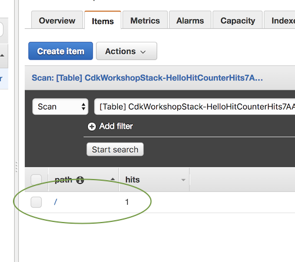

+++
title = "Granting permissions"
weight = 600
+++

## Allow Lambda to read/write our DynamoDB table

Let's give our Lambda's execution role permissions to read/write from our table.

Go back to `hitcounter.py` and add the following highlighted lines:


from aws_cdk import (
    aws_lambda as _lambda,
    aws_dynamodb as ddb,
    core,
)

class HitCounter(core.Construct):

    @property
    def handler(self):
        return self._handler    

    def __init__(self, scope: core.Construct, id: str, downstream: _lambda.IFunction, **kwargs):
        super().__init__(scope, id, **kwargs)

        table = ddb.Table(
            self, 'Hits',
            partition_key={'name': 'path', 'type': ddb.AttributeType.STRING}
        )

        self._handler = _lambda.Function(
            self, 'HitCounterHandler',
            runtime=_lambda.Runtime.PYTHON_3_7,
            handler='hitcounter.handler',
            code=_lambda.Code.asset('lambda'),
            environment={
                'DOWNSTREAM_FUNCTION_NAME': downstream.function_name,
                'HITS_TABLE_NAME': table.table_name,
            }
        )

        table.grant_read_write_data(self.handler)


## Deploy

Save & deploy:

```console
cdk deploy hello-cdk-1
```

## Test again

Okay, deployment is complete. Let's run our test again (either use `curl` or
your web browser):

```console
curl -i https://xxxxxxxxxx.execute-api.us-east-1.amazonaws.com/prod/
```

Again?

```
HTTP/1.1 502 Bad Gateway
...

{"message": "Internal server error"}
```

# 😢

Still getting this pesky 5xx error! Let's look at our CloudWatch logs again
(click "Refresh"):

```json
{
    "errorMessage": "User: arn:aws:sts::585695036304:assumed-role/hello-cdk-1-HelloHitCounterHitCounterHandlerS-TU5M09L1UBID/hello-cdk-1-HelloHitCounterHitCounterHandlerD-144HVUNEWRWEO is not authorized to perform: lambda:InvokeFunction on resource: arn:aws:lambda:us-east-1:585695036304:function:hello-cdk-1-HelloHandler2E4FBA4D-149MVAO4969O7",
    "errorType": "AccessDeniedException",
    "stackTrace": [
        "Object.extractError (/var/runtime/node_modules/aws-sdk/lib/protocol/json.js:48:27)",
        "Request.extractError (/var/runtime/node_modules/aws-sdk/lib/protocol/rest_json.js:52:8)",
        "Request.callListeners (/var/runtime/node_modules/aws-sdk/lib/sequential_executor.js:105:20)",
        "Request.emit (/var/runtime/node_modules/aws-sdk/lib/sequential_executor.js:77:10)",
        "Request.emit (/var/runtime/node_modules/aws-sdk/lib/request.js:683:14)",
        "Request.transition (/var/runtime/node_modules/aws-sdk/lib/request.js:22:10)",
        "AcceptorStateMachine.runTo (/var/runtime/node_modules/aws-sdk/lib/state_machine.js:14:12)",
        "/var/runtime/node_modules/aws-sdk/lib/state_machine.js:26:10",
        "Request.<anonymous> (/var/runtime/node_modules/aws-sdk/lib/request.js:38:9)",
        "Request.<anonymous> (/var/runtime/node_modules/aws-sdk/lib/request.js:685:12)"
    ]
}
```

Another access denied, but this time, if you take a close look:

```
User: <VERY-LONG-STRING> is not authorized to perform: lambda:InvokeFunction on resource: <VERY-LONG-STRING>"
```

So it seems like our hit counter actually managed to write to the database. We can confirm by
going to the [DynamoDB Console](https://console.aws.amazon.com/dynamodb/home):



But, we must also give our hit counter permissions to invoke the downstream lambda function.

## Grant invoke permissions

Add the highlighted lines to `hello/hitcounter.py`:


from aws_cdk import (
    aws_lambda as _lambda,
    aws_dynamodb as ddb,
    core,
)

class HitCounter(core.Construct):

    @property
    def handler(self):
        return self._handler    

    def __init__(self, scope: core.Construct, id: str, downstream: _lambda.IFunction, **kwargs):
        super().__init__(scope, id, **kwargs)

        table = ddb.Table(
            self, 'Hits',
            partition_key={'name': 'path', 'type': ddb.AttributeType.STRING}
        )

        self._handler = _lambda.Function(
            self, 'HitCounterHandler',
            runtime=_lambda.Runtime.PYTHON_3_7,
            handler='hitcounter.handler',
            code=_lambda.Code.asset('lambda'),
            environment={
                'DOWNSTREAM_FUNCTION_NAME': downstream.function_name,
                'HITS_TABLE_NAME': table.table_name,
            }
        )

        table.grant_read_write_data(self.handler)
        downstream.grant_invoke(self.handler)


## Diff

You can check what this did using `cdk diff`:

```console
cdk diff hello-cdk-1
```

The **Resource** section should look something like this,
which shows the IAM statement was added to the role:

```
Stack hello-cdk-1
The hello-cdk-1 stack uses assets, which are currently not accounted for in the diff output! See https://github.com/awslabs/aws-cdk/issues/395
IAM Statement Changes
┌───┬────────────────────────┬────────┬────────────────────────┬────────────────────────┬───────────┐
│   │ Resource               │ Effect │ Action                 │ Principal              │ Condition │
├───┼────────────────────────┼────────┼────────────────────────┼────────────────────────┼───────────┤
│ + │ ${HelloHandler.Arn}    │ Allow  │ lambda:InvokeFunction  │ AWS:${HelloHitCounter/ │           │
│   │                        │        │                        │ HitCounterHandler/Serv │           │
│   │                        │        │                        │ iceRole}               │           │
└───┴────────────────────────┴────────┴────────────────────────┴────────────────────────┴───────────┘
(NOTE: There may be security-related changes not in this list. See http://bit.ly/cdk-2EhF7Np)

Resources
[~] AWS::IAM::Policy HelloHitCounter/HitCounterHandler/ServiceRole/DefaultPolicy HelloHitCounterHitCounterHandlerServiceRoleDefaultPolicy1487A60A 
 └─ [~] PolicyDocument
     └─ [~] .Statement:
         └─ @@ -24,5 +24,15 @@
            [ ]         "Ref": "AWS::NoValue"
            [ ]       }
            [ ]     ]
            [+]   },
            [+]   {
            [+]     "Action": "lambda:InvokeFunction",
            [+]     "Effect": "Allow",
            [+]     "Resource": {
            [+]       "Fn::GetAtt": [
            [+]         "HelloHandler2E4FBA4D",
            [+]         "Arn"
            [+]       ]
            [+]     }
            [ ]   }
            [ ] ]
```

Which is exactly what we wanted.

## Deploy

Okay... let's give this another shot:

```console
cdk deploy hello-cdk-1
```

Then hit your endpoint with `curl` or with your web browser:

```console
curl -i https://xxxxxxxxxx.execute-api.us-east-1.amazonaws.com/prod/
```

Output should look like this:

```
HTTP/1.1 200 OK
...

Hello, CDK! You've hit /
```

> If you still get 5xx, give it a few seconds and try again. Sometimes API
Gateway takes a little bit to "flip" the endpoint to use the new deployment.

# 😲
