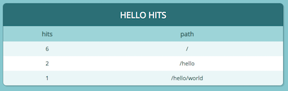

+++
title = "Deploying our app"
weight = 500
+++

## cdk diff

Before we deploy, let's take a look at what will happen when we deploy our app
(this is just the `Resources` section of the output):

```sh
$ cdk diff
Resources
[+] AWS::IAM::Role ViewHitCounter/Rendered/ServiceRole ViewHitCounterRenderedServiceRole254DB4EA
[+] AWS::IAM::Policy ViewHitCounter/Rendered/ServiceRole/DefaultPolicy ViewHitCounterRenderedServiceRoleDefaultPolicy9ADB8C83
[+] AWS::Lambda::Function ViewHitCounter/Rendered ViewHitCounterRendered9C783E45
[+] AWS::Lambda::Permission ViewHitCounter/Rendered/ApiPermission.ANY.. ViewHitCounterRenderedApiPermissionANY72263B1A
[+] AWS::Lambda::Permission ViewHitCounter/Rendered/ApiPermission.Test.ANY.. ViewHitCounterRenderedApiPermissionTestANYA4794B81
[+] AWS::Lambda::Permission ViewHitCounter/Rendered/ApiPermission.ANY..{proxy+} ViewHitCounterRenderedApiPermissionANYproxy42B9E676
[+] AWS::Lambda::Permission ViewHitCounter/Rendered/ApiPermission.Test.ANY..{proxy+} ViewHitCounterRenderedApiPermissionTestANYproxy104CA88E
[+] AWS::ApiGateway::RestApi ViewHitCounter/ViewerEndpoint ViewHitCounterViewerEndpoint5A0EF326
[+] AWS::ApiGateway::Deployment ViewHitCounter/ViewerEndpoint/Deployment ViewHitCounterViewerEndpointDeployment1CE7C5761d44312e8424c23ba090a70e0962c36f
[+] AWS::ApiGateway::Stage ViewHitCounter/ViewerEndpoint/DeploymentStage.prod ViewHitCounterViewerEndpointDeploymentStageprodF3901FC7
[+] AWS::IAM::Role ViewHitCounter/ViewerEndpoint/CloudWatchRole ViewHitCounterViewerEndpointCloudWatchRole87B94D6A
[+] AWS::ApiGateway::Account ViewHitCounter/ViewerEndpoint/Account ViewHitCounterViewerEndpointAccount0B75E76A
[+] AWS::ApiGateway::Resource ViewHitCounter/ViewerEndpoint/Default/{proxy+} ViewHitCounterViewerEndpointproxy2F4C239F
[+] AWS::ApiGateway::Method ViewHitCounter/ViewerEndpoint/Default/{proxy+}/ANY ViewHitCounterViewerEndpointproxyANYFF4B8F5B
[+] AWS::ApiGateway::Method ViewHitCounter/ViewerEndpoint/Default/ANY ViewHitCounterViewerEndpointANY66F2285B
```

You'll notice that the table viewer adds another API Gateway endpoint, a Lambda
function, permissions, outputs, all sorts of goodies.

{} Construct libraries are a very powerful concept. They
allow you to add complex capabilities to your apps with minimum effort. However,
you must understand that with great power comes great responsibility. Constructs
can add IAM permissions, expose data to the public or cause your application not
to function. We are working on providing you tools for protecting your app, and
identifying potential security issues with your stacks, but it is your
responsibility to understand how certain constructs that you use impact your
application, and to make sure you only use construct libraries from vendors you
trust  {}

### cdk deploy

```sh
$ cdk deploy
...
cdkworkshop.ViewHitCounterViewerEndpointCA1B1E4B = https://6i4udz9wb2.execute-api.us-east-2.amazonaws.com/prod/
```

You'll see the viewer endpoint as an output.

### Viewing the hit counter table

Open your browser and browse to the hit counter viewer endpoint URL. You should
see something like this:



### Send a few requests

Send a few more requests to your "hello" endpoint and monitor your hit counter
viewer. You should see the values update in real-time.

Use `curl` or your web browser to produce a few hits:

```sh
$ curl https://xxxxxxxxxx.execute-api.us-east-1.amazonaws.com/prod/hit1
$ curl https://xxxxxxxxxx.execute-api.us-east-1.amazonaws.com/prod/hit1
$ curl https://xxxxxxxxxx.execute-api.us-east-1.amazonaws.com/prod/hit1
$ curl https://xxxxxxxxxx.execute-api.us-east-1.amazonaws.com/prod/hit1
$ curl https://xxxxxxxxxx.execute-api.us-east-1.amazonaws.com/prod/hoooot
$ curl https://xxxxxxxxxx.execute-api.us-east-1.amazonaws.com/prod/hoooot
$ curl https://xxxxxxxxxx.execute-api.us-east-1.amazonaws.com/prod/hit1
$ curl https://xxxxxxxxxx.execute-api.us-east-1.amazonaws.com/prod/hit1
$ curl https://xxxxxxxxxx.execute-api.us-east-1.amazonaws.com/prod/hit1
$ curl https://xxxxxxxxxx.execute-api.us-east-1.amazonaws.com/prod/hit1
$ curl https://xxxxxxxxxx.execute-api.us-east-1.amazonaws.com/prod/hoooot
$ curl https://xxxxxxxxxx.execute-api.us-east-1.amazonaws.com/prod/hoooot
$ curl https://xxxxxxxxxx.execute-api.us-east-1.amazonaws.com/prod/hit1
```

{}

**Interested in how the Table Viewer works?** It's easy to find out!
Hold **Ctrl** (or **Command**) and click on the `TableViewer`
identifier to navigate to its source code. Or navigate to the Github repository [here](https://github.com/eladb/cdk-dynamo-table-viewer)

{}
