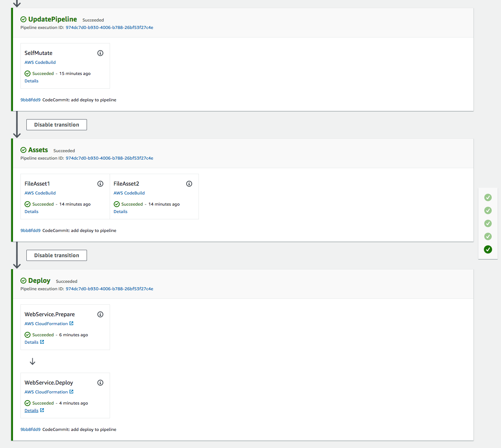

+++
title = "Add Application to Pipeline"
weight = 140
+++

## Create Stage
At this point, you have a fully operating CDK pipeline that will automatically update itself on every commit, *BUT* at the moment, that is all it does. We need to add a stage to the pipeline that will deploy our application.

Create a new file in `cdk_workshop` called `pipeline_stage.py` with the code below:


from aws_cdk import (
    core
)
from pypipworkshop_stack import PypipworkshopStack

class WorkshopPipelineStage(core.Stage):

    def __init__(self, scope: core.Construct, id: str, **kwargs):
        super().__init__(scope, id, **kwargs)

        service = PypipworkshopStack(self, 'WebService')



All this does is declare a new `core.Stage` (component of a pipeline), and in that stage instantiate our application stack.

## Add stage to pipeline
Now we must add the stage to the pipeline by adding the following code to `cdk_workshop/pipeline_stack.py`:


from aws_cdk import (
    core,
    aws_codecommit as codecommit,
    aws_codepipeline as codepipeline,
    aws_codepipeline_actions as codepipeline_actions,
    pipelines as pipelines
)
from pipeline_stage import WorkshopPipelineStage

class WorkshopPipelineStack(core.Stack):

    def __init__(self, scope: core.Construct, id: str, **kwargs) -> None:
        super().__init__(scope, id, **kwargs)

        # Creates a CodeCommit repository called 'WorkshopRepo'
        repo = codecommit.Repository(
            self, 'WorkshopRepo',
            repository_name= "WorkshopRepo"
        )

        # Defines the artifact representing the sourcecode
        source_artifact = codepipeline.Artifact()
        # Defines the artifact representing the cloud assembly
        # (cloudformation template + all other assets)
        cloud_assembly_artifact = codepipeline.Artifact()

        pipeline = pipelines.CdkPipeline(
            self, 'Pipeline',
            cloud_assembly_artifact=cloud_assembly_artifact,

            # Generates the source artifact from the repo we created in the last step
            source_action=codepipeline_actions.CodeCommitSourceAction(
                action_name='CodeCommit', # Any Git-based source control
                output=source_artifact, # Indicates where the artifact is stored
                repository=repo # Designates the repo to draw code from
            ),

            # Builds our source code outlined above into a could assembly artifact
            synth_action=pipelines.SimpleSynthAction(
                install_commands=[
                    'npm install -g aws-cdk', # Installs the cdk cli on Codebuild
                    'pip install -r requirements.txt' # Instructs codebuild to install required packages
                ],
                synth_command='npx cdk synth',
                source_artifact=source_artifact, # Where to get source code to build
                cloud_assembly_artifact=cloud_assembly_artifact, # Where to place built source
            )
        )

        deploy = WorkshopPipelineStage(self, 'Deploy')
        pipeline.add_application_stage(deploy)


This imports and creates an instance of the `WorkshopPipelineStage`. Later, you might instantiate this stage multiple times (e.g. you want a Production deployment and a separate devlopment/test deployment).

Then we add that stage to our pipeline (`pipeline.add_application_stage(deploy);`). An `ApplicationStage` in a CDK pipeline represents any CDK deployment action.

## Commit/Deploy
Now that we have added the code to deploy our application, all that's left is to commit and push those changes to the repo.

```
git commit -am "Add deploy stage to pipeline" && git push
```

Once that is done, we can go back to the [CodePipeline console](https://us-west-2.console.aws.amazon.com/codesuite/codepipeline/pipelines) and take a look as the pipeline runs (this may take a while).



Success!
