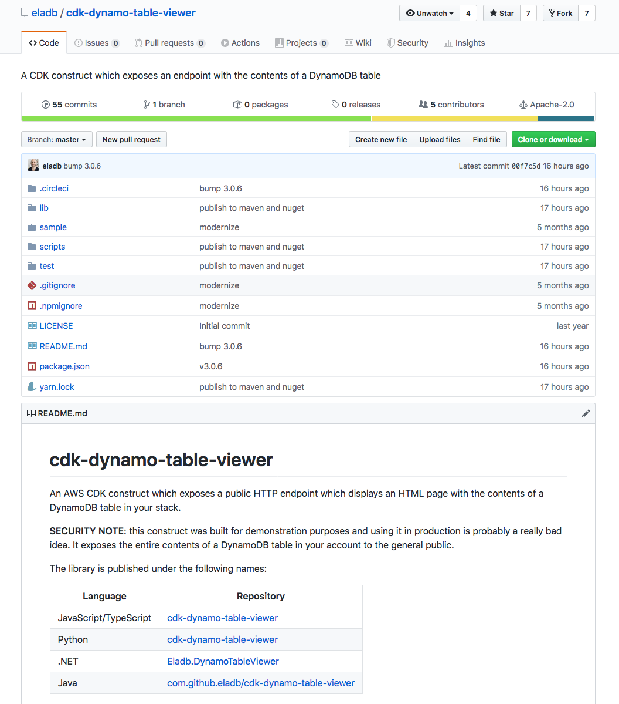

+++
title = "Learning about the Table Viewer construct"
weight = 100
+++

## Reading documentation

Browse to the [cdk-dynamo-table-viewer
page](https://github.com/eladb/cdk-dynamo-table-viewer) on Github if
you want to read the module documentation.

{}
As mentioned in the README page of this library, it is not intended for production use. Namely because
it will expose contents from your DynamoDB table to anyone without authentication.
{}

