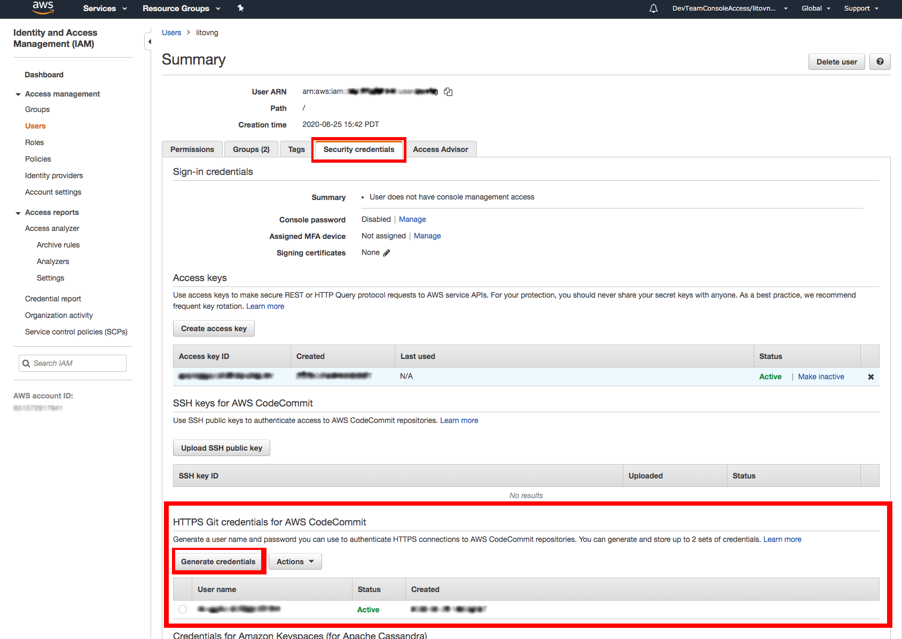

+++
title = "Create Repository"
weight = 120
+++

## Create Repo in Pipeline Stack
The first step in any good CD pipeline is source control. Here we will create a [**CodeCommit**](https://aws.amazon.com/codecommit/) repository to contain our project code.

Edit the file `PipelineStack.java` as follows.


package com.myorg;

import software.amazon.awscdk.core.Construct;
import software.amazon.awscdk.core.Stack;
import software.amazon.awscdk.core.StackProps;

import software.amazon.awscdk.services.codecommit.Repository;

public class PipelineStack extends Stack {
    public PipelineStack(final Construct parent, final String id) {
        this(parent, id, null);
    }

    public PipelineStack(final Construct parent, final String id, final StackProps props) {
        super(parent, id, props);

        // This creates a new CodeCommit repository called 'WorkshopRepo'
        final Repository repo = Repository.Builder.create(this, "WorkshopRepo")
            .repositoryName("WorkshopRepo")
            .build();

        // Pipeline code goes here
    }
}


## Deploy
Now we can install the missing package and deploy the app to see our new repo.

In `pom.xml` add:
``` xml
<dependency>
    <groupId>software.amazon.awscdk</groupId>
    <artifactId>codecommit</artifactId>
    <version>VERSION</version>
</dependency>
```

Then run:
```sh
mvn package
npx cdk deploy
```

## Get Repo Info and Commit
Before we can do anything with our repo, we must add our code to it!

### Git Credentials
Before we can do that, we will need Git credentials for the repo. To do this, go to the [IAM Console](https://console.aws.amazon.com/iam), then navigate to `Users` and then your user of choice.
Inside the manage user interface, navigate to the `Security credentials` tab and scroll until you see "HTTPS Git credentials for AWS CodeCommit". Click generate credentials and follow the instructions on downloading those credentials. We will need them in a moment.



### Add Git remote
The last console step we will need here is to navigate to the [CodeCommit Console](https://console.aws.amazon.com/codesuite/codecommit/repositories) and look for your repo. You will see a column called "Clone URL"; click "HTTPS" to copy the https link so we can add it to your local repo.

> Note: If you do not see your repo here, ensure you are in the interface for the correct region


> While you are here, feel free to explore your repo. You will see that it is still empty, but you do have access to the repo configuration information.

In your terminal, first make sure that all the changes you have made during the workshop are committed by issuing `git status`. If you have unstaged or uncommitted changes, you can execute `git commit -am "SOME_COMMIT_MESSAGE_HERE"`. This will stage and commit all your files so you are ready to go!

> Note: If you copied the code from the repo rather than following through the workshop from the beginning, first issue `git init && git add -A && git commit -m "init"`

> Note: By default, the CDK `.gitignore` file includes a reference to ignore all `*.js` files as those are typically generated by npm-ts. However, since we have lambda files written in js, those must not be ignored. Ensure that the `.gitignore` file includes a line `!lambda/*.js`. This will instruct git to include all `*.js` files in the directory `lambda/`

Next, we add the remote repo to our Git config. You can do this with the command (*XXXXX* represents the Clone URL you copied from the console):

```sh
git remote add origin XXXXX
```

Now all we need to do is to push our code to the repo (`--set-upstream` tells Git to override the current empty master branch on your repo):

```sh
git push --set-upstream origin master
```

Here, CodeCommit will request the credentials you generated in the **Git Credentials** section. You will only have to provide them once.

### See Result
Now you can return to the CodeCommit console and see that your code is all there!


