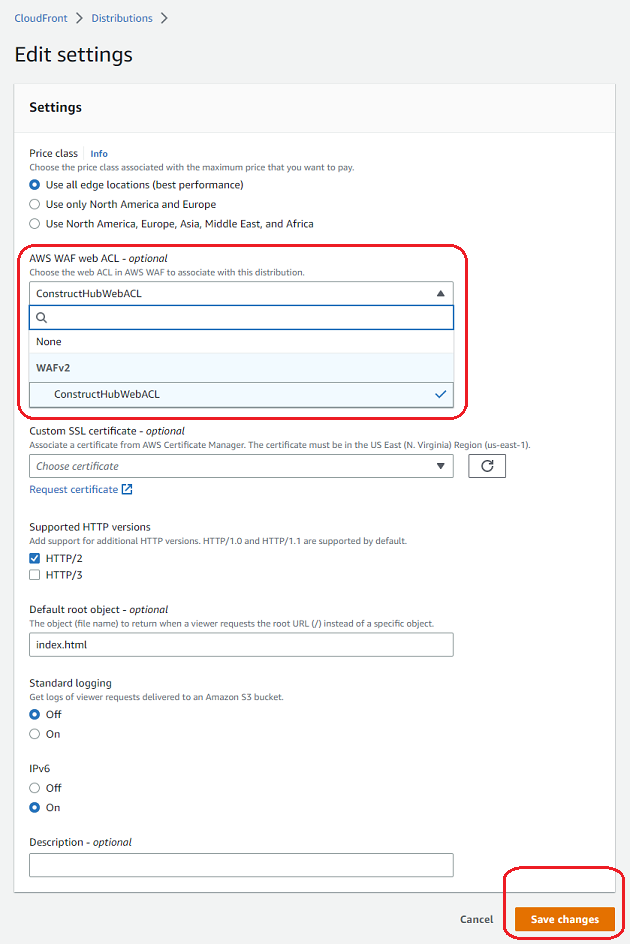

+++
title = "Create ConstructHub"
weight = 100
+++

## Create ConstructHub Infrastructure

{} Please note that the <a href="https://github.com/cdklabs/construct-hub" target="_blank">ConstructHub library</a> is currently in active development and should be considered _experimental_. We welcome any feedback (good or bad) from your experience in using that repo! {}

{} This section of the workshop assumes that you have at least created the [hit counter construct](/20-typescript/40-hit-counter.html) in the main module of the workshop. If you have not, and just want to follow this segment, or you are returning to try this workshop, you can use the code <a href="https://github.com/aws-samples/aws-cdk-intro-workshop/tree/master/code/typescript/main-workshop" target="_blank">here</a> that represents the last state of the project after completing the main module. {}

### Create ConstructHub Stack

The first step is to create an instance of ConstructHub in our AWS Account. By default, ConstructHub has a single package source configured – the public npmjs.com registry. Self-hosted instances typically should list packages from alternate sources, either in addition to packages from npmjs.com. In addition to packages from nmpjs.com, ConstructHub supports CodeArtifact repositories as well as custom package source implementations. In our case, we will create a CodeArtifact domain and a repository to add as a package source to our Private ConstructHub.

Currently, the ConstructHub web interface does not restrict access to specific users. Therefore, in order to make our ConstructHub "Private",  we will use AWS Web Application Firewall (WAF) to create a web access control list (web ACL) with a rule allowing requests based on specific IPs. 

{} Please note that because IPs are easily spoofed, this is for demonstrative purposes only! In the real world, you would use other methods that leverage systems like Active Directory, Single Sign On (SSO), filter for requests from a specific domain that you control, etc. {}

Before you can use the ConstructHub library in your stack, you'll need to install the npm module:


npm install construct-hub@0.4.156


Before we begin, ,ake sure you're outside of the cdkworkshop directory. If you continue to work within this directory, you'll end up with nested git repositories which may cause problems. Run the following command to create a new folder as a sibling of the cdkworkshop directory and initialize a new cdk application.

mkdir private-construct-hub
cdk init app --language typescript {{}}

Create a new file under `lib` called `lib/private-construct-hub-stack.ts`. Add the following to that file and replace _<your_ip_address>_ with your IP address (origin of the web requests):


import * as cdk from "aws-cdk-lib";
import * as waf from "aws-cdk-lib/aws-wafv2";
import * as codeartifact from "aws-cdk-lib/aws-codeartifact";
import { ConstructHub } from "construct-hub";
import * as sources from "construct-hub/lib/package-sources";
import { Construct } from "constructs";

export class ConstructHubStack extends cdk.Stack {
  constructor(scope: Construct, id: string, props?: cdk.StackProps) {
    super(scope, id, props);

    // Create a CodeArtifact domain and repo for user construct packages
    const domain = new codeartifact.CfnDomain(this, "CodeArtifactDomain", {
      domainName: "cdkworkshop-domain",
    });

    const repository = new codeartifact.CfnRepository(
      this,
      "CodeArtifactRepository",
      {
        domainName: domain.domainName,
        repositoryName: "cdkworkshop-repository",
      }
    );

    repository.addDependsOn(domain);

    // Define the IP Set for allowed origin IP range addresses
    const ipSet = new waf.CfnIPSet(this, "ConstructHubIPSet", {
      addresses: ["71.190.189.46/32"],
      ipAddressVersion: "IPV4",
      scope: "CLOUDFRONT",
    });

    // Define the Web ACL with IP Set rule for ContructHub CloudFront distribution
    const webACL = new waf.CfnWebACL(this, "ConstructHubWebACL", {
      name: "ConstructHubWebACL",
      description: "Web ACL for ConstructHub web app CloudFront distribution",
      defaultAction: {
        block: {},
      },
      scope: "CLOUDFRONT",
      rules: [
        {
          name: "ConstructHubIPSetAllowRule",
          priority: 0,
          statement: {
            ipSetReferenceStatement: {
              arn: ipSet.attrArn,
            },
          },
          action: {
            allow: {},
          },
          visibilityConfig: {
            sampledRequestsEnabled: true,
            cloudWatchMetricsEnabled: true,
            metricName: "MetricForConstructHubIPSetAllowRule",
          },
        },
      ],
      visibilityConfig: {
        sampledRequestsEnabled: true,
        cloudWatchMetricsEnabled: true,
        metricName: "MetricForConstructHubWebACL",
      },
    });

    webACL.addDependsOn(ipSet);

    // Create private instance of ConstructHub, register the new CodeArtifact repo
    new ConstructHub(this, "ConstructHub", {
      packageSources: [new sources.CodeArtifact({ repository: repository })],
    });
  }
}


### Update CDK Deploy Entrypoint

Next, modify the main CDK application to deploy new ConstructHub stack. To do this, edit the code in `bin/cdk-workshop.ts` as follows:


import * as cdk from "aws-cdk-lib";
import { ConstructHubStack } from "../lib/private-construct-hub-stack";

const app = new cdk.App();
new ConstructHubStack(app, "ConstructHubStack", {
  env: {
    account: process.env.CDK_DEFAULT_ACCOUNT,
    region: process.env.CDK_DEFAULT_REGION,
  },
});


### Deploy

```
npx cdk deploy
```

{} Deploying ConstructHub stack for the first time may take up to 10 minutes. {}

### Associate Web ACL with CloudFront Distribution

At the moment ConstructHub construct does not allow associating a web ACL programmatically with the CloudFront distribution created as part of the ConstructHub instance. We will manually create this association using AWS Console:

1. Navigate to the <a href="https://console.aws.amazon.com/cloudformation" target="_blank">CloudFormation</a> page, click the `ConstructHubStack` stack, and open the Output tab. Find the value of the key starting with `ConstructHubWebAppDomainName`. This is the domain name of the CloudFront distribution created for the ConstructHub web application.

2. Navigate to the <a href="https://console.aws.amazon.com/cloudfront" target="_blank">CloudFront</a> page, find and open the distribution with the domain name matching the one found in the previous step.

3. Click `Edit` button in the Settings section on the General tab. Choose the web ACL named ConstructHubWebACL from the dropdown for **AWS WAF web ACL - _optional_** field to associate it with this distribution. Scroll down and click `Save changes` button.



4. Navigate to the URL found in the step 1 above and ensure you can open the ConstructHub website. At the moment the ConstructHub will be empty since our CodeArtifact repository does not contain any packages.

{} If the website does not launch, validate that the IP Set used for the ConstructHubWebACL webACL rule includes the IP Address of the origin from which you access the website. Enable sending ConstructHubWebACL webACL logs to a CloudWatch Logs log group to be able to see the detailed information for the allowed and blocked requests including the origin IP address. {}
