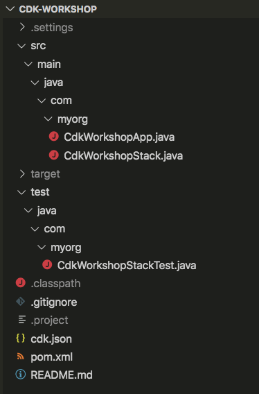

+++
title = "Project structure"
weight = 300
+++

## Open your IDE

Now's a good time to open the project in your favorite IDE and explore.

> If you use VSCode, you can just type `code .` within the project directory.

## Explore your project directory

You'll see something like this:



* `src/main/java/com/myorg/` is the main project directory for Java code in the app, and will be henceforth referred to (to shorten the paths) as `~/`
* `~/CdkWorkshopApp.java` is the entrypoint for the CDK application it will load the stack defined in `~/CdkWorkshopStack.java`
* `~/CdkWorkshopStack.java` is where your CDK application's main stack is defined. This is the file we'll be spending most of our time in.
* `cdk.json` tells the toolkit how to run your app. In our case it will be
  `"mvn -q exec:java"`
* `pom.xml` is the Maven project file. It is an xml file and contains information on build properties, dependencies, and app information. This will be useful to you down the line, but is not relevant for the purposes of this workshop.
* `test/java/com/myorg/CdkWorkshopStackTest.java` Is a build test that is run againt the Java application on build and will indicated success or failure in the terminal. We will not be using this for the purposes of the workshop.
* `.gitignore` tells git which files to include/exclude from source control.
* `.classpath`, `.project`, `.settings/`, and `target/` files/folders are automated Java/Maven project files. These should be ignored.

## Your app's entry point

Let's have a quick look at `~/CdkWorkshopApp.java`:

```java
package com.myorg;

import software.amazon.awscdk.App;

public final class CdkWorkshopApp {
    public static void main(final String[] args) {
        App app = new App();

        new CdkWorkshopStack(app, "CdkWorkshopStack");

        app.synth();
    }
}
```

This code loads and instantiates the `CdkWorkshopStack` class from the
`~/CdkWorkshopStack.java` file. We won't need to look at this file anymore.

## The main stack

Open up `~/CdkWorkshopStack.java`. This is where the meat of our application
is:

```java
package com.myorg;

import software.constructs.Construct;
import software.amazon.awscdk.Duration;
import software.amazon.awscdk.Stack;
import software.amazon.awscdk.StackProps;
import software.amazon.awscdk.services.sns.Topic;
import software.amazon.awscdk.services.sns.subscriptions.SqsSubscription;
import software.amazon.awscdk.services.sqs.Queue;

public class CdkWorkshopStack extends Stack {
    public CdkWorkshopStack(final Construct parent, final String id) {
        this(parent, id, null);
    }

    public CdkWorkshopStack(final Construct parent, final String id, final StackProps props) {
        super(parent, id, props);

        final Queue queue = Queue.Builder.create(this, "CdkWorkshopQueue")
                .visibilityTimeout(Duration.seconds(300))
                .build();

        final Topic topic = Topic.Builder.create(this, "CdkWorkshopTopic")
            .displayName("My First Topic Yeah")
            .build();

        topic.addSubscription(new SqsSubscription(queue));
    }
}
```

As you can see, our app was created with a sample CDK stack
(`CdkWorkshopStack`).

The stack includes:

- SQS Queue (`final Queue queue`)
- SNS Topic (`final Topic topic`)
- Subscribing the queue to receive any messages published to the topic (`topic.AddSubscription`)

