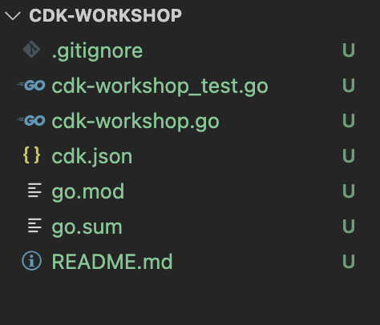

+++
title = "Project structure"
weight = 300
+++

## Open your IDE

Now's a good time to open the project in your favorite IDE and explore.

> If you use VSCode, you can just type `code .` within the project directory.

## Explore your project directory

You'll see something like this:



* __`cdk-workshop.go`__ is where your CDK application's main stack is defined.
  This is the file we'll be spending most of our time in. It also includes the
  entrypoint to the CDK application
* `cdk-workshop_test.go` contains a sample test of the custom CDK stack created in 
  the cdk_workshop package. This is mainly to demonstrate how tests can be hooked 
  up to the project.
* `cdk.json` tells the toolkit how to run your app. In our case it will be
  `"go mod download && go run cdk-workshop.go"`
* `go.mod` defines the module path as well as any dependencies necessary to make
  the application run. We shouldn't need to touch this file during the workshop. 
  (`go.sum` is an autogenerated file which locks the dependencies)
* `.gitignore` tells git which files to include/exclude
  from source control.
* `README.md` is the introductory README for this project. This is a text file
  that can be filled in to describe the project

## Your app's entry point and stack

Let's have a quick look at `cdk-workshop.go`:

```go
package main

import (
	"github.com/aws/aws-cdk-go/awscdk/v2"
	"github.com/aws/aws-cdk-go/awscdk/v2/awssns"
	"github.com/aws/aws-cdk-go/awscdk/v2/awssnssubscriptions"
	"github.com/aws/aws-cdk-go/awscdk/v2/awssqs"
	"github.com/aws/constructs-go/constructs/v10"
	"github.com/aws/jsii-runtime-go"
)

type CdkWorkshopStackProps struct {
	awscdk.StackProps
}

func NewCdkWorkshopStack(scope constructs.Construct, id string, props *CdkWorkshopStackProps) awscdk.Stack {
	var sprops awscdk.StackProps
	if props != nil {
		sprops = props.StackProps
	}
	stack := awscdk.NewStack(scope, &id, &sprops)


	queue := awssqs.NewQueue(stack, jsii.String("CdkWorkshopQueue"), &awssqs.QueueProps{
		VisibilityTimeout: awscdk.Duration_Seconds(jsii.Number(300)),
	})

	topic := awssns.NewTopic(stack, jsii.String("CdkWorkshopTopic"), &awssns.TopicProps{})
	topic.AddSubscription(awssnssubscriptions.NewSqsSubscription(queue, &awssnssubscriptions.SqsSubscriptionProps{}))

	return stack
}

func main() {
	defer jsii.Close()

	app := awscdk.NewApp(nil)

	NewCdkWorkshopStack(app, "CdkWorkshopStack", &CdkWorkshopStackProps{
		awscdk.StackProps{
			Env: env(),
		},
	})

	app.Synth(nil)
}

// env determines the AWS environment (account+region) in which our stack is to
// be deployed. For more information see: https://docs.aws.amazon.com/cdk/latest/guide/environments.html
func env() *awscdk.Environment {
	// If unspecified, this stack will be "environment-agnostic".
	// Account/Region-dependent features and context lookups will not work, but a
	// single synthesized template can be deployed anywhere.
	//---------------------------------------------------------------------------
	return nil

	// Uncomment if you know exactly what account and region you want to deploy
	// the stack to. This is the recommendation for production stacks.
	//---------------------------------------------------------------------------
	// return &awscdk.Environment{
	//  Account: jsii.String("123456789012"),
	//  Region:  jsii.String("us-east-1"),
	// }

	// Uncomment to specialize this stack for the AWS Account and Region that are
	// implied by the current CLI configuration. This is recommended for dev
	// stacks.
	//---------------------------------------------------------------------------
	// return &awscdk.Environment{
	//  Account: jsii.String(os.Getenv("CDK_DEFAULT_ACCOUNT")),
	//  Region:  jsii.String(os.Getenv("CDK_DEFAULT_REGION")),
	// }
}
```

First, this code declares the `NewCdkWorkshopStack` class. This stack
contains the infrastructure that we want to deploy. The stack includes:

- SQS Queue (`sqs.Queue`)
- SNS Topic (`sns.Topic`)
- Subscribes the queue to receive any messages published to the topic (`topic.AddSubscription`)

Next, in `main()` the code creates an app and defines an instance of the `NewCdkWorkshopStack`
within the scope of the app. This will allow the stack to be synthesized and deployed. A null
value is passed in for the environment of the stack - that's okay for the purposes of the workshop
since the account and region to deploy to will be inferred through your credentials.

