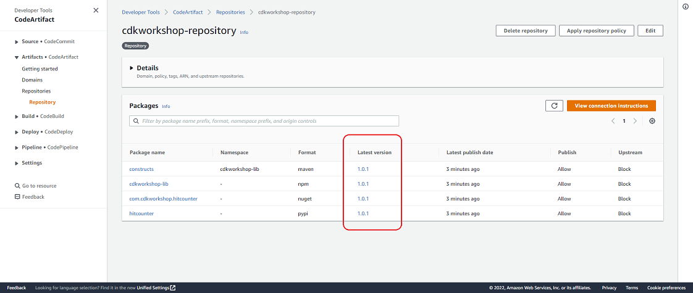
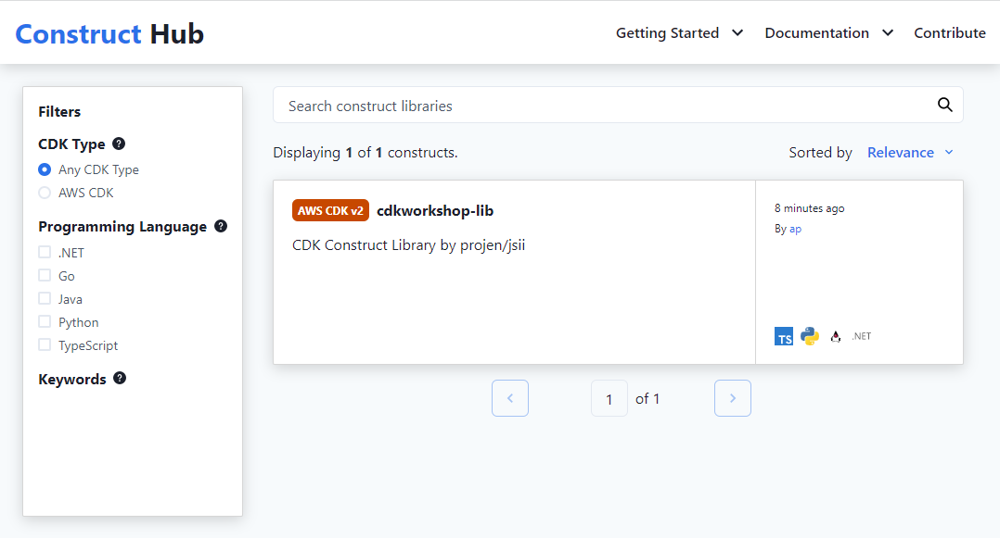
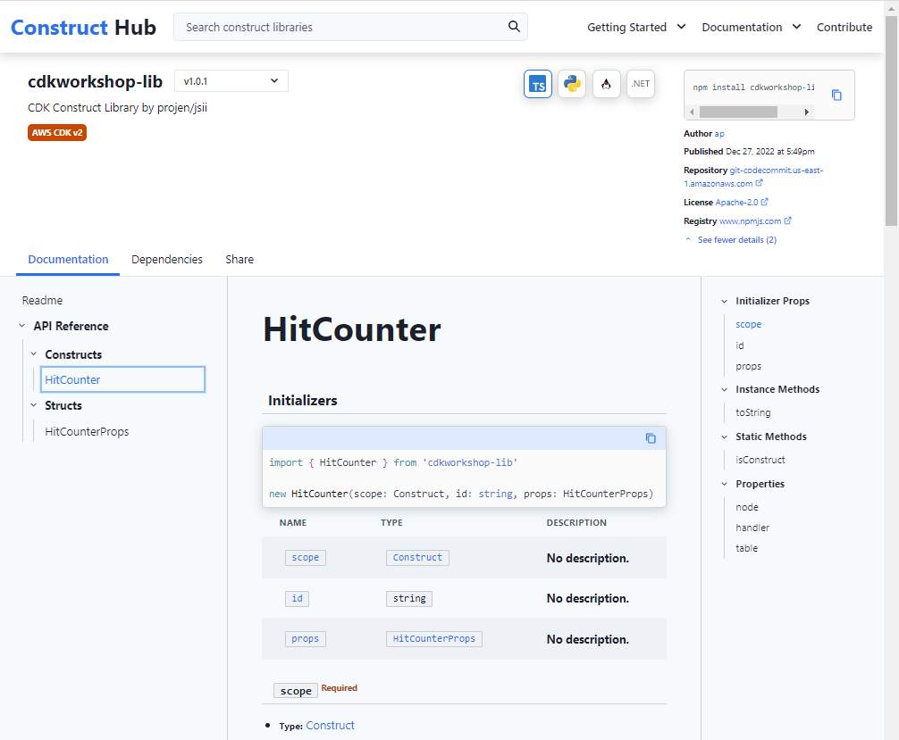

+++
title = "Create Pipeline and Publish Construct"
weight = 500
+++

## Deploy Pipeline

{}
Before continuing, make sure that the InternalConstructHubStack has a status of CREATE_COMPLETE in the <a href="https://console.aws.amazon.com/cloudformation" target="_blank">CloudFormation</a> console.
{}

 Up to this point we have created the construct code in the `constructs/` directory and the pipeline code in the `pipeline/` directory. Now deploy the pipeline from the `pipeline/` directory :


cdk deploy


## Publish Artifact

`cdk deploy` creates the pipeline and publishes the artifacts.

Once `cdk deploy` completes, go to <a href="https://console.aws.amazon.com/codesuite/codepipeline/pipelines" target="_blank">CodePipeline</a> and check out the pipeline run. If you do not see your pipeline, ensure you are in the correct AWS Region. The pipeline will push the artifact to CodeArtifact. Once the pipeline finishes running, navigate to <a href="https://console.aws.amazon.com/codesuite/codeartifact/repositories" target="_blank">CodeArtifact</a>, click into `cdkworkshop-repository`, and observe that version `1.0.0` of the artifact has been published.

If we wait ~5-10 minutes more, we'll see that some of the packages were updated to version `0.0.0`. But why is that? This is because Projen made another commit to the repository and triggered CodePipeline. We can verify this by going to `Respositories > Commits` in the CodeCommit console. Notice that the first commit is from you whereas the second commit is from "CodeBuild Automation". Per the <a href="https://projen.io/releases.html#initial-development-phase" target="_blank">Projen Documentation</a>, new projects start with version 0.0.0. Due to the fact that the Projen commit ran after our own, the version was first set to `1.0.0` and then `0.0.0` afterwards. This only happens on the first commit and is specific to Projen. Subsequent commits will follow standard conventions for version numbers. 

## Merge Divergent Branches
Before moving on it's important to note that because Projen made its own commit's to the codecommit repository, the remote `construct-lib-repo` repository and local `construct-lib-repo` repository are now out of sync. To fix this, make sure that you run `git pull` from your local construct-lib-repo directory before making any pushes to the remote repository:


git pull


## Major, Minor, and Fix Releases
The commit message hints how the version number should be incremented i.e. whether this is a major, minor or hot fix.

Let's make a small change to our construct library code and commit the change to CodeCommit. Open the file `constructs/lambda/hitcounter.js` and modify the log message to read the following:


console.log('downstream function response:', JSON.stringify(resp, undefined, 2));


The code will look like this:


const { DynamoDB, Lambda } = require('aws-sdk');

exports.handler = async function(event) {
  console.log("request:", JSON.stringify(event, undefined, 2));

  // create AWS SDK clients
  const dynamo = new DynamoDB();
  const lambda = new Lambda();

  // update dynamo entry for "path" with hits++
  await dynamo.updateItem({
    TableName: process.env.HITS_TABLE_NAME,
    Key: { path: { S: event.path } },
    UpdateExpression: 'ADD hits :incr',
    ExpressionAttributeValues: { ':incr': { N: '1' } }
  }).promise();

  // call downstream function and capture response
  const resp = await lambda.invoke({
    FunctionName: process.env.DOWNSTREAM_FUNCTION_NAME,
    Payload: JSON.stringify(event)
  }).promise();

  console.log('downstream function response:', JSON.stringify(resp, undefined, 2));

  // return response back to upstream caller
  return JSON.parse(resp.Payload);
};


The commit message has to be formatted a specific way because Projen uses <a href="https://www.conventionalcommits.org/en/v1.0.0/#specification" target="_blank">Conventional Commits</a> to infer new versions of artifacts. Commit the changes to CodeCommit from the construct-lib-repo directory:


git add .
git commit -m 'fix: modified log message'
git push


Now when the pipeline runs, it should publish an updated artifact with the last (Patch) part alone updated. Navigate to <a href="https://console.aws.amazon.com/codesuite/codeartifact/repositories" target="_blank">CodeArtifact</a> and observe that it has version `1.0.1` of the artifact.

## Observe the Artifacts in the Internal Construct Hub

In the <a href="https://console.aws.amazon.com/cloudformation" target="_blank">CloudFormation</a> console, navigate to the Outputs tab of the `InternalConstructHubStack`. Scroll down the `Export name` column to `ConstructHubDomainName`. Click on the domain URL (in the Value column) of that row to view the front-end of the Internal Construct Hub. Click on the `Find constructs` button to see the published constructs.

Select `cdkworkshop-lib > HitCounter` to display the details of the published construct.

## Summary

In this section, we created the pipeline instance from the pipeline CDK code. We saw that the pipeline built, transpiled, packaged and published the artifacts into our Internal Construct Hub. Next we will look into how to consume the transpiled artifacts from our Internal Construct Hub.
