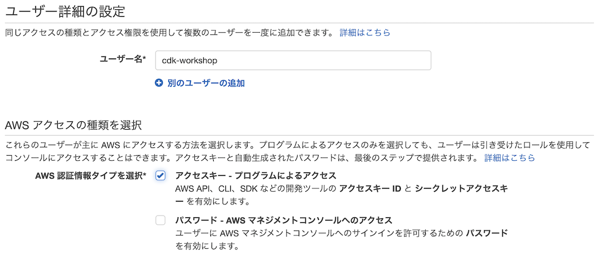
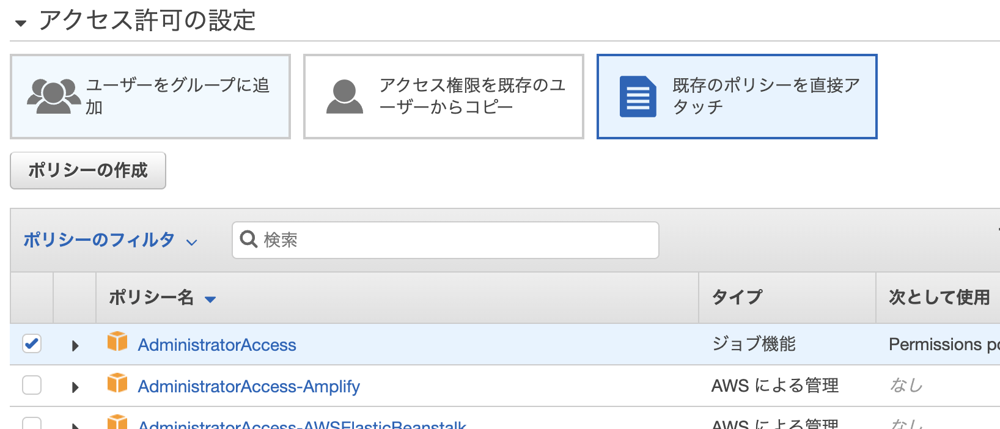
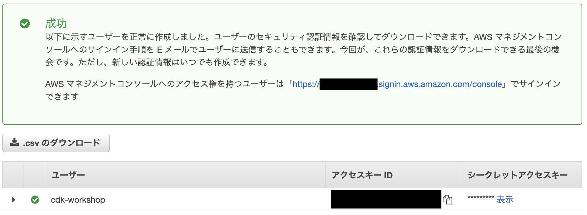

+++
title = "AWS Account と User"
weight = 200
+++

## 実験用 AWS Account

アプリをデプロイするには、AWSアカウントへのアクセス権が必要です。
すでにアカウントがあり、Administrator の権限を持つユーザーで AWS CLI を使用できるよう設定されている場合、[次のステップに進むことができます](./300-nodejs.html)。

{}
個人または会社の既存のアカウントを使用する場合は、このアカウントにリソースをプロビジョニングする意味と方針を理解していることを確認して下さい。
{}

AWSアカウントをお持ちでない場合は、[ここから作成することができます](https://portal.aws.amazon.com/billing/signup).。

## Administrator ユーザーを作成する

2. AWS アカウントでサインインして下さい。
3. AWS IAM コンソール に移動して、 [新しいユーザーを作成します](https://console.aws.amazon.com/iam/home?#/users$new)。
4. ユーザー名を入力 (例: `cdk-workshop`) し、"アクセスキー - プログラムによるアクセス"にチェックを入れます。

    

5. **次のステップ: アクセス権限** をクリックします。
6. **既存のポリシーを直接アタッチ** をクリックし、 **AdministratorAccess** を選択します。

    

7. **次のステップ: タグ** をクリックします。
8. **次のステップ: 確認** をクリックします。
9. **ユーザーの作成** クリックします。
10. 次の画面では **アクセスキー ID** が表示されており、**表示** ボタンを押すと **シークレットアクセスキー** を確認できます。 ブラウザでこの画面を表示したままにして下さい。

    

## 認証情報の設定

ターミナルウィンドウを開き、 `aws configure` を使って環境を設定します。
__アクセスキー ID__ と __シークレットアクセスキー__ を入力し、デフォルトのリージョンを選択します。 (例として `ap-northeast-1`, `eu-west-1`, `us-west-2` を使用できます)。
可能であれば、まだ何もリソースが配置されていないリージョンがよいでしょう。

```
aws configure
```

そしてコンソールに情報を入力します: 

```
AWS Access Key ID [None]: <type key ID here>
AWS Secret Access Key [None]: <type access key>
Default region name [None]: <choose region (e.g. "us-east-1", "eu-west-1")>
Default output format [None]: <leave blank>
```

