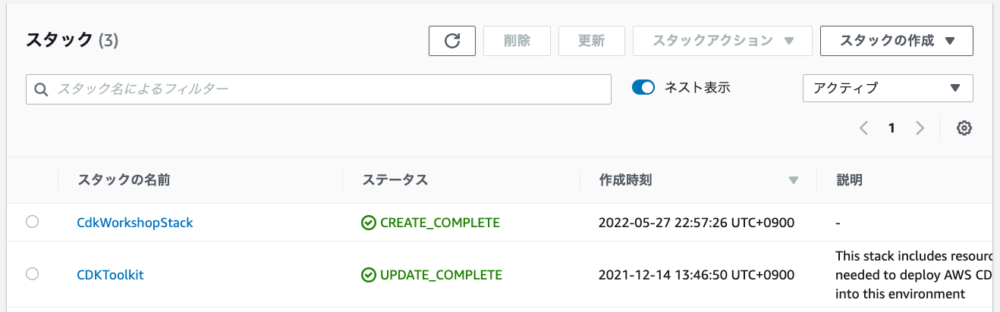

+++
title = "cdk deploy"
weight = 500
+++

さて、CloudFormation テンプレートが得られました。早速、 __それを使ってデプロイしましょう！__

## 環境のブートストラップ

AWS CDK アプリケーションを環境 (アカウント/リージョン) に初めてデプロイするときは、「Bootstrapスタック」をインストールする必要があります。このスタックには、ツールキットの操作に必要なリソースが含まれています。たとえば、このスタックには、デプロイプロセス中にテンプレートとアセットを保存するための S3 バケットが含まれています。

`cdk bootstrap` コマンドを使用して、ブートストラップスタックを環境にインストールできます。


```
cdk bootstrap
```

すると...

```
 ⏳  Bootstrapping environment aws://999999999999/us-east-1...
...
```

{}
アクセス拒否エラーとなるときは **AWS CLI** のクレデンシャル情報が [正しく設定](/15-prerequisites/200-account.html) されているか、現在の [プロファイル](https://docs.aws.amazon.com/cli/latest/userguide/cli-configure-profiles.html) がCloudFormationのCreateChangeSetを実行する権限を持っているか確認してください。
{}

## デプロイしましょう

`cdk deploy` を使って CDK アプリケーションをデプロイします。

```
cdk deploy
```

次のような警告が表示されます。

```text
This deployment will make potentially sensitive changes according to your current security approval level (--require-approval broadening).
Please confirm you intend to make the following modifications:

IAM Statement Changes
┌───┬────────────────────────────────┬────────┬─────────────────┬────────────────────────────────┬────────────────────────────────┐
│   │ Resource                       │ Effect │ Action          │ Principal                      │ Condition                      │
├───┼────────────────────────────────┼────────┼─────────────────┼────────────────────────────────┼────────────────────────────────┤
│ + │ ${CdkWorkshopQueue.Arn}        │ Allow  │ sqs:SendMessage │ Service:sns.amazonaws.com      │ "ArnEquals": {                 │
│   │                                │        │                 │                                │   "aws:SourceArn": "${CdkWorks │
│   │                                │        │                 │                                │ hopTopic}"                     │
│   │                                │        │                 │                                │ }                              │
└───┴────────────────────────────────┴────────┴─────────────────┴────────────────────────────────┴────────────────────────────────┘
(NOTE: There may be security-related changes not in this list. See https://github.com/aws/aws-cdk/issues/1299)

Do you wish to deploy these changes (y/n)?
```

これは、デプロイにセキュリティに関するリスクが伴うことを警告するものです。SNS トピックが SQS キューにメッセージを送信できるようアクセスポリシーを作成してアクセス権を付与する必要があります。**y** と入力してスタックをデプロイし、リソースを作成します。

出力は次のようになります。ACCOUNT-ID はアカウント ID、REGION はアプリケーションを作成したリージョン、STACK-ID はスタックの一意の識別子です。


```
CdkWorkshopStack: deploying...
CdkWorkshopStack: creating CloudFormation changeset...


 ✅  CdkWorkshopStack

Stack ARN:
arn:aws:cloudformation:REGION:ACCOUNT-ID:stack/CdkWorkshopStack/STACK-ID
```

## CloudFormation コンソール

CDK アプリケーションは AWS CloudFormation を通じてデプロイされます。各 CDK スタックは CloudFormation スタックと 1:1 でマッピングされます。

つまり、AWS CloudFormation コンソールを使用してスタックを管理できます。

[AWS CloudFormation
コンソール](https://console.aws.amazon.com/cloudformation/home) を見てみましょう。

次のような内容が表示されているはずです。 (表示されない場合は、正しいリージョンを選択しているか確認してください)


`CdkWorkshopStack` を選択し、 __リソース__ タブを開けば、リソースの物理IDを確認できます。




# これでコーディングの準備が整いました