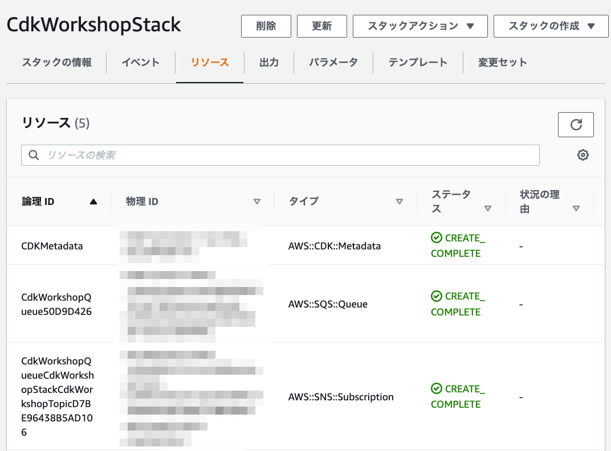

+++
title = "cdk deploy"
weight = 500
+++

Okay, we've got a CloudFormation template. What's next? __Let's deploy it into our account!__

## Bootstrapping an environment

The first time you deploy an AWS CDK app into an environment (account/region),
you can install a "bootstrap stack". This stack includes resources that
are used in the toolkit's operation. For example, the stack includes an S3
bucket that is used to store templates and assets during the deployment process.

You can use the `cdk bootstrap` command to install the bootstrap stack into an
environment:

```
cdk bootstrap
```

Then:

```
 ⏳  Bootstrapping environment aws://999999999999/us-east-1...
...
```

{} You might see an Access Denied error at this step,
if the **AWS CLI** has not been [set up correctly](/15-prerequisites/200-account.html) or if the active
[AWS profile](https://docs.aws.amazon.com/cli/latest/userguide/cli-configure-profiles.html)
does not have the `cloudformation:CreateChangeSet` permission. {}

## Let's deploy

Use `cdk deploy` to deploy a CDK app:

```
cdk deploy
```

You should see a warning like the following:

```text
This deployment will make potentially sensitive changes according to your current security approval level (--require-approval broadening).
Please confirm you intend to make the following modifications:

IAM Statement Changes
┌───┬────────────────────────────────┬────────┬─────────────────┬────────────────────────────────┬────────────────────────────────┐
│   │ Resource                       │ Effect │ Action          │ Principal                      │ Condition                      │
├───┼────────────────────────────────┼────────┼─────────────────┼────────────────────────────────┼────────────────────────────────┤
│ + │ ${CdkWorkshopQueue.Arn}        │ Allow  │ sqs:SendMessage │ Service:sns.amazonaws.com      │ "ArnEquals": {                 │
│   │                                │        │                 │                                │   "aws:SourceArn": "${CdkWorks │
│   │                                │        │                 │                                │ hopTopic}"                     │
│   │                                │        │                 │                                │ }                              │
└───┴────────────────────────────────┴────────┴─────────────────┴────────────────────────────────┴────────────────────────────────┘
(NOTE: There may be security-related changes not in this list. See https://github.com/aws/aws-cdk/issues/1299)

Do you wish to deploy these changes (y/n)?
```

This is warning you that deploying the app entails some risk.
Since we need to allow the topic to send messages to the queue,
enter **y** to deploy the stack and create the resources.

Output should look like the following, where ACCOUNT-ID is your account ID, REGION is the region in which you created the app,
and STACK-ID is the unique identifier for your stack:

```
CdkWorkshopStack: deploying...
CdkWorkshopStack: creating CloudFormation changeset...


 ✅  CdkWorkshopStack

Stack ARN:
arn:aws:cloudformation:REGION:ACCOUNT-ID:stack/CdkWorkshopStack/STACK-ID
```

## The CloudFormation Console

CDK apps are deployed through AWS CloudFormation. Each CDK stack maps 1:1 with
CloudFormation stack.

This means that you can use the AWS CloudFormation console in order to manage
your stacks.

Let's take a look at the [AWS CloudFormation
console](https://console.aws.amazon.com/cloudformation/home).

You will likely see something like this (if you don't, make sure you are in the correct region):



If you select `CdkWorkshopStack` and open the __Resources__ tab, you will see the
physical identities of our resources:


# I am ready for some actual coding!
