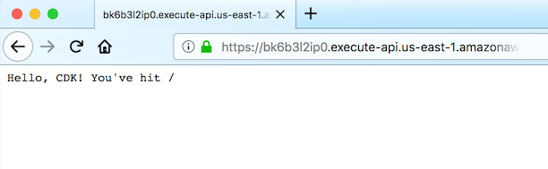

+++
title = "API Gateway"
weight = 400
+++

次のステップは、Lambda 関数の前に API Gateway を追加することです。API Gateway は、インターネット経由で [curl](https://curl.haxx.se/) などの HTTP クライアントやウェブブラウザでアクセスできるパブリック HTTP エンドポイントを公開します。

API のルートにマウントされた [Lambda プロキシ統合](https://docs.aws.amazon.com/apigateway/latest/developerguide/api-gateway-create-api-as-simple-proxy-for-lambda.html) を使用します。つまり、任意の URL パスへのリクエストは全て Lambda 関数に直接プロキシされ、関数からの応答がユーザーに返されます。

## LambdaRestApi コンストラクトをスタックに追加

API エンドポイントを定義して、それを Lambda 関数に関連付けましょう。次のコードを `cdk_workshop_stack.ts` に追加します


import * as cdk from 'aws-cdk-lib';
import * as lambda from 'aws-cdk-lib/aws-lambda';
import * as apigw from 'aws-cdk-lib/aws-apigateway';

export class CdkWorkshopStack extends cdk.Stack {
  constructor(scope: cdk.App, id: string, props?: cdk.StackProps) {
    super(scope, id, props);

    // defines an AWS Lambda resource
    const hello = new lambda.Function(this, 'HelloHandler', {
      runtime: lambda.Runtime.NODEJS_14_X,    // execution environment
      code: lambda.Code.fromAsset('lambda'),  // code loaded from "lambda" directory
      handler: 'hello.handler'                // file is "hello", function is "handler"
    });

    // defines an API Gateway REST API resource backed by our "hello" function.
    new apigw.LambdaRestApi(this, 'Endpoint', {
      handler: hello
    });

  }
}


AWS Lambda 関数へのすべてのリクエストをプロキシする API Gateway を定義するために必要なことはこれだけです。

## cdk diff

これを展開するとどうなるか見てみましょう。

```
cdk diff
```

出力は次のようになります。

```text
Stack CdkWorkshopStack
IAM Statement Changes
┌───┬───────────────────────────┬────────┬───────────────────────────┬───────────────────────────┬─────────────────────────────┐
│   │ Resource                  │ Effect │ Action                    │ Principal                 │ Condition                   │
├───┼───────────────────────────┼────────┼───────────────────────────┼───────────────────────────┼─────────────────────────────┤
│ + │ ${Endpoint/CloudWatchRole │ Allow  │ sts:AssumeRole            │ Service:apigateway.${AWS: │                             │
│   │ .Arn}                     │        │                           │ :URLSuffix}               │                             │
├───┼───────────────────────────┼────────┼───────────────────────────┼───────────────────────────┼─────────────────────────────┤
│ + │ ${HelloHandler.Arn}       │ Allow  │ lambda:InvokeFunction     │ Service:apigateway.amazon │ "ArnLike": {                │
│   │                           │        │                           │ aws.com                   │   "AWS:SourceArn": "arn:${A │
│   │                           │        │                           │                           │ WS::Partition}:execute-api: │
│   │                           │        │                           │                           │ ${AWS::Region}:${AWS::Accou │
│   │                           │        │                           │                           │ ntId}:${EndpointEEF1FD8F}/$ │
│   │                           │        │                           │                           │ {Endpoint/DeploymentStage.p │
│   │                           │        │                           │                           │ rod}/*/"                    │
│   │                           │        │                           │                           │ }                           │
│ + │ ${HelloHandler.Arn}       │ Allow  │ lambda:InvokeFunction     │ Service:apigateway.amazon │ "ArnLike": {                │
│   │                           │        │                           │ aws.com                   │   "AWS:SourceArn": "arn:${A │
│   │                           │        │                           │                           │ WS::Partition}:execute-api: │
│   │                           │        │                           │                           │ ${AWS::Region}:${AWS::Accou │
│   │                           │        │                           │                           │ ntId}:${EndpointEEF1FD8F}/t │
│   │                           │        │                           │                           │ est-invoke-stage/*/"        │
│   │                           │        │                           │                           │ }                           │
│ + │ ${HelloHandler.Arn}       │ Allow  │ lambda:InvokeFunction     │ Service:apigateway.amazon │ "ArnLike": {                │
│   │                           │        │                           │ aws.com                   │   "AWS:SourceArn": "arn:${A │
│   │                           │        │                           │                           │ WS::Partition}:execute-api: │
│   │                           │        │                           │                           │ ${AWS::Region}:${AWS::Accou │
│   │                           │        │                           │                           │ ntId}:${EndpointEEF1FD8F}/$ │
│   │                           │        │                           │                           │ {Endpoint/DeploymentStage.p │
│   │                           │        │                           │                           │ rod}/*/{proxy+}"            │
│   │                           │        │                           │                           │ }                           │
│ + │ ${HelloHandler.Arn}       │ Allow  │ lambda:InvokeFunction     │ Service:apigateway.amazon │ "ArnLike": {                │
│   │                           │        │                           │ aws.com                   │   "AWS:SourceArn": "arn:${A │
│   │                           │        │                           │                           │ WS::Partition}:execute-api: │
│   │                           │        │                           │                           │ ${AWS::Region}:${AWS::Accou │
│   │                           │        │                           │                           │ ntId}:${EndpointEEF1FD8F}/t │
│   │                           │        │                           │                           │ est-invoke-stage/*/{proxy+} │
│   │                           │        │                           │                           │ "                           │
│   │                           │        │                           │                           │ }                           │
└───┴───────────────────────────┴────────┴───────────────────────────┴───────────────────────────┴─────────────────────────────┘
IAM Policy Changes
┌───┬────────────────────────────┬─────────────────────────────────────────────────────────────────────────────────────────┐
│   │ Resource                   │ Managed Policy ARN                                                                      │
├───┼────────────────────────────┼─────────────────────────────────────────────────────────────────────────────────────────┤
│ + │ ${Endpoint/CloudWatchRole} │ arn:${AWS::Partition}:iam::aws:policy/service-role/AmazonAPIGatewayPushToCloudWatchLogs │
└───┴────────────────────────────┴─────────────────────────────────────────────────────────────────────────────────────────┘
(NOTE: There may be security-related changes not in this list. See https://github.com/aws/aws-cdk/issues/1299)

Resources
[+] AWS::ApiGateway::RestApi Endpoint EndpointEEF1FD8F
[+] AWS::ApiGateway::Deployment Endpoint/Deployment EndpointDeployment318525DA37c0e38727e25b4317827bf43e918fbf
[+] AWS::ApiGateway::Stage Endpoint/DeploymentStage.prod EndpointDeploymentStageprodB78BEEA0
[+] AWS::IAM::Role Endpoint/CloudWatchRole EndpointCloudWatchRoleC3C64E0F
[+] AWS::ApiGateway::Account Endpoint/Account EndpointAccountB8304247
[+] AWS::ApiGateway::Resource Endpoint/Default/{proxy+} Endpointproxy39E2174E
[+] AWS::Lambda::Permission Endpoint/Default/{proxy+}/ANY/ApiPermission.CdkWorkshopStackEndpoint018E8349.ANY..{proxy+} EndpointproxyANYApiPermissionCdkWorkshopStackEndpoint018E8349ANYproxy747DCA52
[+] AWS::Lambda::Permission Endpoint/Default/{proxy+}/ANY/ApiPermission.Test.CdkWorkshopStackEndpoint018E8349.ANY..{proxy+} EndpointproxyANYApiPermissionTestCdkWorkshopStackEndpoint018E8349ANYproxy41939001
[+] AWS::ApiGateway::Method Endpoint/Default/{proxy+}/ANY EndpointproxyANYC09721C5
[+] AWS::Lambda::Permission Endpoint/Default/ANY/ApiPermission.CdkWorkshopStackEndpoint018E8349.ANY.. EndpointANYApiPermissionCdkWorkshopStackEndpoint018E8349ANYE84BEB04
[+] AWS::Lambda::Permission Endpoint/Default/ANY/ApiPermission.Test.CdkWorkshopStackEndpoint018E8349.ANY.. EndpointANYApiPermissionTestCdkWorkshopStackEndpoint018E8349ANYB6CC1B64
[+] AWS::ApiGateway::Method Endpoint/Default/ANY EndpointANY485C938B

Outputs
[+] Output Endpoint/Endpoint Endpoint8024A810: {"Value":{"Fn::Join":["",["https://",{"Ref":"EndpointEEF1FD8F"},".execute-api.",{"Ref":"AWS::Region"},".",{"Ref":"AWS::URLSuffix"},"/",{"Ref":"EndpointDeploymentStageprodB78BEEA0"},"/"]]}}
```

追加したコードにより、12 個の新しいリソースがスタックに追加されることがわかります。

## cdk deploy

デプロイしましょう。

```
cdk deploy
```

## スタックの出力

デプロイが完了すると、次の行にご注目ください。

```text
CdkWorkshopStack.Endpoint8024A810 = https://xxxxxxxxxx.execute-api.us-east-1.amazonaws.com/prod/
```

これは、API Gateway コンストラクトによって自動的に追加され、API Gateway エンドポイントの URL を含む [スタック出力値](https://docs.aws.amazon.com/AWSCloudFormation/latest/UserGuide/stacks.html) です。

## アプリのテスト

このエンドポイントを `curl` でアクセスしてみましょう。URL をコピーして実行します (プレフィックスとリージョンは異なる可能性があります)。

{}
[curl](https://curl.haxx.se/) がインストールされていない場合は、お気に入りのウェブブラウザでもこの URL にアクセスできます。
{}

```
curl https://xxxxxxxxxx.execute-api.us-east-1.amazonaws.com/prod/
```

出力は次のようになります。

```text
Hello, CDK! You've hit /
```

Webブラウザでも確認できます。



この出力がされていれば、アプリは正常に動作しています。

## 正常に動作していないとき

API Gateway から 5xx エラーを受け取った場合、次の 2つの問題のいずれかが該当しています。

1. Lambda 関数が返した応答は、API Gateway が期待するものではありません。手順を戻って、Lambda の handler 関数が `statusCode`、`body`、`header` フィールドが含まれているか確認してください ([Lambda handler のコード](./200-lambda.html)を参照)。

2. 何らかの理由で Lambda 関数が失敗しました。この Lambda 関数をデバッグするには、[このセクション](../40-hit-counter/500-logs.html)に先取りして、Lambda 関数のログを表示する方法を学習します。

---

お疲れさまでした！ 次の章では再利用可能な独自のコンストラクトを作成します。

