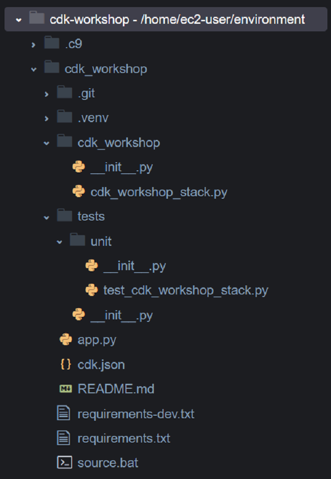

+++
title = "プロジェクトの構造"
weight = 300
+++

## IDEを開く

お気に入りのIDEでプロジェクトを開き、ディレクトリの中身を見てみましょう。

> VSCodeを使用する場合は、プロジェクトディレクトリ内で `code .` と入力するだけです。

## プロジェクトディレクトリを探索する

次のような内容が表示されます。



* .venv - 前のセクションで説明したPython 仮想環境の情報。
* cdk_workshop - Python のモジュールディレクトリ。
  <!-- * cdk_workshop.egg-info - Folder that contains build information relevant for the packaging on the project -->
  * cdk_workshop_stack.py - サンプルアプリケーションで使用するカスタム CDK スタックです。
* tests - すべてのテストを含んでいます。
  * unit - 単体テストを含んでいます。
    * test_cdk_workshop.py - CDK パッケージで作成されたカスタム CDK スタックをテストするための簡単なコード。これは、プロジェクトにテストを組み込むための一例として参考になります。
* app.py - サンプルアプリケーションの「メイン」です。
* cdk.json - CDK の設定ファイル。コンストラクトツリーの生成をどのように実行するか定義します。
* README.md - このプロジェクトの始め方を説明しています。
* requirements.txt - このファイルは依存関係のあるパッケージを pip でインストールするために利用されます。<!-- In this case, it contains only -e . This tells pip to install the requirements specified in setup.py. It also tells pip to run python setup.py develop to install the code in the cdk_workshop module so that it can be edited in place. -->
<!-- * setup.py - この Python パッケージの構築方法と依存関係を定義します。 -->

## エントリーポイント

`app.py` ファイルを簡単に見てみましょう。

```python
#!/usr/bin/env python3

import aws_cdk as cdk

from cdk_workshop.cdk_workshop_stack import CdkWorkshopStack


app = cdk.App()
CdkWorkshopStack(app, "cdk-workshop")

app.synth()
```

このコードは `cdk_workshop/cdk_workshop_stack.py` ファイルから
`CdkWorkshopStack` クラスをロードしてインスタンス化します。

## メインスタック

`cdk_workshop/cdk_workshop_stack.py` を開いてください。これがアプリケーションの要のファイルです。

```python
from constructs import Construct
from aws_cdk import (
    Duration,
    Stack,
    aws_sqs as sqs,
    aws_sns as sns,
    aws_sns_subscriptions as subs,
)

class CdkWorkshopStack(Stack):

    def __init__(self, scope: Construct, id: str, **kwargs) -> None:
        super().__init__(scope, id, **kwargs)

        queue = sqs.Queue(
            self, "CdkWorkshopQueue",
            visibility_timeout=Duration.seconds(300),
        )

        topic = sns.Topic(
            self, "CdkWorkshopTopic"
        )

        topic.add_subscription(subs.SqsSubscription(queue))
```

ご覧のとおり、CDK スタック(`CdkWorkshopStack`)　 によってアプリケーションが作成されます。

このスタックは次のリソースを含んでいます。

- SQS キュー (`sqs.Queue`)
- SNS トピック (`sns.Topic`)
- SNS トピックにパブリッシュされたメッセージを受信するように SQS キューをサブスクライブします。 (`topic.add_subscription`)

