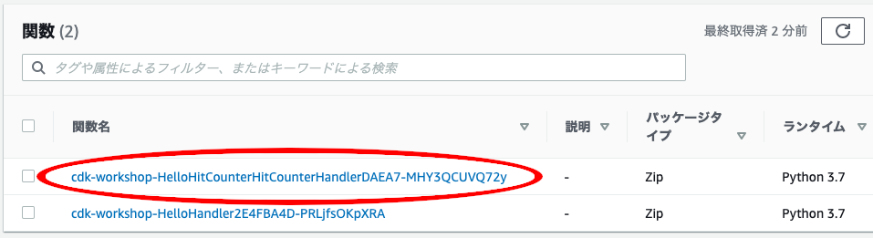
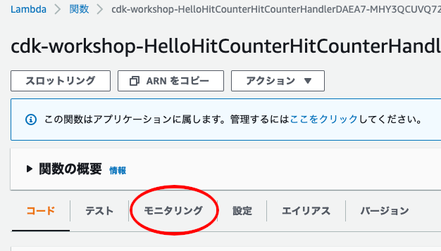
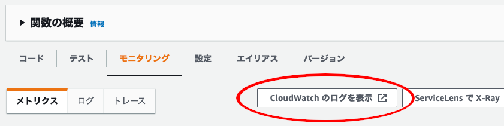

+++
title = "CloudWatch ログ"
weight = 500
+++

## Lambda 関数の CloudWatch ログを表示する

最初にやるべきことは、hit counter Lambda 関数のログの確認です。

[SAM CLI](https://github.com/awslabs/aws-sam-cli) や [awslogs](https://github.com/jorgebastida/awslogs)
のようなツールが役に立ちます。このワークショップでは、AWS コンソールを使ったログの参照方法を紹介します。

1. [AWS Lambda コンソール](https://console.aws.amazon.com/lambda/home) を開きます。
   (正しいリージョンに接続されていることを確認してください)

2. __HitCounter__ Lambda 関数をクリックします。
   (関数名には、`HelloHitCounterHitCountHandler` という文字列が含まれています)
    

3. __モニタリング__ をクリックします。
    

4. __CloudWatch のログを表示__ をクリックします. AWS CloudWatch のコンソールが開きます。
    

5. 一番新しいロググループを選択します。

6. 文字列「errorMessage」を含む最新のメッセージを探します。おそらく次のようなものが表示されます。


   ```json
   {
       "errorMessage": "User: arn:aws:sts::585695036304:assumed-role/hello-cdk-1-HelloHitCounterHitCounterHandlerS-TU5M09L1UBID/hello-cdk-1-HelloHitCounterHitCounterHandlerD-144HVUNEWRWEO is not authorized to perform: dynamodb:UpdateItem on resource: arn:aws:dynamodb:us-east-1:585695036304:table/hello-cdk-1-HelloHitCounterHits7AAEBF80-1DZVT3W84LJKB",
       "errorType": "AccessDeniedException",
       "stackTrace": [
           "Request.extractError (/var/runtime/node_modules/aws-sdk/lib/protocol/json.js:48:27)",
           "Request.callListeners (/var/runtime/node_modules/aws-sdk/lib/sequential_executor.js:105:20)",
           "Request.emit (/var/runtime/node_modules/aws-sdk/lib/sequential_executor.js:77:10)",
           "Request.emit (/var/runtime/node_modules/aws-sdk/lib/request.js:683:14)",
           "Request.transition (/var/runtime/node_modules/aws-sdk/lib/request.js:22:10)",
           "AcceptorStateMachine.runTo (/var/runtime/node_modules/aws-sdk/lib/state_machine.js:14:12)",
           "/var/runtime/node_modules/aws-sdk/lib/state_machine.js:26:10",
           "Request.<anonymous> (/var/runtime/node_modules/aws-sdk/lib/request.js:38:9)",
           "Request.<anonymous> (/var/runtime/node_modules/aws-sdk/lib/request.js:685:12)",
           "Request.callListeners (/var/runtime/node_modules/aws-sdk/lib/sequential_executor.js:115:18)"
       ]
   }
   ```

---

どうやら、Lambda 関数が DynamoDB テーブルに書き込みできないようです。当たり前です。この時点では権限を付与していないからです。早速追加しましょう。

