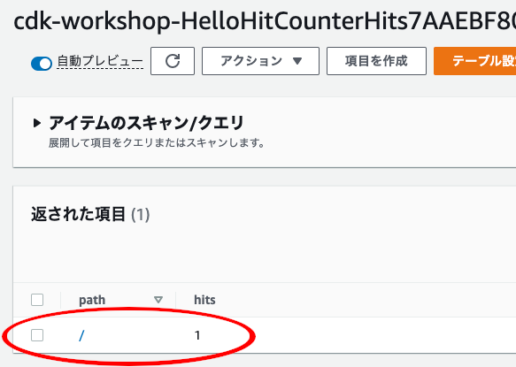

+++
title = "アクセス権限の付与"
weight = 600
+++

## Lambda 関数に DynamoDB テーブルの読み書き権限を付与

Lambda 関数の実行ロールに、テーブルに対しての読み取り/書き込み権限を与えましょう。

`hitcounter.py` を開き、次のようなハイライトされたコードを追加します。


from constructs import Construct
from aws_cdk import (
    aws_lambda as _lambda,
    aws_dynamodb as ddb,
)

class HitCounter(Construct):

    @property
    def handler(self):
        return self._handler

    def __init__(self, scope: Construct, id: str, downstream: _lambda.IFunction, **kwargs):
        super().__init__(scope, id, **kwargs)

        table = ddb.Table(
            self, 'Hits',
            partition_key={'name': 'path', 'type': ddb.AttributeType.STRING}
        )

        self._handler = _lambda.Function(
            self, 'HitCountHandler',
            runtime=_lambda.Runtime.PYTHON_3_7,
            handler='hitcount.handler',
            code=_lambda.Code.from_asset('lambda'),
            environment={
                'DOWNSTREAM_FUNCTION_NAME': downstream.function_name,
                'HITS_TABLE_NAME': table.table_name,
            }
        )

        table.grant_read_write_data(self.handler)


## デプロイ

保存して、デプロイします。

```
cdk deploy
```

## 再テスト

デプロイが完了したら、もう一度テストを実行します。 (`curl` やウェブブラウザーでアクセスします)

```
curl -i https://xxxxxxxxxx.execute-api.us-east-1.amazonaws.com/prod/
```

あれ？

```
HTTP/1.1 502 Bad Gateway
...

{"message": "Internal server error"}
```

# 😢

まだこの厄介な 5xx エラーが発生しています！CloudWatch ログをもう一度見てみましょう (「再表示」を忘れずに)。

```json
{
    "errorMessage": "User: arn:aws:sts::585695036304:assumed-role/hello-cdk-1-HelloHitCounterHitCounterHandlerS-TU5M09L1UBID/hello-cdk-1-HelloHitCounterHitCounterHandlerD-144HVUNEWRWEO is not authorized to perform: lambda:InvokeFunction on resource: arn:aws:lambda:us-east-1:585695036304:function:hello-cdk-1-HelloHandler2E4FBA4D-149MVAO4969O7",
    "errorType": "AccessDeniedException",
    "stackTrace": [
        "Object.extractError (/var/runtime/node_modules/aws-sdk/lib/protocol/json.js:48:27)",
        "Request.extractError (/var/runtime/node_modules/aws-sdk/lib/protocol/rest_json.js:52:8)",
        "Request.callListeners (/var/runtime/node_modules/aws-sdk/lib/sequential_executor.js:105:20)",
        "Request.emit (/var/runtime/node_modules/aws-sdk/lib/sequential_executor.js:77:10)",
        "Request.emit (/var/runtime/node_modules/aws-sdk/lib/request.js:683:14)",
        "Request.transition (/var/runtime/node_modules/aws-sdk/lib/request.js:22:10)",
        "AcceptorStateMachine.runTo (/var/runtime/node_modules/aws-sdk/lib/state_machine.js:14:12)",
        "/var/runtime/node_modules/aws-sdk/lib/state_machine.js:26:10",
        "Request.<anonymous> (/var/runtime/node_modules/aws-sdk/lib/request.js:38:9)",
        "Request.<anonymous> (/var/runtime/node_modules/aws-sdk/lib/request.js:685:12)"
    ]
}
```

今回もアクセス権限の問題ですが、よく見てみると・・・

```text
User: <長い文字列> is not authorized to perform: lambda:InvokeFunction on resource: <長い文字列>"
```

HitCounter が正常にテーブルに書き込みできたようです。[DynamoDB コンソール](https://console.aws.amazon.com/dynamodb/home) で確認できます。



しかし、HitCounter にダウンストリームの Lambda 関数を呼び出す権限も付与する必要があります。

## 呼び出し権限を付与

`hitcounter.py` にハイライトされたコードを追加します。


from constructs import Construct
from aws_cdk import (
    aws_lambda as _lambda,
    aws_dynamodb as ddb,
)

class HitCounter(Construct):

    @property
    def handler(self):
        return self._handler

    def __init__(self, scope: Construct, id: str, downstream: _lambda.IFunction, **kwargs):
        super().__init__(scope, id, **kwargs)

        table = ddb.Table(
            self, 'Hits',
            partition_key={'name': 'path', 'type': ddb.AttributeType.STRING}
        )

        self._handler = _lambda.Function(
            self, 'HitCountHandler',
            runtime=_lambda.Runtime.PYTHON_3_7,
            handler='hitcount.handler',
            code=_lambda.Code.from_asset('lambda'),
            environment={
                'DOWNSTREAM_FUNCTION_NAME': downstream.function_name,
                'HITS_TABLE_NAME': table.table_name,
            }
        )

        table.grant_read_write_data(self.handler)
        downstream.grant_invoke(self.handler)


## 差分確認

`cdk diff` で変更点を確認することができます。

```
cdk diff
```

**Resource** セクションが以下のように表示されます。IAM 権限が追加されたことを確認できます。

```text
Stack cdk-workshop
The cdk-workshop stack uses assets, which are currently not accounted for in the diff output! See https://github.com/awslabs/aws-cdk/issues/395
IAM Statement Changes
┌───┬────────────────────────┬────────┬────────────────────────┬────────────────────────┬───────────┐
│   │ Resource               │ Effect │ Action                 │ Principal              │ Condition │
├───┼────────────────────────┼────────┼────────────────────────┼────────────────────────┼───────────┤
│ + │ ${HelloHandler.Arn}    │ Allow  │ lambda:InvokeFunction  │ AWS:${HelloHitCounter/ │           │
│   │                        │        │                        │ HitCounterHandler/Serv │           │
│   │                        │        │                        │ iceRole}               │           │
└───┴────────────────────────┴────────┴────────────────────────┴────────────────────────┴───────────┘
(NOTE: There may be security-related changes not in this list. See http://bit.ly/cdk-2EhF7Np)

Resources
[~] AWS::IAM::Policy HelloHitCounter/HitCounterHandler/ServiceRole/DefaultPolicy HelloHitCounterHitCounterHandlerServiceRoleDefaultPolicy1487A60A
 └─ [~] PolicyDocument
     └─ [~] .Statement:
         └─ @@ -24,5 +24,15 @@
            [ ]         "Ref": "AWS::NoValue"
            [ ]       }
            [ ]     ]
            [+]   },
            [+]   {
            [+]     "Action": "lambda:InvokeFunction",
            [+]     "Effect": "Allow",
            [+]     "Resource": {
            [+]       "Fn::GetAtt": [
            [+]         "HelloHandler2E4FBA4D",
            [+]         "Arn"
            [+]       ]
            [+]     }
            [ ]   }
            [ ] ]
```

狙い通りです。

## デプロイ

もう一度やってみましょう！

```
cdk deploy
```

次にエンドポイントを `curl` またはウェブブラウザーでアクセスします。

```
curl -i https://xxxxxxxxxx.execute-api.us-east-1.amazonaws.com/prod/
```

結果は以下の通りになるはずです。

```text
HTTP/1.1 200 OK
...

Hello, CDK! You've hit /
```

> もし、まだ 5xx エラーが出たら、数秒待ってからもう一度アクセスしてみてください。API Gateway
のエンドポイントに新しいデプロイを適用するのに少し時間がかかることがあります。

# 😲

