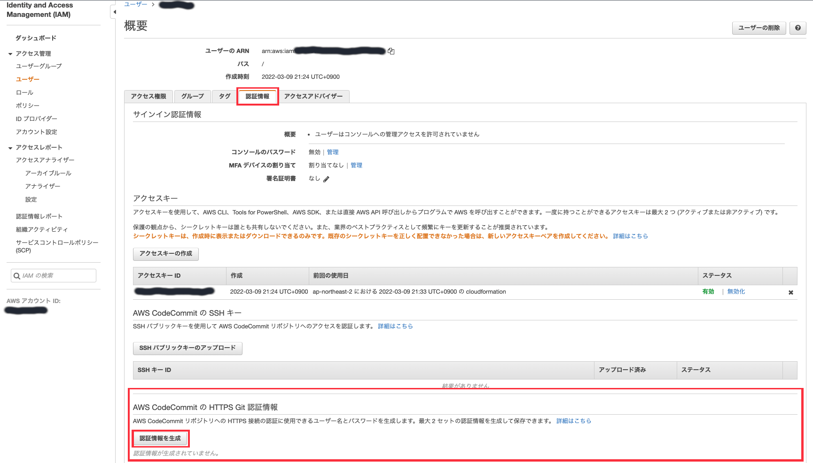
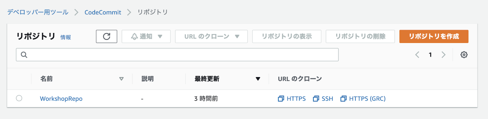
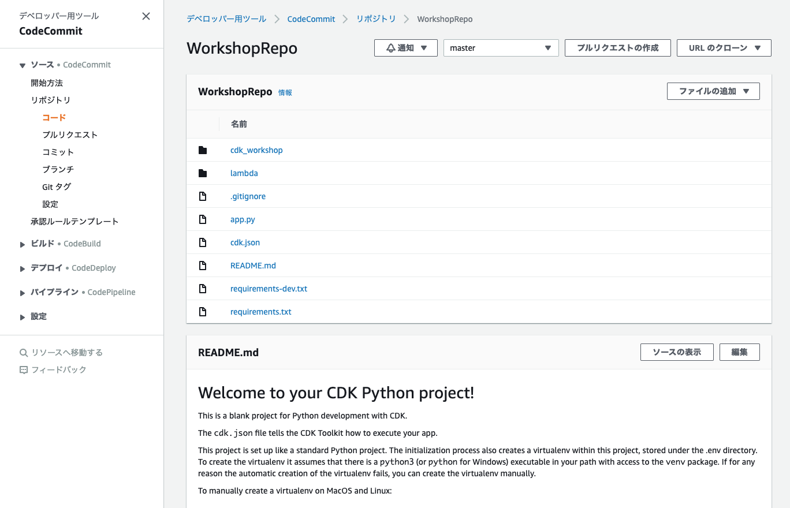

+++
title = "リポジトリの作成"
weight = 120
+++

## パイプラインのスタックでリポジトリの作成
優れた CD パイプラインの最初のステップはソース管理です。
これから、プロジェクトコードを格納する [**CodeCommit**](https://aws.amazon.com/jp/codecommit/) リポジトリを作成します。

次のように `cdk_workshop/pipeline_stack.py` ファイルを編集します。


from constructs import Construct
from aws_cdk import (
    Stack,
    aws_codecommit as codecommit,
)

class WorkshopPipelineStack(Stack):

    def __init__(self, scope: Construct, id: str, **kwargs) -> None:
        super().__init__(scope, id, **kwargs)

        # Creates a CodeCommit repository called 'WorkshopRepo'
        repo = codecommit.Repository(
            self, 'WorkshopRepo',
            repository_name= "WorkshopRepo"
        )

        # Pipeline code goes here


## デプロイメント

```
npx cdk deploy
```

## リポジトリ情報の取得とコミット
リポジトリで何かをする前に、ソースコードをリポジトリに追加する必要があります。

### Git 認証情報
先にリポジトリの Git 認証情報が必要です。
[IAM コンソール](https://console.aws.amazon.com/iam) を開き、`ユーザー` 画面で対象ユーザを開きます。
ユーザー管理画面で `認証情報` タブを開き、「AWS CodeCommit の HTTPS Git 認証情報」セクションまでスクロールします。
認証情報を生成 ボタンをクリックし、指示に従って認証情報をダウンロードします。すぐに利用します。



### Git remote の追加
[CodeCommit コンソール](https://console.aws.amazon.com/codesuite/codecommit/repositories) に移動してリポジトリを特定します。「URL のクローン」列の「HTTPS」をクリックして https のリンクがコピーされます。その値をローカルリポジトリに追加します。

> 注意 : リポジトリが表示されない場合は、コンソールが表示する AWS リージョンが正しいことを確認してください。



> こちらの画面でリポジトリの内容を確認できます。現時点ではまだ空です。さらに、リポジトリの設定内容を参照できます。

最初は、ターミナルで `git status` を用いて、適用した変更が全てコミットされていることを確認します。
ステージングされていないことや、コミットされていない内容があれば、`git commit -am "SOME_COMMIT_MESSAGE_HERE"` で適用できます。
このコマンドで全てのファイルをステージ又はコミットしてくれるので、準備が完了です。

> 注意 : 最初からワークショップをたどるのではなく、リポジトリからソースコードをコピーした場合は、まずは `git init && git add -A && git commit -m "init"` を実行してください。

次に、Git config にリモートリポジトリーを追加します。以下のコマンドで追加できます (*XXXXX* は AWS コンソールからコピーしたクローン URL を表します)。

```
git remote add origin XXXXX
```

最後に、リポジトリにソースコードをプッシュするだけです (`--set-upstream` はリポジトリで空になっている master ブランチを上書きするためです)。

```
git push --set-upstream origin master
```

ここで CodeCommitの認証情報が求められます。**Git 認証情報** セクションで作成した認証情報を使います。入力するのは 1回めだけです。

### 結果の確認
CodeCommit のコンソールを見ると、コードがプッシュされたことを確認できます！


