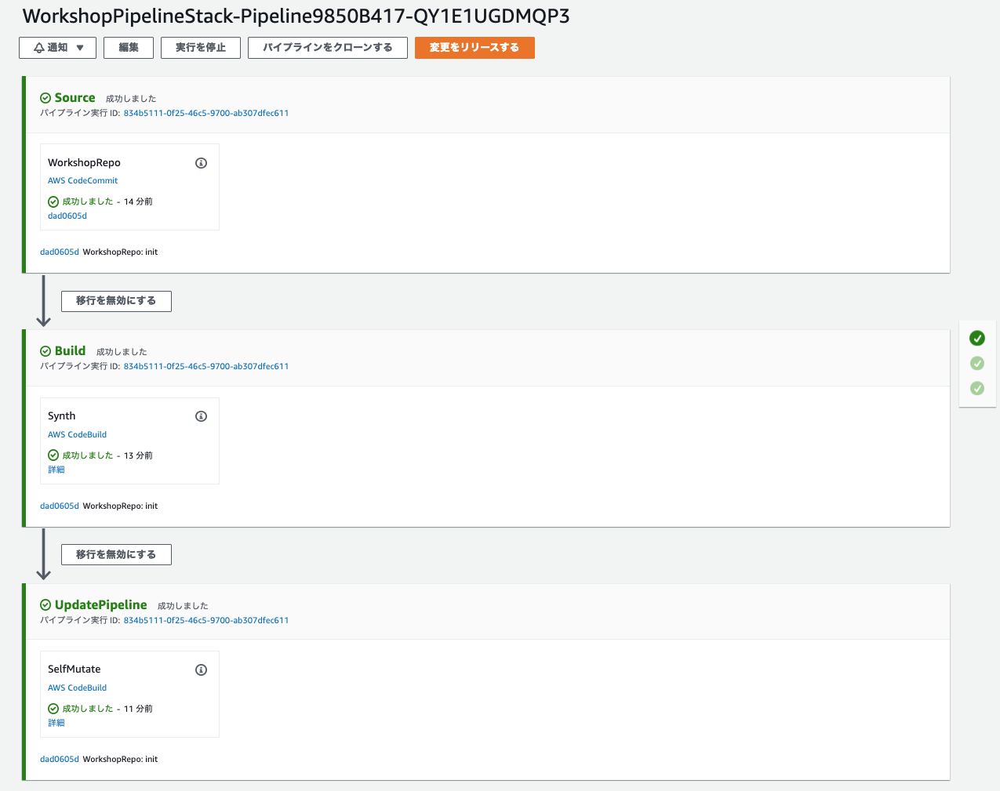

+++
title = "パイプラインの作成"
weight = 130
+++

## 空のパイプラインの定義
パイプラインの基本を定義する準備が整いました。


`pipeline_stack.py` を開き、以下のように編集します。


from constructs import Construct
from aws_cdk import (
    Stack,
    aws_codecommit as codecommit,
    pipelines as pipelines,
)

class WorkshopPipelineStack(Stack):
    def __init__(self, scope: Construct, id: str, **kwargs) -> None:
        super().__init__(scope, id, **kwargs)

        # Creates a CodeCommit repository called 'WorkshopRepo'
        repo = codecommit.Repository(
            self, "WorkshopRepo", repository_name="WorkshopRepo"
        )

        pipeline = pipelines.CodePipeline(
            self,
            "Pipeline",
            synth=pipelines.ShellStep(
                "Synth",
                input=pipelines.CodePipelineSource.code_commit(repo, "master"),
                commands=[
                    "npm install -g aws-cdk",  # Installs the cdk cli on Codebuild
                    "pip install -r requirements.txt",  # Instructs Codebuild to install required packages
                    "cdk synth",
                ]
            ),
        )


### コンポーネントの説明
上記ソースコードは以下の通りに構成されています。

* `pipelines.CodePipeline(...)` : 必要な値でパイプラインを初期化します。今後のベースコンポーネントになります。すべてのパイプラインには以下のような構成が必要です。
   * `pipelines.ShellStep(...)` : パイプラインの `synth` の値は、依存関係のインストール、ビルド、ソースから CDK アプリケーションの生成を行うために必要なコマンドを示します。最後に必ず *synth* コマンドで終わる必要があります。NPM ベースのプロジェクトの場合は、`npx cdk synth` になります。
      * synth ステップの `input` の値はCDK ソースコードが格納されているリポジトリを指定します。

## パイプラインをデプロイし、結果を確認
パイプラインを稼働させるためには、変更をコミットして、再度 cdk deploy を実行するだけです。

```
git commit -am "MESSAGE" && git push
cdk deploy
```

CDK パイプラインはソースリポジトリのコミットごとに自動的に更新するので、このコマンドを実行するのはこれで *最後* です！

デプロイが完了したら [CodePipeline コンソール](https://console.aws.amazon.com/codesuite/codepipeline/pipelines) を開くと、新しいパイプラインを確認できます。パイプラインを開くと、以下のような画面を確認できます。


