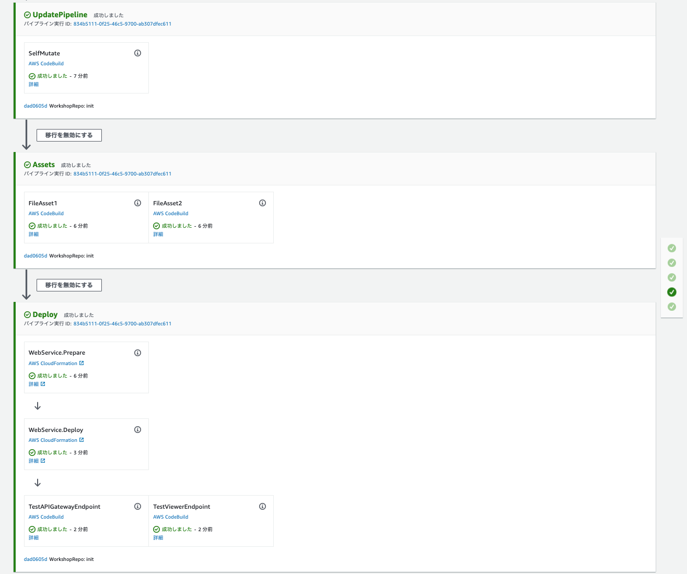

+++
title = "アプリケーションの追加"
weight = 140
+++

## ステージの作成
この時点では、自動的に自分を更新する CDK パイプラインができています。*しかし*、それ以外は何もしていません。アプリケーションをデプロイするには、そのためのステージを追加する必要があります。

`cdk_workshop` フォルダに新規に `pipeline_stage.py` というファイルを以下の内容で作成します。


from constructs import Construct
from aws_cdk import (
    Stage
)
from .cdk_workshop_stack import CdkWorkshopStack

class WorkshopPipelineStage(Stage):

    def __init__(self, scope: Construct, id: str, **kwargs):
        super().__init__(scope, id, **kwargs)

        service = CdkWorkshopStack(self, 'WebService')



このソースコードはアプリケーションのスタックを作成する `core.Stage` (パイプラインのコンポーネント) を定義します。

## パイプラインにステージを追加
次に、`cdk_workshop/pipeline_stack.py` に次のコードを追加して、パイプラインにステージを追加します。


from constructs import Construct
from aws_cdk import (
    Stack,
    aws_codecommit as codecommit,
    pipelines as pipelines,
)
from cdk_workshop.pipeline_stage import WorkshopPipelineStage

class WorkshopPipelineStack(Stack):
    def __init__(self, scope: Construct, id: str, **kwargs) -> None:
        super().__init__(scope, id, **kwargs)

        # Creates a CodeCommit repository called 'WorkshopRepo'
        repo = codecommit.Repository(
            self, "WorkshopRepo", repository_name="WorkshopRepo"
        )

        pipeline = pipelines.CodePipeline(
            self,
            "Pipeline",
            synth=pipelines.ShellStep(
                "Synth",
                input=pipelines.CodePipelineSource.code_commit(repo, "master"),
                commands=[
                    "npm install -g aws-cdk",  # Installs the cdk cli on Codebuild
                    "pip install -r requirements.txt",  # Instructs Codebuild to install required packages
                    "cdk synth",
                ]
            ),
        )

        deploy = WorkshopPipelineStage(self, "Deploy")
        deploy_stage = pipeline.add_stage(deploy)


`WorkshopPipelineStage` をインポートし、インスタンスが作成されます。
場合によって、このステージの複数のインスタンスを作成することがあります (たとえば、本番環境と開発/テスト環境のデプロイを分ける場合など)。

次に、このステージをパイプラインに追加します (`pipeline.add_stage(deploy)`)。CDK パイプラインの `Stage` とは、特定の環境にて一緒にデプロイする必要のある 1つ以上の CDK スタックのセットを表します。

## コミット/デプロイ
アプリケーションをデプロイするためのコードを追加できたので、後は変更をコミットしてリポジトリにプッシュするだけです。

```
git commit -am "Add deploy stage to pipeline" && git push
```

プッシュが完了したら、[CodePipeline コンソール](https://console.aws.amazon.com/codesuite/codepipeline/pipelines) でパイプラインの実行状況を確認できます (しばらく時間がかかる場合があります)。



成功しました !

