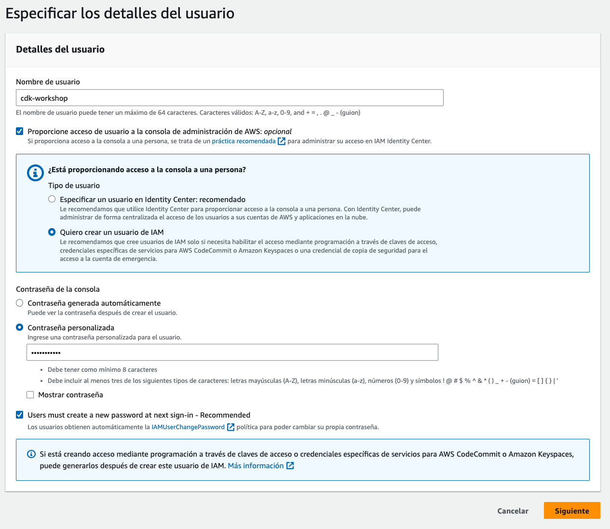

+++
title = "Cuenta de AWS y usuario"
weight = 200
+++

## Cuenta de AWS para experimentación

Para desplegar nuestra aplicación, necesitarás acceso a una cuenta de AWS. Si ya tienes una y tu equipo estás configurado con las credenciales de un usuario administrador, puedes [moverte a la siguiente sección](http://#).

{}
Si estás usando una cuenta existente, sea personal o
una cuenta empresarial, asegurate de entender las implicaciones y políticas de
aprovisionamiento de recursos en esa cuenta.
{}

Si no tienes una cuenta de AWS, puedes [crear una cuenta gratis aquí](https://portal.aws.amazon.com/billing/signup#/start/email)

## Usuario Administrador

1. Inicia sesión en tu cuenta de AWS.
2. Dirígete hacia la consola de **AWS IAM**
3. Debajo de la pestaña de **Administración del acceso**, selecciona **Usuarios**
4. Clic en el botón **Agregar usuarios**
5. Escribe un nombre para tu usuario (Ejemplo: `cdk-workshop`), selecciona la casilla **Proporcione acceso de usuario a la consola de administración de AWS: *Opcional***
6. Seleccione el **Quiero crear un usuario de IAM**
7. Elija la configuración de contraseña que desee, clic en **siguiente**


    

1. En opciones de permiso elija Adjuntar políticas directamente. 

*Como práctica recomendada, le sugerimos, en cambio, adjuntar políticas a un grupo. A continuación, agregue el usuario al grupo adecuado.*

1. Seleccione la política con el nombre **AdministratorAccess**, y clic en **siguiente**.
2. Clic en **Crear usuario**
3. Regresa a la lista de usuarios, selecciona el usuario recientemente creado **cdk-workshop**
4. Selecciona la pestaña **credenciales de seguridad**, En el apartado **Claves de acceso** clic en **Crear clave de acceso**
5. En Caso de uso, selecciona Interfaz de línea de comandos (CLI)
6. Clic en el checkbox ***Entiendo la recomendación anterior y deseo proceder a la creación de una clave de acceso**.* Y **Siguiente**. Y luego en **Crear clave de acceso**

*Puedes copiar la clave de acceso y la clave de acceso secreta o descargar el archivo.csv con la información.*

Configura tus credenciales

Abre una ventana de terminal y escribe `aws configure` para configurar tu ambiente. Ingresa la **access key ID** (Clave de acceso) y la **secret access key** (Clave de acceso secreta), luego elija una región por defecto (Puedes usar `us-east-1`, `us-west-1`, `us-west-2` por ejemplo). Preferiblemente elija una región que no contenga ningún recurso desplegado en ella.


```
aws configure
```

Y llena la información desde la consola:


```
AWS Access Key ID [None]: <type key ID here>
AWS Secret Access Key [None]: <type access key>
Default region name [None]: <choose region (e.g. "us-east-1", "eu-west-1")>
Default output format [None]: <leave blank>
```