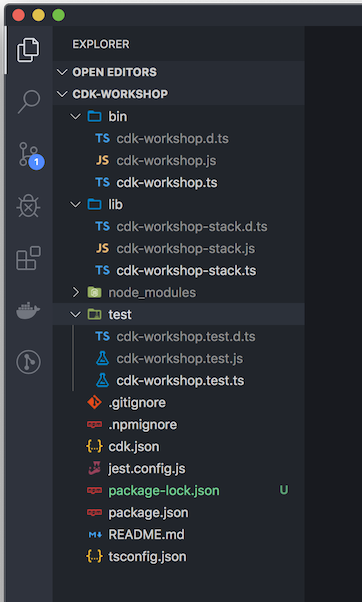

+++
title = "Estructura del proyecto"
weight = 300
+++

## Abre tu IDE

Ahora es un buen momento para abrir el proyecto en tu IDE favorito y explorarlo.

> Si usa VSCode, simplemente puede escribir `code .` en el directorio del proyecto.

## Explore su directorio de proyectos

Verás algo como esto:



* __`lib/cdk-workshop-stack.ts`__ es donde se define la pila principal de la aplicación CDK.
 Este es el archivo en el que pasaremos la mayor parte del tiempo.
* `bin/cdk-workshop.ts` es el punto de entrada de la aplicación CDK. Cargará la pila definida en `lib/cdk-workshop-stack.ts`.
* `package.json` es el manifiesto de tu módulo npm. Incluye información como la
 el nombre de tu aplicación, la versión, las dependencias y los scripts de compilación como "watch" y
 "build" (`package-lock.json` es mantenido por npm)
* `cdk.json` indica al kit de herramientas cómo ejecutar la aplicación. En nuestro caso, será
  `"npx ts-node bin/cdk-workshop.ts"`
* `tsconfig.json` el de tu proyecto [typescript
  configuración](https://www.typescriptlang.org/docs/handbook/tsconfig-json.html)
* `.gitignore` y `.npmignore` dígale a git y npm qué archivos incluir/excluir
 desde el control de código fuente y al publicar este módulo en el administrador de paquetes.
* `node_modules` es mantenido por npm e incluye todos sus proyectos
 dependencias.

## El punto de entrada de tu aplicación

Echemos un vistazo rápido a `bin/cdk-workshop.ts`:

```js
#!/usr/bin/env node
import * as cdk from 'aws-cdk-lib';
import { CdkWorkshopStack } from '../lib/cdk-workshop-stack';

const app = new cdk.App();
new CdkWorkshopStack(app, 'CdkWorkshopStack');
```

Este código carga y crea instancias del `CdkWorkshopStack` clase del
`lib/cdk-workshop-stack.ts` archivo. Ya no necesitaremos mirar este archivo.

## La pila principal

Abre `lib/cdk-workshop-stack.ts`. Aquí es donde está el meollo de nuestra aplicación
es:

```ts
import * as cdk from 'aws-cdk-lib';
import * as sns from 'aws-cdk-lib/aws-sns';
import * as subs from 'aws-cdk-lib/aws-sns-subscriptions';
import * as sqs from 'aws-cdk-lib/aws-sqs';

export class CdkWorkshopStack extends cdk.Stack {
  constructor(scope: cdk.App, id: string, props?: cdk.StackProps) {
    super(scope, id, props);

    const queue = new sqs.Queue(this, 'CdkWorkshopQueue', {
      visibilityTimeout: cdk.Duration.seconds(300)
    });

    const topic = new sns.Topic(this, 'CdkWorkshopTopic');

    topic.addSubscription(new subs.SqsSubscription(queue));
  }
}
```

Como puede ver, nuestra aplicación se creó con una pila de CDK de muestra
(`CdkWorkshopStack`).

La pila incluye:

- SQS Queue (`new sqs.Queue`)
- SNS Topic (`new sns.Topic`)
- Suscribe la cola para recibir cualquier mensaje publicado en el tema (`topic.addSubscription`)
