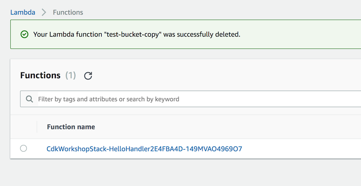
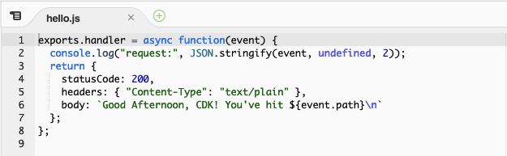

+++
title = "CDK Watch"
weight = 300
+++

## Despliegues particulares más rápidos

{}Esta sección no es necesaria para completar el workshop, pero recomendamos que tomes el tiempo para ver cómo `cdk deploy --hotswap` y `cdk watch` pueden acelerar tus despliegues particulares.
{}

Es genial tener nuestra función Lambda corriendo! Pero qué tal sí queremos retocar el código de la función lambda para hacerlo diferente? Digamos que hemos decidido ahora que queremos que nuestra función responda un `"Buenos días, CDK!"`  en vez de `"Hello, CDK!"`.

Hasta ahora, parece que la única herramienta que tenemos a nuestra disposición para actualizar nuestro stack es `cdk deploy`. Sin embargo, `cdk deploy` toma tiempo; tiene que implementar su pila de CloudFormation y cargar el directorio `lambda` desde tu disco al bucket de boostrap. Si solo cambiamos algo en nuestro código lambda, en realidad no necesitamos actualizar la pila de CloudFormation, por lo que parte de `cdk deploy` es un esfuerzo en vano.

Realmente solo necesitamos actualizar nuestro código lambda. Sería estupendo si tuviéramos algún otro mecanismo para hacer solo eso...

## Temporización `cdk deploy`

Primero, calculemos cuánto tiempo lleva ejecutar `cdk deploy`. Esto, nos ayudará a establecer una línea de base sobre el tiempo que lleva una implementación completa de CloudFormation. Para ello, cambiaremos el código dentro de `lambda/hello.js`:


exports.handler = async function(event) {
  console.log("request:", JSON.stringify(event, undefined, 2));
  return {
    statusCode: 200,
    headers: { "Content-Type": "text/plain" },
    body: `Good Morning, CDK! You've hit ${event.path}\n`
  };
};


Entonces, podemos ejecutar `cdk deploy`:

```
cdk deploy
```

La salida se verá así:

```
✨  Synthesis time: 6s

CdkWorkshopStack: deploying...
CdkWorkshopStack: creating CloudFormation changeset...


 ✅  CdkWorkshopStack

✨  Deployment time: 66.82s

Stack ARN:
arn:aws:cloudformation:REGION:ACCOUNT-ID:stack/CdkWorkshopStack/STACK-ID

✨  Total time: 72.82s
```

El tiempo exacto variará, ¡pero deberíamos hacernos una idea bastante clara de cuánto dura un despliegue normal!

## Despliegues Hotswap

{}Este comando introduce deliberadamente desvíos en las pilas de CloudFormation para acelerar las implementaciones. Por este motivo, utilícelo únicamente con fines de desarrollo. ¡Nunca utilices hotswap para tus despliegues de producción!
{}

Podemos acelerar ese tiempo de implementación con` cdk deploy --hotswap`, que evaluará si se puede realizar una implementación de intercambio en caliente en lugar de una implementación de CloudFormation. Si es posible, la CLI del CDK utilizará las API de servicio de AWS para realizar los cambios directamente; de lo contrario, recurrirá a realizar una implementación completa de CloudFormation.

En este caso, utilizaremos `cdk deploy --hotswap` para implementar un cambio intercambiable en caliente en el código de sus AWS Lambda.

## Temporización `cdk deploy --hotswap`

Cambiemos otra vez el código de la función lambda en `lambda/hello.js`:


exports.handler = async function(event) {
  console.log("request:", JSON.stringify(event, undefined, 2));
  return {
    statusCode: 200,
    headers: { "Content-Type": "text/plain" },
    body: `Good Afternoon, CDK! You've hit ${event.path}\n`
  };
};


Ahora corramos `cdk deploy --hotswap`:

```
cdk deploy --hotswap
```

La salida se verá como la siguiente:

```
✨  Synthesis time: 6.44s

⚠️ The --hotswap flag deliberately introduces CloudFormation drift to speed up deployments
⚠️ It should only be used for development - never use it for your production Stacks!

CdkWorkshopStack: deploying...
✨ hotswapping resources:
   ✨ Lambda Function 'CdkWorkshopStack-HelloHandler2E4FBA4D-tEZTcXqG8YYe'
✨ Lambda Function 'CdkWorkshopStack-HelloHandler2E4FBA4D-tEZTcXqG8YYe' hotswapped!

 ✅  CdkWorkshopStack

✨  Deployment time: 3.07s

Stack ARN:
arn:aws:cloudformation:REGION:ACCOUNT-ID:stack/CdkWorkshopStack/STACK-ID

✨  Total time: 9.51s
```

Vaya implementar un cambio intercambiable en caliente tomó solo 3 segundos, mientras que un despliegue completo tomó 67 segundos! Sin embargo tomemos un momento y leamos el mensaje de advertencia a fondo - Es importante!

```
⚠️ The --hotswap flag deliberately introduces CloudFormation drift to speed up deployments
⚠️ It should only be used for development - never use it for your production Stacks!
```

## ¿Cambió el código en realidad?

Vaya eso fue rápido. ¿Cambió el código en realidad? Vayamos a la consola de AWS Lambda y revisemos!

1. Abre la [consola de AWS Lambda](https://console.aws.amazon.com/lambda/home#/functions) (Asegúrate que estás en la región correcta)

    Deberías ver nuestra función:



2. Clic en el nombre de la función para ir a la consola

3. El código debería verse cargado en tu pantalla. Se muestra tu cambio?



## CDK Watch

Podemos hacer más que solo llamar a `cdk deploy` o `cdk deploy --hotswap` cada vez. `cdk watch` es similar a cdk deploy, excepto que, en lugar de ser una operación única, supervisa el código y los activos para detectar cambios e intenta realizar un despliegue automáticamente cuando se detecta un cambio. De forma predeterminada, cdk watch utilizará el indicador `--hotswap`, que inspecciona los cambios y determina si se pueden intercambiar en caliente. Si llamas a `cdk watch --no-hotswap`, se deshabilitará el comportamiento de intercambio en caliente.

Una vez que lo hayamos configurado, podemos usar `cdk watch` para detectar tanto los cambios intercambiables en caliente como los cambios que requieren un despliegue completo de CloudFormation.

## Mira tu archivo `cdk.json`

Cuando se ejecuta el comando `cdk watch`, los archivos que observa vienen determinados por la configuración `«watch»` del archivo cdk.json. Este tiene dos subclaves, `«incluir»` y `«excluir»`, cada una de las cuales puede ser una sola cadena o un conjunto de cadenas. Cada entrada se interpreta como una ruta relativa a la ubicación del archivo `cdk.json`. Se permite el uso de globos, tanto `*` como `**`.

Tu archivo `cdk.json` debería tener un aspecto similar al siguiente:

```json
{
  "app": "npx ts-node --prefer-ts-exts bin/cdk-workshop.ts",
  "watch": {
    "include": [
      "**"
    ],
    "exclude": [
      "README.md",
      "cdk*.json",
      "**/*.d.ts",
      "**/*.js",
      "tsconfig.json",
      "package*.json",
      "yarn.lock",
      "node_modules",
      "test"
    ]
  },
  "context": {
    // ...
  }
}
```

Como puede ver, la aplicación de muestra viene con una configuración de `«watch»` sugerida. Nosotros de hecho queremos ver nuestros archivos `.js` en la carpeta `lambda`, así qué eliminemos `"**/*.js"` de la lista `"exclude"`:

```json
{
  "app": "npx ts-node --prefer-ts-exts bin/cdk-workshop.ts",
  "watch": {
    "include": [
      "**"
    ],
    "exclude": [
      "README.md",
      "cdk*.json",
      "**/*.d.ts",
      "tsconfig.json",
      "package*.json",
      "yarn.lock",
      "node_modules",
      "test"
    ]
  },
  "context": {
    // ...
  }
}
```

¡Ya estás listo para empezar a mirar!

## Timing `cdk watch`

Primero, ejecutemos `cdk watch`: 

```
cdk watch
```

Esto activará una implementación inicial e inmediatamente comenzará a observar los archivos que hemos especificado en `cdk.json`.

Cambiemos el código de nuestro activo lambda en `lambda/hello.js` una vez más:


exports.handler = async function(event) {
  console.log("request:", JSON.stringify(event, undefined, 2));
  return {
    statusCode: 200,
    headers: { "Content-Type": "text/plain" },
    body: `Good Night, CDK! You've hit ${event.path}\n`
  };
};


Una vez guardados los cambios en el archivo de código de Lambda, `cdk watch` reconocerá que el archivo ha cambiado y activará una nueva implementación. En este caso, reconocerá que podemos intercambiar en caliente el código de activos de Lambda, por lo que omitirá la implementación de CloudFormation y, en su lugar, se implementará directamente en el servicio de Lambda.

¿Qué tan rápido fue la implementación?

```
Detected change to 'lambda/hello.js' (type: change). Triggering 'cdk deploy'

✨  Synthesis time: 5.57s

⚠️ The --hotswap flag deliberately introduces CloudFormation drift to speed up deployments
⚠️ It should only be used for development - never use it for your production Stacks!

CdkWorkshopStack: deploying...
✨ hotswapping resources:
   ✨ Lambda Function 'CdkWorkshopStack-HelloHandler2E4FBA4D-tEZTcXqG8YYe'
✨ Lambda Function 'CdkWorkshopStack-HelloHandler2E4FBA4D-tEZTcXqG8YYe' hotswapped!

 ✅  CdkWorkshopStack

✨  Deployment time: 2.54s

Stack ARN:
arn:aws:cloudformation:REGION:ACCOUNT-ID:stack/CdkWorkshopStack/STACK-ID

✨  Total time: 8.11s
```

## Para finalizar

El resto de este tutorial continuará usando `cdk deploy` en lugar de `cdk watch`. Pero si lo desea, simplemente puede mantener activado `cdk watch`. Si necesita realizar una implementación completa, `cdk watch` llamará a `cdk deploy` por ti.

Para obtener más información sobre los casos de uso de cdk watch, consulta [Cómo aumentar la velocidad de desarrollo con CDK Watch.](https://aws.amazon.com/es/blogs/developer/increasing-development-speed-with-cdk-watch/)