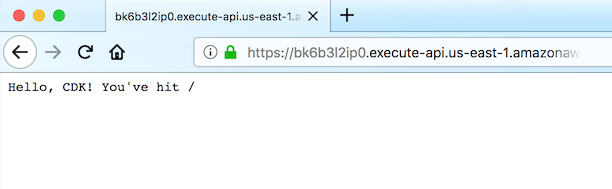

+++
title = "API Gateway"
weight = 400
+++

El siguiente paso es añadir API Gateway delante de nuestra función. API Gateway mostrará un endpoint HTTP público al que cualquier usuario de internet puede acceder con un cliente HTTP, como [curl](https://curl.haxx.se/) o un navegador web.

Usaremos la [integración de proxy Lambda](https://docs.aws.amazon.com/es_es/apigateway/latest/developerguide/api-gateway-create-api-as-simple-proxy-for-lambda.html) montada en la raíz de la API. Esto significa que cualquier solicitud a cualquier ruta URL se enviará directamente a nuestra función de Lambda y la respuesta de la función se devolverá al usuario.

## Agregue una construcción LambdaRestAPI a su pila

Regresa a `lib/cdk-workshop-stack.ts`, Definamos un endpoint para la API y asociémoslo a nuestra función Lambda:


import * as cdk from 'aws-cdk-lib';
import * as lambda from 'aws-cdk-lib/aws-lambda';
import * as apigw from 'aws-cdk-lib/aws-apigateway';

export class CdkWorkshopStack extends cdk.Stack {
  constructor(scope: cdk.App, id: string, props?: cdk.StackProps) {
    super(scope, id, props);

    // defines an AWS Lambda resource
    const hello = new lambda.Function(this, 'HelloHandler', {
      runtime: lambda.Runtime.NODEJS_14_X,    // Ambiente de ejecución
      code: lambda.Code.fromAsset('lambda'),  // Código cargado desde el directorio de "lambda"
      handler: 'hello.handler'                // El archivo es "hello", la función es "handler"
    });

    // define un recurso de REST API en API Gateway REST API en frente de nuestra función "hello".
    new apigw.LambdaRestApi(this, 'Endpoint', {
      handler: hello
    });

  }
}


Eso es todo. Esto es todo lo que necesita hacer para definir una pasarela de API que redirija todas las solicitudes a una función de AWS Lambda

## cdk diff

La salida debería verse así:

```
cdk diff
```

Output should look like this:

```text
Stack CdkWorkshopStack
IAM Statement Changes
┌───┬───────────────────────────┬────────┬───────────────────────────┬───────────────────────────┬─────────────────────────────┐
│   │ Resource                  │ Effect │ Action                    │ Principal                 │ Condition                   │
├───┼───────────────────────────┼────────┼───────────────────────────┼───────────────────────────┼─────────────────────────────┤
│ + │ ${Endpoint/CloudWatchRole │ Allow  │ sts:AssumeRole            │ Service:apigateway.${AWS: │                             │
│   │ .Arn}                     │        │                           │ :URLSuffix}               │                             │
├───┼───────────────────────────┼────────┼───────────────────────────┼───────────────────────────┼─────────────────────────────┤
│ + │ ${HelloHandler.Arn}       │ Allow  │ lambda:InvokeFunction     │ Service:apigateway.amazon │ "ArnLike": {                │
│   │                           │        │                           │ aws.com                   │   "AWS:SourceArn": "arn:${A │
│   │                           │        │                           │                           │ WS::Partition}:execute-api: │
│   │                           │        │                           │                           │ ${AWS::Region}:${AWS::Accou │
│   │                           │        │                           │                           │ ntId}:${EndpointEEF1FD8F}/$ │
│   │                           │        │                           │                           │ {Endpoint/DeploymentStage.p │
│   │                           │        │                           │                           │ rod}/*/"                    │
│   │                           │        │                           │                           │ }                           │
│ + │ ${HelloHandler.Arn}       │ Allow  │ lambda:InvokeFunction     │ Service:apigateway.amazon │ "ArnLike": {                │
│   │                           │        │                           │ aws.com                   │   "AWS:SourceArn": "arn:${A │
│   │                           │        │                           │                           │ WS::Partition}:execute-api: │
│   │                           │        │                           │                           │ ${AWS::Region}:${AWS::Accou │
│   │                           │        │                           │                           │ ntId}:${EndpointEEF1FD8F}/t │
│   │                           │        │                           │                           │ est-invoke-stage/*/"        │
│   │                           │        │                           │                           │ }                           │
│ + │ ${HelloHandler.Arn}       │ Allow  │ lambda:InvokeFunction     │ Service:apigateway.amazon │ "ArnLike": {                │
│   │                           │        │                           │ aws.com                   │   "AWS:SourceArn": "arn:${A │
│   │                           │        │                           │                           │ WS::Partition}:execute-api: │
│   │                           │        │                           │                           │ ${AWS::Region}:${AWS::Accou │
│   │                           │        │                           │                           │ ntId}:${EndpointEEF1FD8F}/$ │
│   │                           │        │                           │                           │ {Endpoint/DeploymentStage.p │
│   │                           │        │                           │                           │ rod}/*/{proxy+}"            │
│   │                           │        │                           │                           │ }                           │
│ + │ ${HelloHandler.Arn}       │ Allow  │ lambda:InvokeFunction     │ Service:apigateway.amazon │ "ArnLike": {                │
│   │                           │        │                           │ aws.com                   │   "AWS:SourceArn": "arn:${A │
│   │                           │        │                           │                           │ WS::Partition}:execute-api: │
│   │                           │        │                           │                           │ ${AWS::Region}:${AWS::Accou │
│   │                           │        │                           │                           │ ntId}:${EndpointEEF1FD8F}/t │
│   │                           │        │                           │                           │ est-invoke-stage/*/{proxy+} │
│   │                           │        │                           │                           │ "                           │
│   │                           │        │                           │                           │ }                           │
└───┴───────────────────────────┴────────┴───────────────────────────┴───────────────────────────┴─────────────────────────────┘
IAM Policy Changes
┌───┬────────────────────────────┬─────────────────────────────────────────────────────────────────────────────────────────┐
│   │ Resource                   │ Managed Policy ARN                                                                      │
├───┼────────────────────────────┼─────────────────────────────────────────────────────────────────────────────────────────┤
│ + │ ${Endpoint/CloudWatchRole} │ arn:${AWS::Partition}:iam::aws:policy/service-role/AmazonAPIGatewayPushToCloudWatchLogs │
└───┴────────────────────────────┴─────────────────────────────────────────────────────────────────────────────────────────┘
(NOTE: There may be security-related changes not in this list. See https://github.com/aws/aws-cdk/issues/1299)

Resources
[+] AWS::ApiGateway::RestApi Endpoint EndpointEEF1FD8F
[+] AWS::ApiGateway::Deployment Endpoint/Deployment EndpointDeployment318525DA37c0e38727e25b4317827bf43e918fbf
[+] AWS::ApiGateway::Stage Endpoint/DeploymentStage.prod EndpointDeploymentStageprodB78BEEA0
[+] AWS::IAM::Role Endpoint/CloudWatchRole EndpointCloudWatchRoleC3C64E0F
[+] AWS::ApiGateway::Account Endpoint/Account EndpointAccountB8304247
[+] AWS::ApiGateway::Resource Endpoint/Default/{proxy+} Endpointproxy39E2174E
[+] AWS::Lambda::Permission Endpoint/Default/{proxy+}/ANY/ApiPermission.CdkWorkshopStackEndpoint018E8349.ANY..{proxy+} EndpointproxyANYApiPermissionCdkWorkshopStackEndpoint018E8349ANYproxy747DCA52
[+] AWS::Lambda::Permission Endpoint/Default/{proxy+}/ANY/ApiPermission.Test.CdkWorkshopStackEndpoint018E8349.ANY..{proxy+} EndpointproxyANYApiPermissionTestCdkWorkshopStackEndpoint018E8349ANYproxy41939001
[+] AWS::ApiGateway::Method Endpoint/Default/{proxy+}/ANY EndpointproxyANYC09721C5
[+] AWS::Lambda::Permission Endpoint/Default/ANY/ApiPermission.CdkWorkshopStackEndpoint018E8349.ANY.. EndpointANYApiPermissionCdkWorkshopStackEndpoint018E8349ANYE84BEB04
[+] AWS::Lambda::Permission Endpoint/Default/ANY/ApiPermission.Test.CdkWorkshopStackEndpoint018E8349.ANY.. EndpointANYApiPermissionTestCdkWorkshopStackEndpoint018E8349ANYB6CC1B64
[+] AWS::ApiGateway::Method Endpoint/Default/ANY EndpointANY485C938B

Outputs
[+] Output Endpoint/Endpoint Endpoint8024A810: {"Value":{"Fn::Join":["",["https://",{"Ref":"EndpointEEF1FD8F"},".execute-api.",{"Ref":"AWS::Region"},".",{"Ref":"AWS::URLSuffix"},"/",{"Ref":"EndpointDeploymentStageprodB78BEEA0"},"/"]]}}
```

Eso está bien. Esta línea de código agregó 12 recursos nuevos a nuestra pila.

## cdk deploy

Bueno, estamos listos para desplegar?

```
cdk deploy
```

## Stack outputs

Cuando la implementación esté completa, verás esta linea:

```
CdkWorkshopStack.Endpoint8024A810 = https://xxxxxxxxxx.execute-api.us-east-1.amazonaws.com/prod/
```

Esta es una[salida de pila](https://docs.aws.amazon.com/AWSCloudFormation/latest/UserGuide/stacks.html) que la construcción de API Gateway agrega automáticamente e incluye la URL del endpoint de API Gateway.

## Probando la aplicación

Intentemos alcanzar este endpoint con `curl`. Copia la URL y ejecútala (es probable que tu prefijo y región sean diferentes).

{}
Si no tienes [curl](https://curl.haxx.se/) instalado, siempre puedes usar tu navegador web favorito para acceder a esta URL.
{}

```
curl https://xxxxxxxxxx.execute-api.us-east-1.amazonaws.com/prod/
```

La salida se verá así:

```
Hello, CDK! You've hit /
```

También podemos verlo desde el navegador:



If this is the output you received, your app works!

## ¿Qué pasa si no funciona?

Si recibiste un error 5xx de API Gateway, es probable que se deba a uno de estos dos problemas:

1. La respuesta que ha devuelto tu función no es la que espera API Gateway. Vuelva atrás y asegúrese de que su `handler` devuelva una respuesta que incluya los campos de `statusCode`, `body` y `header` (consulte [Escribir el código de ejecución del controlador](./200-lambda.html)).
2. La función falló por algún motivo. Para depurarlo, puedes ir rápidamente a [esta sección](../40-hit-counter/500-logs.html) para aprender a ver tus registros de Lambda.

---
¡Buen trabajo! En el próximo capítulo, escribiremos nuestra propia construcción reutilizable.