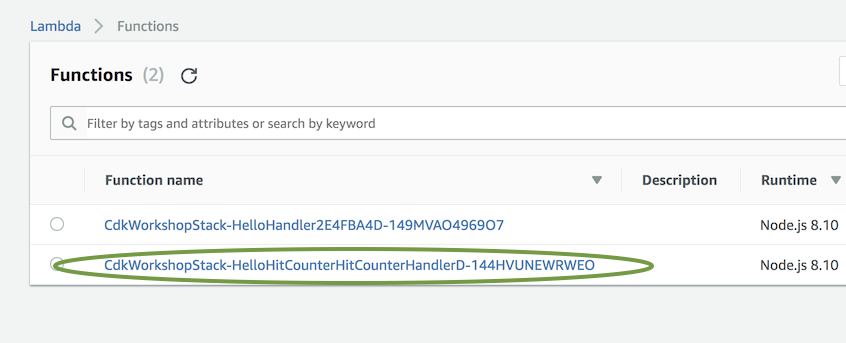
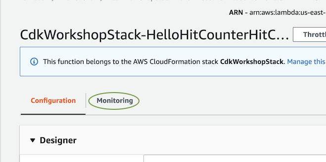
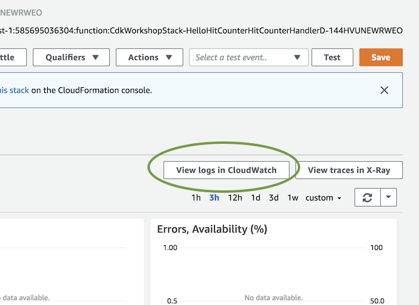

+++
title = "CloudWatch Logs"
weight = 500
+++

## Visualización de registros de CloudWatch para nuestra función Lambda

Lo primero que debe hacer es ir y mirar los registros de nuestra función AWS Lambda de contador de solicitudes.

Hay muchas herramientas que lo ayudan a hacerlo, como  [SAM
CLI](https://github.com/awslabs/aws-sam-cli) y
[awslogs](https://github.com/jorgebastida/awslogs). En este taller, le mostraremos cómo encontrar sus registros a través de la consola de AWS.

1. Abra la consola de [AWS Lambda console](https://console.aws.amazon.com/lambda/home) (asegúrese de estar conectado a la región correcta).

2. Haga clic en la función __HitCounter__ Lambda (el nombre debe contener la cadena `HelloHitCounterHitCountHandler`):
    

3. Haga clic en __Monitoring__
    

4. Haga clic en __View Logs in CloudWatch__. Esto abrirá la consola de AWS CloudWatch.
    

5. Seleccione el grupo de registro más reciente.

6. Busque el mensaje más reciente que contenga la cadena "errorMessage". Es probable que veas algo como esto:


   ```json
   {
       "errorMessage": "User: arn:aws:sts::585695036304:assumed-role/CdkWorkshopStack-HelloHitCounterHitCounterHandlerS-TU5M09L1UBID/CdkWorkshopStack-HelloHitCounterHitCounterHandlerD-144HVUNEWRWEO is not authorized to perform: dynamodb:UpdateItem on resource: arn:aws:dynamodb:us-east-1:585695036304:table/CdkWorkshopStack-HelloHitCounterHits7AAEBF80-1DZVT3W84LJKB",
       "errorType": "AccessDeniedException",
       "stackTrace": [
           "Request.extractError (/var/runtime/node_modules/aws-sdk/lib/protocol/json.js:48:27)",
           "Request.callListeners (/var/runtime/node_modules/aws-sdk/lib/sequential_executor.js:105:20)",
           "Request.emit (/var/runtime/node_modules/aws-sdk/lib/sequential_executor.js:77:10)",
           "Request.emit (/var/runtime/node_modules/aws-sdk/lib/request.js:683:14)",
           "Request.transition (/var/runtime/node_modules/aws-sdk/lib/request.js:22:10)",
           "AcceptorStateMachine.runTo (/var/runtime/node_modules/aws-sdk/lib/state_machine.js:14:12)",
           "/var/runtime/node_modules/aws-sdk/lib/state_machine.js:26:10",
           "Request.<anonymous> (/var/runtime/node_modules/aws-sdk/lib/request.js:38:9)",
           "Request.<anonymous> (/var/runtime/node_modules/aws-sdk/lib/request.js:685:12)",
           "Request.callListeners (/var/runtime/node_modules/aws-sdk/lib/sequential_executor.js:115:18)"
       ]
   }
   ```

---

Parece que nuestra función Lambda no puede escribir en nuestra tabla de DynamoDB. Esto realmente tiene sentido: ¡No le otorgamos esos permisos! Vamos a hacer eso ahora.


