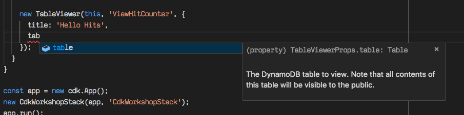

+++
title = "Agregar el visualizador a la aplicación"
weight = 300
+++

## Agregar el visualizador a nuestro stack

Agregaremos las líneas destacadas a
`cdk_workshop_stack.py` para agregar un constructo
`TableViewer` a nuestro stack:


import * as cdk from 'aws-cdk-lib';
import * as lambda from 'aws-cdk-lib/aws-lambda';
import * as apigw from 'aws-cdk-lib/aws-apigateway';
import { HitCounter } from './hitcounter';
import { TableViewer } from 'cdk-dynamo-table-viewer';

export class CdkWorkshopStack extends cdk.Stack {
  constructor(scope: cdk.App, id: string, props?: cdk.StackProps) {
    super(scope, id, props);

    const hello = new lambda.Function(this, 'HelloHandler', {
      runtime: lambda.Runtime.NODEJS_14_X,
      code: lambda.Code.fromAsset('lambda'),
      handler: 'hello.handler'
    });

    const helloWithCounter = new HitCounter(this, 'HelloHitCounter', {
      downstream: hello
    });

    // defines an API Gateway REST API resource backed by our "hello" function.
    new apigw.LambdaRestApi(this, 'Endpoint', {
      handler: helloWithCounter.handler
    });

    new TableViewer(this, 'ViewHitCounter', {
      title: 'Hello Hits',
      table: //??????
    });
  }
}


## Y la tabla?

Como se pueden dar cuenta, `TableViewer` necesita que especifiquemos una propiedad `table`.

Lo que queremos es de alguna manera acceder la tabla de DynamoDB que está detrás de nuestro contador.
Sin embargo, la API actual de nuestro contador no expone la tabla como un miembro público.

---

En la próxima sección, expondremos nuestra tabla como una propiedad de `HitCounter` para que podamos
accederlo desde nuestro stack.