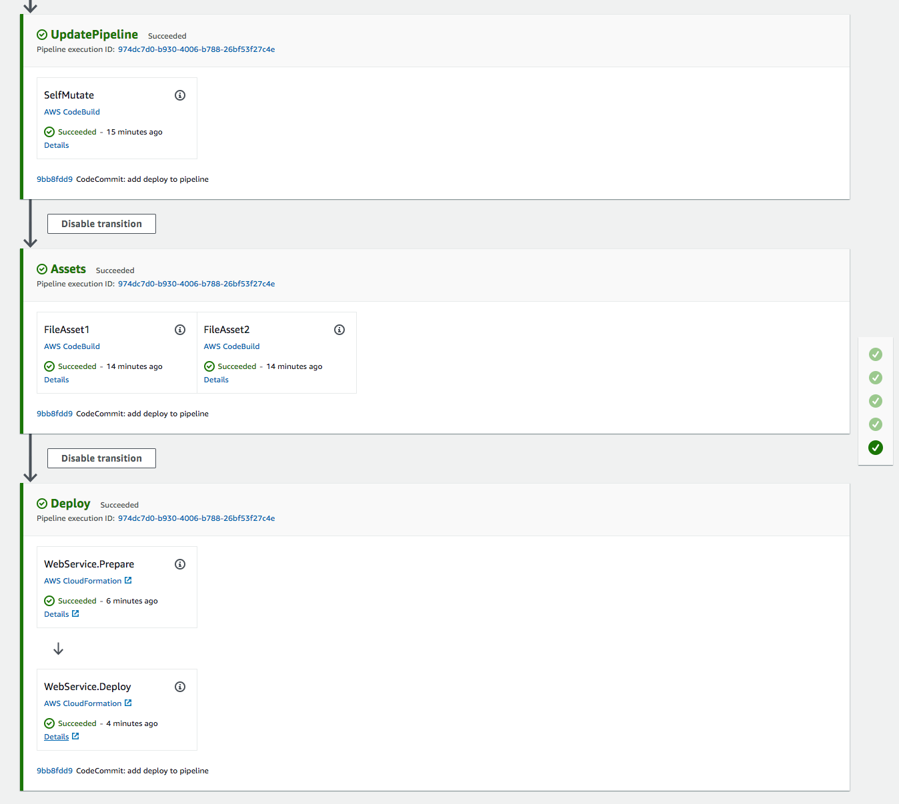

+++
title = "Adicionar una Aplicación a la Canalización"
weight = 140
+++

## Crear una Etapa
En este punto, usted tiene una canalización operativa completa de CDK que se actualiza automáticamente con cada confirmacióm, *PERO* por el momento, eso es todo lo que hace. Necesitamos adicionar una etapa a la canalización que despliegue nuestra aplicación.

Cree un nuevo archivo llamado `pipeline-stage.ts` en el directorio `lib` con el siguiente código:


import { CdkWorkshopStack } from './cdk-workshop-stack';
import { Stage, StageProps } from 'aws-cdk-lib';
import { Construct } from 'constructs';

export class WorkshopPipelineStage extends Stage {
    constructor(scope: Construct, id: string, props?: StageProps) {
        super(scope, id, props);

        new CdkWorkshopStack(this, 'WebService');
    }
}


Esto solamente declara una nueva etapa (`Stage`) (componente de una canalización), y en esa etapa crea una instancia de la pila de nuestra aplicación.

Ahora, en este punto su editor podría decirle que usted está haciendo algo mal.  Esto se debe a que la pila de la aplicación tal como se encuentra ahora no está configurada para ser desplegada como una canalización.
Abra `lib/cdk-workshop-stack.ts` y haga los sigientes cambios:


import * as cdk from 'aws-cdk-lib';
import * as lambda from 'aws-cdk-lib/aws-lambda';
import * as apigw from 'aws-cdk-lib/aws-apigateway';
import { Construct } from 'constructs';
import { HitCounter } from './hitcounter';
import { TableViewer } from 'cdk-dynamo-table-viewer';

export class CdkWorkshopStack extends cdk.Stack {
  constructor(scope: Construct, id: string, props?: cdk.StackProps) {
    super(scope, id, props);

    // The rest of your code...


El parámetro `scope` de esta pila fue definido como un `cdk.App`, lo que significa que en el árbol del constructo, debe ser descendiente de la aplicación. Ya que la pila está siendo desplegada por la canalización, ya no es descendiente de la aplicación, así que su tipo debe ser cambiado a `Construct`.

## Adicionar la pila a la canalización
Ahora debemos adicionar la etapa a la canalización agregando el siguiento código a `lib/pipeline-stack.ts`:


import * as cdk from 'aws-cdk-lib';
import * as codecommit from 'aws-cdk-lib/aws-codecommit';
import { Construct } from 'constructs';
import {WorkshopPipelineStage} from './pipeline-stage';
import {CodeBuildStep, CodePipeline, CodePipelineSource} from "aws-cdk-lib/pipelines";

export class WorkshopPipelineStack extends cdk.Stack {
    constructor(scope: Construct, id: string, props?: cdk.StackProps) {
        super(scope, id, props);

        // This creates a new CodeCommit repository called 'WorkshopRepo'
        const repo = new codecommit.Repository(this, 'WorkshopRepo', {
            repositoryName: "WorkshopRepo"
        });

       // The basic pipeline declaration. This sets the initial structure
        // of our pipeline
       const pipeline = new CodePipeline(this, 'Pipeline', {
            pipelineName: 'WorkshopPipeline',
            synth: new CodeBuildStep('SynthStep', {
                    input: CodePipelineSource.codeCommit(repo, 'main'),
                    installCommands: [
                        'npm install -g aws-cdk'
                    ],
                    commands: [
                        'npm ci',
                        'npm run build',
                        'npx cdk synth'
                    ]
                }
            )
        });

        const deploy = new WorkshopPipelineStage(this, 'Deploy');
        const deployStage = pipeline.addStage(deploy);
    }
}


Esto importa y crea una instancia de `WorkshopPipelineStage`. Más tarde, usted podría instanciar esta etapa múltiples veces (por ejemplo, usted desea crear un despliegue de Producción y un despliegue de Desarrollo/Pruebas separados).

Luego agregamos esa etapa a nuestra canalización (`pipeline.addStage(deploy);`). Una etapa (`Stage`) en una canalización de CDK representa un juego de una o mas pilas de CDK que deben ser desplegadas juntas, a un ambiente particular.

## Confirmar/Desplegar
Ahora que hemos adicionado el código para desplegar nuestra aplicación, solo nos falta confirmar y enviar los cambios al repositorio.

```
git commit -am "Add deploy stage to pipeline" && git push
```

Una que que esto se ha hecho, podemos volver a la [consola de CodePipeline](https://console.aws.amazon.com/codesuite/codepipeline/pipelines) y observar que la canalización está en ejecución (esto puede tomar algún tiempo).

<!--


Uh oh! The pipeline synth failed. Lets take a look and see why.


It looks like the build step is failing to find our Lambda function.

## Fix Lambda Path
We are currently locating our Lambda code based on the directory that `cdk synth` is being executed in. Since CodeBuild uses a different folder structure than you might for development, it can't find the path to our Lambda code. We can fix that with a small change in `lib/cdk-workshop-stack.ts`:


import * as cdk from 'aws-cdk-lib';
import * as lambda from 'aws-cdk-lib/aws-lambda';
import * as apigw from 'aws-cdk-lib/aws-apigateway';
import { Construct } from 'constructs';
import { HitCounter } from './hitcounter';
import { TableViewer } from 'cdk-dynamo-table-viewer';
import * as path from 'path';

export class CdkWorkshopStack extends cdk.Stack {
  constructor(scope: Construct, id: string, props?: cdk.StackProps) {
    super(scope, id, props);

    const hello = new lambda.Function(this, 'HelloHandler', {
      runtime: lambda.Runtime.NODEJS_14_X,
      code: lambda.Code.fromAsset(path.resolve(__dirname, '../lambda')),
      handler: 'hello.handler',

    });


Here we are explicitly navigating up a level from the current directory to find the Lambda code.

If we commit the change (`git commit -am "fix lambda path" && git push`) and take a look at our pipeline again, we can see that our pipeline now builds without error!

-->



Éxito!
