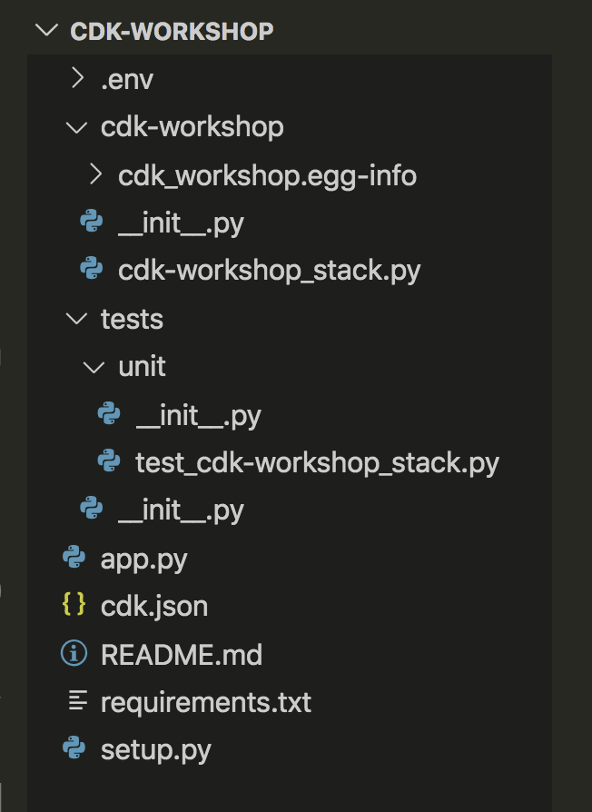

+++
title = "Estructura del proyecto"
weight = 300
+++

## Abre tu IDE

Ahora es un buen momento para abrir el proyecto en tu IDE favorito y explorarlo.

> Si usa VSCode, simplemente puede escribir `code .` en el directorio del proyecto.

## Explore su directorio de proyectos

Verás algo como esto:



* .venv - La información del entorno virtual de Python discutida en la sección anterior.
* cdk_workshop — Un directorio de módulos de Python.
  * cdk_workshop.egg-info - Carpeta que contiene información de construcción relevante para el empaquetado del proyecto
  * cdk_workshop_stack.py — Una construcción de pila de CDK personalizada para usar en su aplicación de CDK.
* tests — Contiene todas las pruebas.
  * unit — Contiene pruebas unitarias.
    * test_cdk_workshop.py — Una prueba trivial de la pila de CDK personalizada creada en el paquete cdk_workshop. Esto es principalmente para demostrar cómo se pueden vincular las pruebas al proyecto.
* app.py — El "principal" de esta aplicación de ejemplo.
* cdk.json — Un archivo de configuración para el CDK que define qué CDK ejecutable debe ejecutarse para generar el árbol de construcciones del CDK.
* README.md — El archivo README introductorio de este proyecto.
* requirements.txt — Este archivo lo usa pip para instalar todas las dependencias de su aplicación. En este caso, solo contiene -e. Esto le indica a pip que instale los requisitos especificados en setup.py. También le indica a pip que ejecute python setup.py develop para instalar el código en el módulo cdk_workshop para poder editarlo in situ.
* setup.py — Define cómo se construiría este paquete de Python y cuáles son las dependencias.

## El punto de entrada de tu aplicación

Echemos un vistazo rápido a `app.py`:

```python
#!/usr/bin/env python3

import aws_cdk as cdk

from cdk_workshop.cdk_workshop_stack import CdkWorkshopStack


app = cdk.App()
CdkWorkshopStack(app, "cdk-workshop")

app.synth()
```

Este código carga y crea instancias del `CdkWorkshopStack` clase del
`cdk_workshop/cdk_workshop_stack.py` archivo. Ya no necesitaremos mirar este archivo.

## La pila principal

Abre `cdk_workshop/cdk_workshop_stack.py`. Aquí es donde está el meollo de nuestra aplicación
es:

```python
from constructs import Construct
from aws_cdk import (
    Duration,
    Stack,
    aws_sqs as sqs,
    aws_sns as sns,
    aws_sns_subscriptions as subs,
)

class CdkWorkshopStack(Stack):

    def __init__(self, scope: Construct, id: str, **kwargs) -> None:
        super().__init__(scope, id, **kwargs)

        queue = sqs.Queue(
            self, "CdkWorkshopQueue",
            visibility_timeout=Duration.seconds(300),
        )

        topic = sns.Topic(
            self, "CdkWorkshopTopic"
        )

        topic.add_subscription(subs.SqsSubscription(queue))
```

Como puede ver, nuestra aplicación se creó con una pila de CDK de muestra
(`CdkWorkshopStack`).

La pila incluye:

- SQS Queue (`sqs.Queue`)
- SNS Topic (`sns.Topic`)
- Suscribe la cola para recibir cualquier mensaje publicado en el tema (`topic.add_subscription`)
