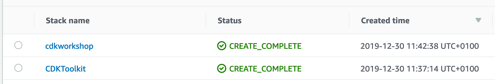
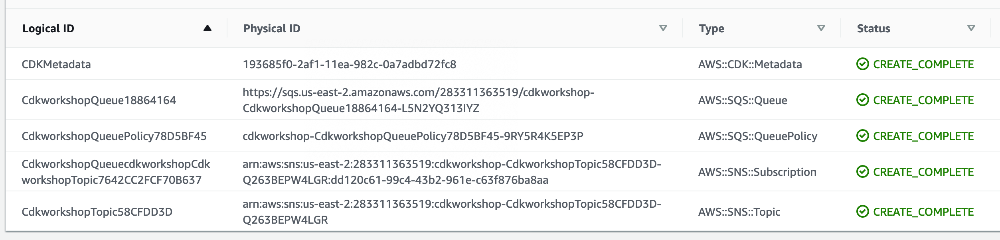

+++
title = "cdk deploy"
weight = 500
+++

Vale, tenemos una plantilla de CloudFormation. ¿Qué es lo siguiente? __¡Vamos a implementarlo en nuestra cuenta!__

## Arrancar un entorno

La primera vez que implemente una aplicación de AWS CDK en un entorno (cuenta/región),
puede instalar una "pila de arranque". Esta pila incluye recursos que
se utilizan en el funcionamiento del kit de herramientas. Por ejemplo, la pila incluye un S3
depósito que se usa para almacenar plantillas y activos durante el proceso de implementación.

Puede usar el comando `cdk bootstrap` para instalar la pila de arranque en un
entorno:

```
cdk bootstrap
```

Entonces:

```
 ⏳  Bootstrapping environment 123456789012/us-east-1...
...
```

{}
Si recibe un mensaje de acceso denegado en este paso, compruebe que
has [configurado correctamente la CLI de AWS](/15-prerequisites/200-account.html) (o has especificado una clave secreta o de acceso adecuada) y también has comprobado que tienes permiso para llamar a `CloudFormation:createChangeset` en el ámbito de tu [cuenta/sesión](https://docs.aws.amazon.com/cli/latest/userguide/cli-configure-profiles.html)
{}

## Vamos a desplegar

Use `cdk deploy` para implementar una aplicación de CDK:

```
cdk deploy
```

En primer lugar, se le informará de los cambios relacionados con la seguridad que el CDK realizará en su nombre, si se producen cambios relacionados con la seguridad

```
This deployment will make potentially sensitive changes according to your current security approval level (--require-approval broadening).
Please confirm you intend to make the following modifications:

IAM Statement Changes
┌───┬─────────────────────────┬────────┬─────────────────┬───────────────────────────┬─────────────────────────────────────────────────────────┐
│   │ Resource                │ Effect │ Action          │ Principal                 │ Condition                                               │
├───┼─────────────────────────┼────────┼─────────────────┼───────────────────────────┼─────────────────────────────────────────────────────────┤
│ + │ ${CdkworkshopQueue.Arn} │ Allow  │ sqs:SendMessage │ Service:sns.amazonaws.com │ "ArnEquals": {                                          │
│   │                         │        │                 │                           │   "aws:SourceArn": "${CdkworkshopTopic}"                │
│   │                         │        │                 │                           │ }                                                       │
└───┴─────────────────────────┴────────┴─────────────────┴───────────────────────────┴─────────────────────────────────────────────────────────┘
(NOTE: There may be security-related changes not in this list. See https://github.com/aws/aws-cdk/issues/1299)

Do you wish to deploy these changes (y/n)?
```

Esto te avisa de que la implementación de la aplicación contiene cambios sensibles a la seguridad.
Como necesitamos permitir que el tema envíe mensajes a la cola,
escriba **y** para implementar la pila y crear los recursos.

El resultado debería tener el siguiente aspecto, donde ACCOUNT-ID es el ID de tu cuenta, REGION es la región en la que creaste la aplicación,
y STACK-ID es el identificador único de tu pila:

```
cdk-workshop: deploying...
cdk-workshop: creating CloudFormation changeset...
 0/6 | 1:31:31 PM | CREATE_IN_PROGRESS   | AWS::CDK::Metadata     | CDKMetadata
 0/6 | 1:31:31 PM | CREATE_IN_PROGRESS   | AWS::SQS::Queue        | CdkworkshopQueue (CdkworkshopQueue18864164)
 0/6 | 1:31:32 PM | CREATE_IN_PROGRESS   | AWS::SNS::Topic        | CdkworkshopTopic (CdkworkshopTopic58CFDD3D)
 0/6 | 1:31:32 PM | CREATE_IN_PROGRESS   | AWS::SQS::Queue        | CdkworkshopQueue (CdkworkshopQueue18864164) Resource creation Initiated
 0/6 | 1:31:32 PM | CREATE_IN_PROGRESS   | AWS::SNS::Topic        | CdkworkshopTopic (CdkworkshopTopic58CFDD3D) Resource creation Initiated
 0/6 | 1:31:33 PM | CREATE_IN_PROGRESS   | AWS::CDK::Metadata     | CDKMetadata Resource creation Initiated
 1/6 | 1:31:33 PM | CREATE_COMPLETE      | AWS::CDK::Metadata     | CDKMetadata
 2/6 | 1:31:33 PM | CREATE_COMPLETE      | AWS::SQS::Queue        | CdkworkshopQueue (CdkworkshopQueue18864164)
 3/6 | 1:31:42 PM | CREATE_COMPLETE      | AWS::SNS::Topic        | CdkworkshopTopic (CdkworkshopTopic58CFDD3D)
 3/6 | 1:31:44 PM | CREATE_IN_PROGRESS   | AWS::SQS::QueuePolicy  | CdkworkshopQueue/Policy (CdkworkshopQueuePolicy78D5BF45)
 3/6 | 1:31:44 PM | CREATE_IN_PROGRESS   | AWS::SNS::Subscription | CdkworkshopQueue/cdkworkshopCdkworkshopTopic7642CC2F (CdkworkshopQueuecdkworkshopCdkworkshopTopic7642CC2FCF70B637)
 3/6 | 1:31:45 PM | CREATE_IN_PROGRESS   | AWS::SQS::QueuePolicy  | CdkworkshopQueue/Policy (CdkworkshopQueuePolicy78D5BF45) Resource creation Initiated
 3/6 | 1:31:45 PM | CREATE_IN_PROGRESS   | AWS::SNS::Subscription | CdkworkshopQueue/cdkworkshopCdkworkshopTopic7642CC2F (CdkworkshopQueuecdkworkshopCdkworkshopTopic7642CC2FCF70B637) Resource creation Initiated
 4/6 | 1:31:45 PM | CREATE_COMPLETE      | AWS::SQS::QueuePolicy  | CdkworkshopQueue/Policy (CdkworkshopQueuePolicy78D5BF45)
 5/6 | 1:31:45 PM | CREATE_COMPLETE      | AWS::SNS::Subscription | CdkworkshopQueue/cdkworkshopCdkworkshopTopic7642CC2F (CdkworkshopQueuecdkworkshopCdkworkshopTopic7642CC2FCF70B637)

 ✅  cdk-workshop

Stack ARN:
arn:aws:cloudformation:us-west-2:************:stack/cdk-workshop/********-****-****-****-************
```

## La consola de CloudFormation

Las aplicaciones de CDK se implementan a través de AWS CloudFormation. Cada pila de CDK se mapea 1:1 con
Pila de CloudFormation.

Esto significa que puede usar la consola de AWS CloudFormation para administrar
tus pilas.

Echemos un vistazo a [AWS CloudFormation
consola](https://console.aws.amazon.com/cloudformation/home).

Es probable que veas algo como esto (si no lo ves, asegúrate de estar en la región correcta):



Si selecciona `CdkWorkshopStack` y abre la pestaña __Resources__, verá la
identidades físicas de nuestros recursos:



# ¡Estoy listo para un poco de codificación real!
