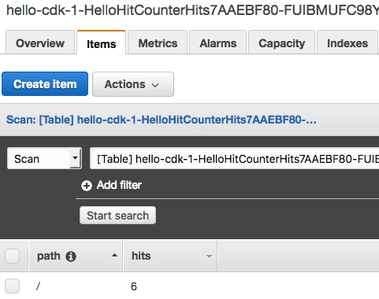

+++
title = "Probando el HitCounter"
weight = 700
+++

## Envia algunas solictudes 

Emitamos algunas solicitudes y veamos si nuestro contador de visitas funciona. También puede usar su navegador web para hacer eso:

```
curl https://xxxxxxxxxx.execute-api.us-east-1.amazonaws.com/prod/
curl https://xxxxxxxxxx.execute-api.us-east-1.amazonaws.com/prod/
curl https://xxxxxxxxxx.execute-api.us-east-1.amazonaws.com/prod/hello
curl https://xxxxxxxxxx.execute-api.us-east-1.amazonaws.com/prod/hello/world
curl https://xxxxxxxxxx.execute-api.us-east-1.amazonaws.com/prod/hello/world
```

## Abra la consola de DynamoDb


1. Vaya a la consola de [DynamoDB console](https://console.aws.amazon.com/dynamodb/home).. 
2. Asegúrese de estar en la región donde creó la tabla. 
3. Seleccione `Tables` en el panel de navegación y seleccione la tabla que comienza con `cdkworkshop-HelloHitCounterHits`.
4. Abra la tabla y seleccione "Items". 
5. Deberías ver cuántos resultados obtuviste para cada ruta.


    

6. Intente encontrar una nueva ruta y actualice la vista Elementos. Debería ver un elemento nuevo con un recuento de visitas (`hits`) de uno.

## ¡Buen trabajo!

Lo bueno de nuestro `HitCounter` es que es bastante útil. Básicamente, permite que cualquier persona lo "adjunte" a cualquier función de Lambda que sirva como back-end de proxy API Gateway y registrará visitas a esta API.

Dado que nuestro contador de visitas es una clase de Python simple, puede empaquetarlo en un módulo pip y publicarlo en [PyPi](http://pypi.org/), que es el administrador de paquetes de Python. Luego, cualquiera podría `pip install`  y agregarlo a sus aplicaciones de CDK.

---

En el siguiente capítulo, __consumiremos__ una biblioteca de construcción publicada en pip, que nos permite ver el contenido de nuestra tabla de contadores de visitas desde cualquier navegador.
