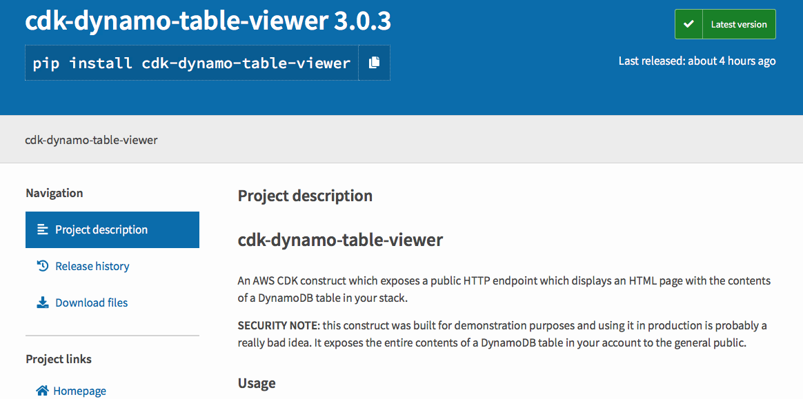

+++
title = "Aprendiendo sobre el constructo Table Viewer"
weight = 100
+++

## Leyendo la documentación

Navegaremos hacia [la página de cdk-dynamo-table-view](https://pypi.org/project/cdk-dynamo-table-view/) en pypi.org para leer la documentación del módulo.

Hay algo de documentación sobre cómo usar el _table viewer_ en el README, pero está todo enfocado en TypeScript en lugar de Python. Entonces seguiremos el proceso de usar un constructo de terceros en Python.

{}
Como menciona el README de esta librería, no está pensada para uso productivo. Principalmente 
porque expondrá contenido de la tabla de DynamoDB a cualquiera, sin autenticación.
{}

