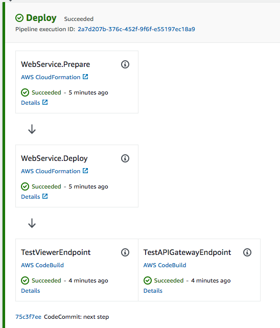

+++
title = "Mejorar la Canalización"
weight = 150
+++

## Obtener Puntos de Conexión
Observando detenidamente, podemos ver que hay un problema ahora que la aplicación esta siendo desplegada por nuestra canalización. No hay una manera fácil de encontrar los puntos de conexión de nuestra aplicación (para `TableViewer` y `LambdaRestApi`), así que no podemos acceder a ellos! Agreguemos un poco de código que nos permita exponerlos de una manera más obvia.

Primero editemos `cdk_workshop/cdk_workshop_stack.py` para obtener estos valores y exponerlos como propiedades de nuestra pila:


from constructs import Construct
from aws_cdk import (
    Stack,
    CfnOutput,
    aws_lambda as _lambda,
    aws_apigateway as apigw,
)
from cdk_dynamo_table_view import TableViewer
from .hitcounter import HitCounter

class CdkWorkshopStack(Stack):

    @property
    def hc_endpoint(self):
        return self._hc_endpoint

    @property
    def hc_viewer_url(self):
        return self._hc_viewer_url

    def __init__(self, scope: Construct, id: str, **kwargs) -> None:
        super().__init__(scope, id, **kwargs)

        # Defines an AWS Lambda resource
        my_lambda = _lambda.Function(
            self, 'HelloHandler',
            runtime=_lambda.Runtime.PYTHON_3_7,
            code=_lambda.Code.from_asset('lambda'),
            handler='hello.handler',
        )

        hello_with_counter = HitCounter(
            self, 'HelloHitCounter',
            downstream=my_lambda
        )

        gateway = apigw.LambdaRestApi(
            self, 'Endpoint',
            handler=hello_with_counter._handler
        )

        tv = TableViewer(
            self, 'ViewHitCounter',
            title='Hello Hits',
            table=hello_with_counter.table
        )

        self._hc_endpoint = CfnOutput(
            self, 'GatewayUrl',
            value=gateway.url
        )

        self._hc_viewer_url = CfnOutput(
            self, 'TableViewerUrl',
            value=tv.endpoint
        )



Al agregar las salidas `hc_viewer_url` y `hc_endpoint`, estamos exponiendo los puntos de conexión necesarios para nuestra aplicación HitCounter. Estamos utilizando el constructo básico `CfnOutput` para declarar estas salidas como salidas de la pila de CloudFormation (explicaremos mas detalles en un minuto).

Confirmemos estos cambios a nuestro repositorio (`git commit -am "MESSAGE" && git push`), y naveguemos a la [consola de CloudFormation](https://console.aws.amazon.com/cloudformation). Allí usted puede ver que hay tres pilas.

* `CDKToolkit`: La primera es la pila integrada de CDK (ustede debe ver esta pila en todas las cuentas en donde haya configurado CDK). Puede ignorar esta pila.
* `WorkshopPipelineStack`: Esta es la pila que declara nuestra canalización. No es realmente la que necesitamos ahora.
* `Deploy-WebService`: Aquí está nuestra aplicación! Seleccione esta pila, y bajo sus detalles, seleccione el tab `Outputs`. Aquí ustede debe encontrar cuatro puntos de conexión (dos pares de valores duplicados).  Dos de ellos, `EndpointXXXXXX` y `ViewerHitCounterViewerEndpointXXXXXXX`, son los generados por Cloudformation, y los otros dos son los que nosotros mismos generamos.

Si usted hace click en `TableViewerUrl`, usted debería ver nuestra bella tabla contadora de hits que creamos durante el workshop inicial.

## Adicionar una Prueba de Validación
Ahora ya hemos desplegado nuestra aplicación, pero una canalización de CD no es completa sin pruebas!

Comencemos con una simple prueba que le haga ping a nuestros puntos de conexión para confirmar que están vivos.
Volvamos a `cdk_workshop/pipeline_stack.py` y agreguemos lo siguiente:


from constructs import Construct
from aws_cdk import (
    Stack,
    aws_codecommit as codecommit,
    pipelines as pipelines
)
from cdk_workshop.pipeline_stage import WorkshopPipelineStage

class WorkshopPipelineStack(Stack):

    def __init__(self, scope: Construct, id: str, **kwargs) -> None:
        super().__init__(scope, id, **kwargs)

        # PIPELINE CODE HERE...

        deploy = WorkshopPipelineStage(self, "Deploy")
        deploy_stage = pipeline.add_stage(deploy)
        deploy_stage.add_post(
            pipelines.ShellStep(
                "TestViewerEndpoint",
                env_from_cfn_outputs={
                    "ENDPOINT_URL": # TBD
                },
                commands=["curl -Ssf $ENDPOINT_URL"],
            )
        )
        deploy_stage.add_post(
            pipelines.ShellStep(
                "TestAPIGatewayEndpoint",
                env_from_cfn_outputs={
                    "ENDPOINT_URL": # TBD
                },
                commands=[
                    "curl -Ssf $ENDPOINT_URL",
                    "curl -Ssf $ENDPOINT_URL/hello",
                    "curl -Ssf $ENDPOINT_URL/test",
                ],
            )
        )



Adicionamos pasos post-implementación utilizando `deployStage.AddPost(...)` de Canalizaciones de CDK. Agregamos dos acciones a nuestra etapa de despliegue: para probar el punto de conexión de nuestro TableViewer y el punto de conexión de nuestro APIGateway, respectivamente.

> Nota: Enviamos varios requerimientos de `curl` al punto de conexión de APIGateway de tal forma que cuando accedamos a nuestro TableViewer, haya varios valores ya poblados.

Usted puede haber notado que aun no hemos asignado el valor de los URLs de estos puntos de conexión. Esto se debe a que aún no han sido expuestos a esta pila!

Con una pequeña modificación a `cdk_workshop/pipeline_stage.py` los podemos exponer:


from constructs import Construct
from aws_cdk import Stage
from cdk_workshop.cdk_workshop_stack import CdkWorkshopStack

class WorkshopPipelineStage(Stage):

    @property
    def hc_endpoint(self):
        return self._hc_endpoint

    @property
    def hc_viewer_url(self):
        return self._hc_viewer_url

    def __init__(self, scope: Construct, id: str, **kwargs):
        super().__init__(scope, id, **kwargs)

        service = CdkWorkshopStack(self, "WebService")

        self._hc_endpoint = service.hc_endpoint
        self._hc_viewer_url = service.hc_viewer_url



Y ahora podemos agregar esos valores a nuestras acciones en `cdk_workshop/pipeline_stack.py` obteniendo el `cfn_output` de nuestra etapa de despliegue:

  # CODE HERE...

    deploy = WorkshopPipelineStage(self, "Deploy")
        deploy_stage = pipeline.add_stage(deploy)
        deploy_stage.add_post(
            pipelines.ShellStep(
                "TestViewerEndpoint",
                env_from_cfn_outputs={
                    "ENDPOINT_URL": deploy.hc_viewer_url
                },
                commands=["curl -Ssf $ENDPOINT_URL"],
            )
        )
        deploy_stage.add_post(
            pipelines.ShellStep(
                "TestAPIGatewayEndpoint",
                env_from_cfn_outputs={
                    "ENDPOINT_URL": deploy.hc_endpoint
                },
                commands=[
                    "curl -Ssf $ENDPOINT_URL",
                    "curl -Ssf $ENDPOINT_URL/hello",
                    "curl -Ssf $ENDPOINT_URL/test",
                ],
            )
        )



## Confirmar y Verificar!
Confirme estos cambios, espere a que la canalización haga el re-despliegue de la aplicación, navegue de nuevo a la [consola de CodePipeline](https://console.aws.amazon.com/codesuite/codepipeline/pipelines) y allí usted podrá ver que hay dos acciones de prueba contenidas dentro de la etapa de despliegue (`Deploy`)!

Felicitaciones! Usted ha creado exitosamente una canalización de CD para su aplicación completa con pruebas y todo! Sientase libre de explorar la consola para ver los detalles de la pila creada, o dele un vistazo a la sección en la [Referencia del API](https://docs.aws.amazon.com/cdk/api/latest/docs/aws-construct-library.html) acerca de Canalizaciones de CDK y construya una para su aplicación.
