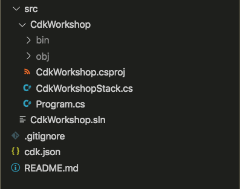

+++
title = "Estructura del proyecto"
weight = 300
+++

## Abre tu IDE

Ahora es un buen momento para abrir el proyecto en tu IDE favorito y explorarlo.

> Si usa VSCode, simplemente puede escribir `code .` en el directorio del proyecto.
>
> Es posible que veas una notificación que diga `Required assets to build and debug are missing from 'YOURPROJECT'. Add them?`
>
> Esto puede ignorarse para nuestros propósitos.

## Explore su directorio de proyectos

Verás algo como esto:



* `src/CdkWorkshop/Program.cs` es el punto de entrada de la aplicación CDK. Cargará la pila definida en `src/CdkWorkshop/CdkWorkshopStack.cs`
* `src/CdkWorkshop/CdkWorkshopStack.cs` es donde se define la pila principal de la aplicación CDK.
 Este es el archivo en el que pasaremos la mayor parte del tiempo.
* `cdk.json` indica al kit de herramientas cómo ejecutar la aplicación. En nuestro caso, será `"dotnet run -p src/CdkWorkshop/CdkWorkshop.csproj"`
* `src/CdkWorkshop/CdkWorkshop.csproj` es el archivo de proyecto de C#. Es un archivo xml y contiene información sobre las referencias. Esto le será útil en el futuro, pero no es relevante para los fines de este taller.
* `src/CdkWorkshop/GlobalSuppressions.cs` desactiva el analizador Roslyn para `RECS0026:Possible unassigned object created by 'new'` ya que esto genera muchos falsos positivos con CDK.
* `src/CdkWorkshop.sln` es el archivo de solución de C# que proporciona información de compilación. No debería necesitar interactuar con este archivo.
* `.gitignore` le dice a git qué archivos incluir/excluir
 desde el control de código fuente y al publicar este módulo en el administrador de paquetes.
* El `src/CdkWorkshop/bin` y `src/CdkWorkshop/obj` las carpetas son las carpetas de compilación del proyecto y se pueden ignorar.

## El punto de entrada de tu aplicación

Echemos un vistazo rápido a `src/CdkWorkshop/Program.cs`:

```c#
using Amazon.CDK;

namespace CdkWorkshop
{
    class Program
    {
        static void Main(string[] args)
        {
            var app = new App();
            new CdkWorkshopStack(app, "CdkWorkshopStack");

            app.Synth();
        }
    }
}
```

Este código carga y crea instancias del `CdkWorkshopStack` clase del
`src/CdkWorkshop/CdkWorkshopStack.cs` archivo. Ya no necesitaremos mirar este archivo.

## La pila principal

Abre `src/CdkWorkshop/CdkWorkshopStack.cs`. Aquí es donde está el meollo de nuestra aplicación
es:

```cs
using Amazon.CDK;
using Amazon.CDK.AWS.SNS;
using Amazon.CDK.AWS.SNS.Subscriptions;
using Amazon.CDK.AWS.SQS;
using Constructs;

namespace CdkWorkshop
{
    public class CdkWorkshopStack : Stack
    {
        public CdkWorkshopStack(Construct scope, string id, IStackProps props = null) : base(scope, id, props)
        {
             // The CDK includes built-in constructs for most resource types, such as Queues and Topics.
            var queue = new Queue(this, "CdkWorkshopQueue", new QueueProps
            {
                VisibilityTimeout = Duration.Seconds(300)
            });

            var topic = new Topic(this, "CdkWorkshopTopic");

            topic.AddSubscription(new SqsSubscription(queue));
        }
    }
}
```

Como puede ver, nuestra aplicación se creó con una pila de CDK de muestra
(`CdkWorkshopStack`).

La pila incluye:

- SQS Queue (`new Queue`)
- SNS Topic (`new Topic`)
- Suscribe la cola para recibir cualquier mensaje publicado en el tema (`topic.AddSubscription`)
