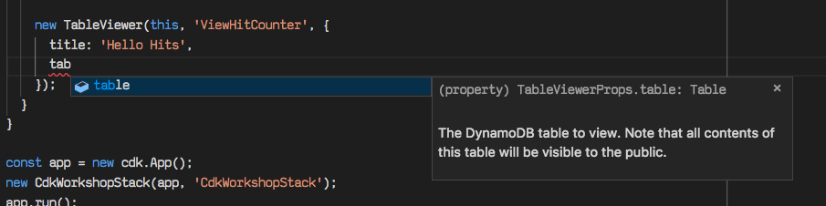

+++
title = "Agregar el visualizador a la aplicación"
weight = 300
+++

## Agregar el visualizador a nuestro stack

Agregaremos las líneas destacadas a
`src/CdkWorkshop/CdkWorkshopStack.cs` para agregar un constructo
`TableViewer` a nuestro stack:


using Amazon.CDK;
using Amazon.CDK.AWS.APIGateway;
using Amazon.CDK.AWS.Lambda;
using Cdklabs.DynamoTableViewer;
using Construct;

namespace CdkWorkshop
{
    public class CdkWorkshopStack : Stack
    {
        public CdkWorkshopStack(Construct scope, string id, IStackProps props = null) : base(scope, id, props)
        {
            // Defines a new lambda resource
            var hello = new Function(this, "HelloHandler", new FunctionProps
            {
                Runtime = Runtime.NODEJS_14_X, // execution environment
                Code = Code.FromAsset("lambda"), // Code loaded from the "lambda" directory
                Handler = "hello.handler" // file is "hello", function is "handler"
            });

            // Defines out HitCounter resource
            var helloWithCounter = new HitCounter(this, "HelloHitCounter", new HitCounterProps
            {
                Downstream = hello
            });

            // Defines an API Gateway REST API resource backed by our "hello" function.
            new LambdaRestApi(this, "Endpoint", new LambdaRestApiProps
            {
                Handler = helloWithCounter.Handler
            });

            // Defines a new TableViewer resource
            new TableViewer(this, "ViewerHitCount", new TableViewerProps
            {
                Title = "Hello Hits",
                Table = //???
            });
        }
    }
}



## Y la tabla?

Como se pueden dar cuenta, `TableViewer` necesita que especifiquemos una propiedad `table`.

Lo que queremos es de alguna manera acceder la tabla de DynamoDB que está detrás de nuestro contador.
Sin embargo, la API actual de nuestro contador no expone la tabla como un miembro público.

---

En la próxima sección, expondremos nuestra tabla como una propiedad de `HitCounter` para que podamos
accederlo desde nuestro stack.
