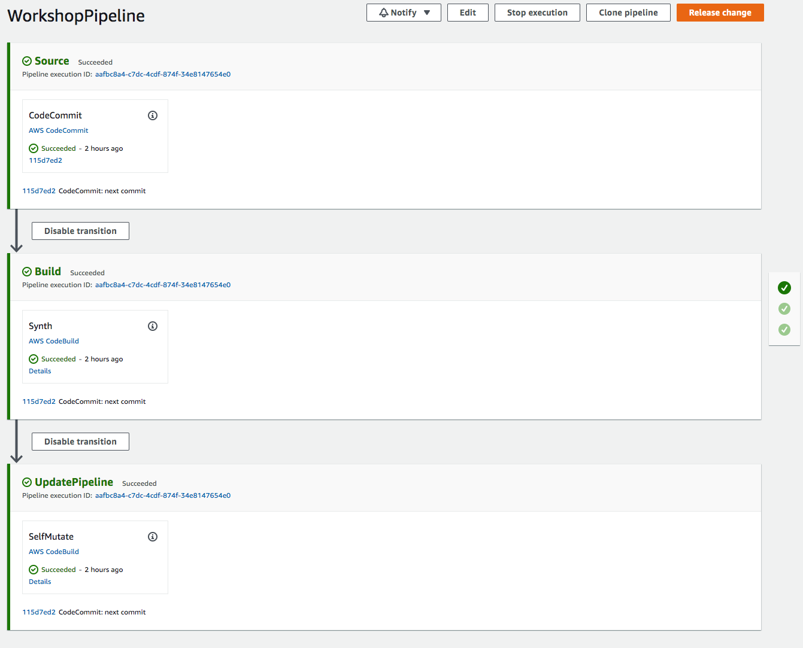

+++
title = "Crear una Nueva Canalización"
weight = 3000
+++

## Definir una Canalización Vacía
Ahora estamos listos para definir las bases de la canalización.

Edite el archivo `CdkWorkshop/PipelineStack.cs` así:


using Amazon.CDK;
using Amazon.CDK.AWS.CodeCommit;
using Amazon.CDK.AWS.CodePipeline;
using Amazon.CDK.AWS.CodePipeline.Actions;
using Amazon.CDK.Pipelines;
using Constructs;

namespace CdkWorkshop
{
    public class WorkshopPipelineStack : Stack
    {
        public WorkshopPipelineStack(Construct parent, string id, IStackProps props = null) : base(parent, id, props)
        {
            // Creates a CodeCommit repository called 'WorkshopRepo'
            var repo = new Repository(this, "WorkshopRepo", new RepositoryProps
            {
                RepositoryName = "WorkshopRepo"
            });

            // The basic pipeline declaration. This sets the initial structure
            // of our pipeline
            var pipeline = new CodePipeline(this, "Pipeline", new CodePipelineProps
            {
                PipelineName = "WorkshopPipeline",

                // Builds our source code outlined above into a could assembly artifact
                Synth = new ShellStep("Synth", new ShellStepProps{
                    Input = CodePipelineSource.CodeCommit(repo, "main"),  // Where to get source code to build
                    Commands = new string[] {
                        "npm install -g aws-cdk",
                        "sudo apt-get install -y dotnet-sdk-3.1", // Language-specific install cmd
                        "dotnet build"  // Language-specific build cmd
                    }
                }),
            });
        }
    }
}



### Descripción de los Componentes
El código anterior hace diferentes cosas:

* `new CodePipeline(...)`: Esto inicializa la canalización con los valores requeridos. Esto servirá como el componente base de aquí en adelante. Cada canalización requiere como mínimo:
    * `Synth(...)`: El `synthAction` de la canalización describe los comandos necesarios para instalar dependencias, construir, y sintetizar la aplicación CDK desde el código fuente. Esto siempre debe terminar en un comando *synth*, para proyectos basados en NPM esto siempre es `npx cdk synth`.
        * El `input` del paso synth especifica el repositorio donde el codigo fuente de CDK está almacenado.


## Desplegar la Canalización y Ver el Resultado
Tolo lo que falta para poner en marcha nuestra canalización es confirmar nuestros cambios y hacer el despliegue una última vez.

```
git commit -am "MESSAGE" && git push
cdk deploy
```

CdkPipelines actualiza automáticamente cada vez que se hace una confirmación a un repositorio, así que esta es la *última vez* que necesitaremos ejecutar este comando!

Una vez que el despliegue haya finalizado, usted puede ir a la [consola de CodePipeline](https://console.aws.amazon.com/codesuite/codepipeline/pipelines) y allí podrá ver una nueva canalización! Si lo hace, debería ver algo así:


