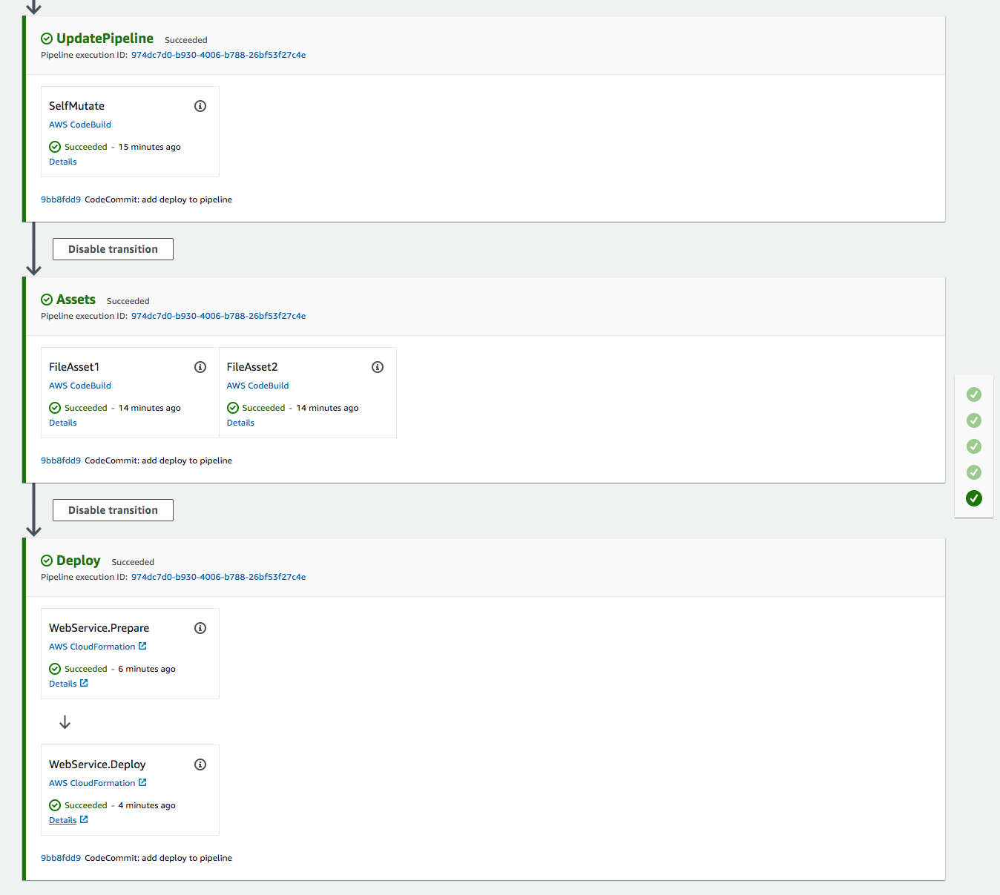

+++
title = "Add Application to Pipeline"
weight = 4000
+++

## Create Stage
At this point, you have a fully operating CDK pipeline that will automatically update itself on every commit, *BUT* at the moment, that is all it does. We need to add a stage to the pipeline that will deploy our application.

Create a new file in `CdkWorkshop` called `PipelineStage.cs` with the code below:


using Amazon.CDK;
using Amazon.CDK.Pipelines;
using Constructs;

namespace CdkWorkshop
{
    public class WorkshopPipelineStage : Stage
    {
        public WorkshopPipelineStage(Construct scope, string id, StageProps props = null)
            : base(scope, id, props)
        {
            var service = new CdkWorkshopStack(this, "WebService");
        }
    }
}


All this does is declare a new `Stage` (component of a pipeline), and in that stage instantiate our application stack.

## Add stage to pipeline
Now we must add the stage to the pipeline by adding the following code to `CdkWorkshop/PipelineStack.cs`:


using Amazon.CDK;
using Amazon.CDK.AWS.CodeCommit;
using Amazon.CDK.AWS.CodePipeline;
using Amazon.CDK.AWS.CodePipeline.Actions;
using Amazon.CDK.Pipelines;
using Constructs;
using System.Collections.Generic;

namespace CdkWorkshop
{
    public class WorkshopPipelineStack : Stack
    {
        public WorkshopPipelineStack(Construct parent, string id, IStackProps props = null) : base(parent, id, props)
        {
            // Creates a CodeCommit repository called 'WorkshopRepo'
            var repo = new Repository(this, "WorkshopRepo", new RepositoryProps
            {
                RepositoryName = "WorkshopRepo"
            });

            // The basic pipeline declaration. This sets the initial structure
            // of our pipeline
            var pipeline = new CodePipeline(this, "Pipeline", new CodePipelineProps
            {
                PipelineName = "WorkshopPipeline",

                // Builds our source code outlined above into a cloud assembly artifact
                Synth = new ShellStep("Synth", new ShellStepProps{
                    Input = CodePipelineSource.CodeCommit(repo, "main"),  // Where to get source code to build
                    Commands = new string[] {
                        "npm install -g aws-cdk",
                        "sudo apt-get install -y dotnet-sdk-3.1",  // Language-specific install cmd
                        "dotnet build",  // Language-specific build cmd
                        "npx cdk synth"
                    }
                }),
            });

            var deploy = new WorkshopPipelineStage(this, "Deploy");
            var deployStage = pipeline.AddStage(deploy);
        }
    }
}


This imports and creates an instance of the `WorkshopPipelineStage`. Later, you might instantiate this stage multiple times (e.g. you want a Production deployment and a separate development/test deployment).

Then we add that stage to our pipeline (`pipepeline.AddStage(deploy);`). A `Stage` in a CDK pipeline represents a set of one or more CDK Stacks that should be deployed together, to a particular environment.

## Commit/Deploy
Now that we have added the code to deploy our application, all that's left is to commit and push those changes to the repo.

```
git commit -am "Add deploy stage to pipeline" && git push
```

Once that is done, we can go back to the [CodePipeline console](https://console.aws.amazon.com/codesuite/codepipeline/pipelines) and take a look as the pipeline runs (this may take a while).



Success!
