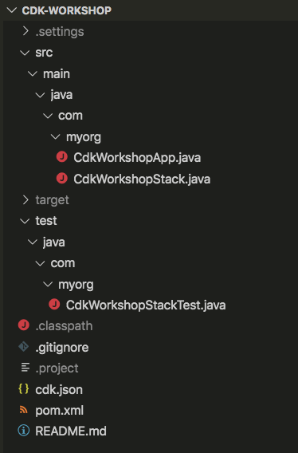

+++
title = "Estructura del proyecto"
weight = 300
+++

## Abre tu IDE

Ahora es un buen momento para abrir el proyecto en tu IDE favorito y explorarlo.

> Si usa VSCode, simplemente puede escribir `code .` en el directorio del proyecto.

## Explore su directorio de proyectos

Verás algo como esto:



* `src/main/java/com/myorg/` es el directorio de proyectos principal para el código Java de la aplicación y, en adelante, se denominará (para acortar las rutas) como `~/`
* `~/CdkWorkshopApp.java` es el punto de entrada de la aplicación CDK. Cargará la pila definida en `~/CdkWorkshopStack.java`
* `~/CdkWorkshopStack.java` es donde se define la pila principal de la aplicación CDK.
 Este es el archivo en el que pasaremos la mayor parte del tiempo.
* `cdk.json` indica al kit de herramientas cómo ejecutar la aplicación. En nuestro caso, será
  `"mvn -q exec:java"`
* `pom.xml` es el archivo del proyecto Maven. Es un archivo xml y contiene información sobre las propiedades de compilación, las dependencias y la información de la aplicación. Esto le será útil en el futuro, pero no es relevante para los fines de este taller.
* `test/java/com/myorg/CdkWorkshopStackTest.java` Es una prueba de compilación que se ejecuta en la aplicación Java durante la compilación e indicará el éxito o el fracaso en el terminal. No utilizaremos esto para los fines del taller.
* `.gitignore` le dice a git qué archivos incluir/excluir del control de código fuente.
* `.classpath`, `.project`, `.settings/`, y `target/` los archivos/carpetas son archivos de proyecto Java/Maven automatizados. Estos deben ignorarse.

## El punto de entrada de tu aplicación

Echemos un vistazo rápido a `~/CdkWorkshopApp.java`:

```java
package com.myorg;

import software.amazon.awscdk.App;

public final class CdkWorkshopApp {
    public static void main(final String[] args) {
        App app = new App();

        new CdkWorkshopStack(app, "CdkWorkshopStack");

        app.synth();
    }
}
```

Este código carga y crea instancias del `CdkWorkshopStack` clase del
`~/CdkWorkshopStack.java` archivo. Ya no necesitaremos mirar este archivo.

## La pila principal

Abre `~/CdkWorkshopStack.java`. Aquí es donde está el meollo de nuestra aplicación
es:

```java
package com.myorg;

import software.constructs.Construct;
import software.amazon.awscdk.Duration;
import software.amazon.awscdk.Stack;
import software.amazon.awscdk.StackProps;
import software.amazon.awscdk.services.sns.Topic;
import software.amazon.awscdk.services.sns.subscriptions.SqsSubscription;
import software.amazon.awscdk.services.sqs.Queue;

public class CdkWorkshopStack extends Stack {
    public CdkWorkshopStack(final Construct parent, final String id) {
        this(parent, id, null);
    }

    public CdkWorkshopStack(final Construct parent, final String id, final StackProps props) {
        super(parent, id, props);

        final Queue queue = Queue.Builder.create(this, "CdkWorkshopQueue")
                .visibilityTimeout(Duration.seconds(300))
                .build();

        final Topic topic = Topic.Builder.create(this, "CdkWorkshopTopic")
            .displayName("My First Topic Yeah")
            .build();

        topic.addSubscription(new SqsSubscription(queue));
    }
}
```

Como puede ver, nuestra aplicación se creó con una pila de CDK de muestra
(`CdkWorkshopStack`).

La pila incluye:

- SQS Queue (`final Queue queue`)
- SNS Topic (`final Topic topic`)
- Suscribe la cola para recibir cualquier mensaje publicado en el tema (`topic.AddSubscription`)
