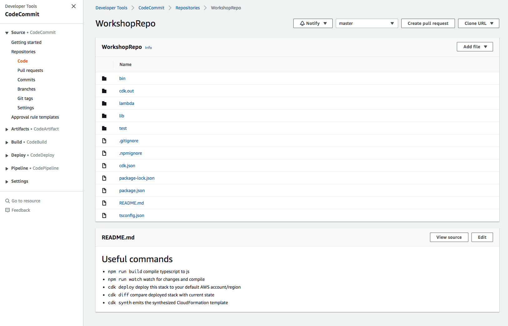

+++
title = "Crear el Repositorio"
weight = 120
+++

## Crear el Repositorio en la Pila de la Canalización
El primer paso en una buena canalización de CD es el control de código fuente. Aquí vamos a crear un repositorio de [**CodeCommit**](https://aws.amazon.com/codecommit/) para almacenar el código de nuestro proyecto.

Edite el archivo `WorkshopPipelineStack.java` así.


package com.myorg;

import software.constructs.Construct;
import software.amazon.awscdk.Stack;
import software.amazon.awscdk.StackProps;

import software.amazon.awscdk.services.codecommit.Repository;

public class WorkshopPipelineStack extends Stack {
    public WorkshopPipelineStack(final Construct parent, final String id) {
        this(parent, id, null);
    }

    public WorkshopPipelineStack(final Construct parent, final String id, final StackProps props) {
        super(parent, id, props);

        // This creates a new CodeCommit repository called 'WorkshopRepo'
        final Repository repo = Repository.Builder.create(this, "WorkshopRepo")
            .repositoryName("WorkshopRepo")
            .build();

        // Pipeline code goes here
    }
}


## Despliegue
Ahora podemos hacer el despliegue de la aplicación para ver nuestro nuevo repositorio.

Ejecutemos:
```
mvn package
npx cdk deploy
```

## Obtener la Información del Repositorio y Confirmar
Antes que podamos hacer cualquier cosa con nuestro repositorio, necesitamos adicionar nuestro código a el!

### Credenciales de Git
Primero que todo, necesitamos las credenciales de Git para el repositorio. Para hacer esto, vaya a la [Consola de IAM](https://console.aws.amazon.com/iam), navegue a `Users` y luego al usuario que desee.
Dentro de la interfaz para el manejo del usuario, navegue al tab `Security credentials` y desplace la página hacia abajo hasta encontrar la sección "HTTPS Git credentials for AWS CodeCommit". Haga click en "Generate credentials" y siga las instrucciones para descargar las credenciales. Las necesitaremos en un momento.


### Adicionar el repositorio remoto
Ahora debemos navegar a la [Consola de CodeCommit](https://console.aws.amazon.com/codesuite/codecommit/repositories) y buscar el repositorio. Alli deberá ver una columna llamada "Clone URL"; haga click en "HTTPS" para copiar el link https que podemos utilizar para adicionar al repositorio local.

> Nota: Si usted no ve el repositorio aquí, asegúrese que esta en la interfaz para la región correcta.


> Mientras usted esta aqui, sientase en libertad de explorar el repositorio. Usted podrá ver que aun está vacío, pero usted tiene acceso a la información de configuración del repositorio.

En la terminal, asegúrese primero que todos los cambios que se han hecho durante el workshop han sido confirmados ejecutando el comando `git status`. Si usted tiene cambios que no han sido preparados o confirmados, usted puede ejecutar `git commit -am "SOME_COMMIT_MESSAGE_HERE"`. Esto preparará y confirmará todos sus archivos de tal forma que usted estará listo para empezar!

> Nota: Si usted copió el código desde el repositorio en lugar de seguir a través del workshop desde el comienzo, ejecute primero`git init && git add -A && git commit -m "init"`

> Nota: Por defecto, el archivo `.gitignore` de CDK incluye una referencia para ignorar todos los archivos `*.js` ya que estos son típicamente generados por npm-ts. Sin embargo, ya que tenemos archivos lambda escritos en js, estos no deben ser ignorados. Asegurese que el archivo `.gitignore` incluye una línea `!lambda/*.js`. Esto le dirá a git que incluya todos los archivos `*.js` en en directorio `lambda/`.

Ahora, adicionaremos el repositorio remoto a nuestra confirguración de Git. Esto se hace con el comando (*XXXXX* representa el "Clone URL" que usted copió previamente de la consola):

```
git remote add origin XXXXX
```

Finalmente solo tenemos que enviar nuestro código al repositorio (`--set-upstream` le dice a Git que "anule" la rama actual -vacía- en su repositorio):

```
git push --set-upstream origin main
```

Aquí, CodeCommit le pedirá las credenciales generadas en la sección **Credenciales de Git**. Usted sólo debe proveerlas una vez.

## Ver el Resultado
Ahora puede volver a la Consola de CodeCommit y ver que su código se encuentra allí!


