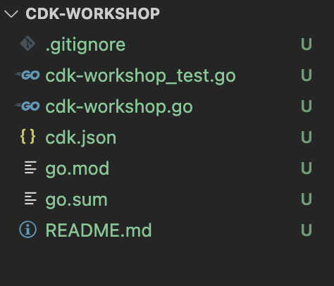

+++
title = "Estructura del proyecto"
weight = 300
+++

## Abre tu IDE

Ahora es un buen momento para abrir el proyecto en tu IDE favorito y explorarlo.

> Si usa VSCode, simplemente puede escribir `code .` en el directorio del proyecto.

## Explore su directorio de proyectos

Verás algo como esto:



* __`cdk-workshop.go`__ es donde se define la pila principal de la aplicación CDK.
 Este es el archivo en el que pasaremos la mayor parte del tiempo. También incluye el
 punto de entrada a la aplicación CDK.
* `cdk-workshop_test.go` contiene una prueba de muestra de la pila de CDK personalizada creada en 
 el paquete cdk_workshop. Esto es principalmente para demostrar cómo se pueden enganchar las pruebas 
 hasta el proyecto.
* `cdk.json` indica al kit de herramientas cómo ejecutar la aplicación. En nuestro caso, será
  `"go mod download && go run cdk-workshop.go"`
* `go.mod` define la ruta del módulo, así como las dependencias necesarias para crear
 la aplicación se ejecuta. No deberíamos tener que tocar este archivo durante el taller. 
  (`go.sum` es un archivo generado automáticamente que bloquea las dependencias)
* `.gitignore` le dice a git qué archivos incluir/excluir
 desde el control de código fuente.
* `README.md` es el archivo README introductorio de este proyecto. Este es un archivo de texto
 que se puede rellenar para describir el proyecto

## El punto de entrada de tu aplicación

Echemos un vistazo rápido a `cdk-workshop.go`:

```go
package main

import (
	"github.com/aws/aws-cdk-go/awscdk/v2"
	"github.com/aws/aws-cdk-go/awscdk/v2/awssns"
	"github.com/aws/aws-cdk-go/awscdk/v2/awssnssubscriptions"
	"github.com/aws/aws-cdk-go/awscdk/v2/awssqs"
	"github.com/aws/constructs-go/constructs/v10"
	"github.com/aws/jsii-runtime-go"
)

type CdkWorkshopStackProps struct {
	awscdk.StackProps
}

func NewCdkWorkshopStack(scope constructs.Construct, id string, props *CdkWorkshopStackProps) awscdk.Stack {
	var sprops awscdk.StackProps
	if props != nil {
		sprops = props.StackProps
	}
	stack := awscdk.NewStack(scope, &id, &sprops)


	queue := awssqs.NewQueue(stack, jsii.String("CdkWorkshopQueue"), &awssqs.QueueProps{
		VisibilityTimeout: awscdk.Duration_Seconds(jsii.Number(300)),
	})

	topic := awssns.NewTopic(stack, jsii.String("CdkWorkshopTopic"), &awssns.TopicProps{})
	topic.AddSubscription(awssnssubscriptions.NewSqsSubscription(queue, &awssnssubscriptions.SqsSubscriptionProps{}))

	return stack
}

func main() {
	defer jsii.Close()

	app := awscdk.NewApp(nil)

	NewCdkWorkshopStack(app, "CdkWorkshopStack", &CdkWorkshopStackProps{
		awscdk.StackProps{
			Env: env(),
		},
	})

	app.Synth(nil)
}

// env determines the AWS environment (account+region) in which our stack is to
// be deployed. For more information see: https://docs.aws.amazon.com/cdk/latest/guide/environments.html
func env() *awscdk.Environment {
	// If unspecified, this stack will be "environment-agnostic".
	// Account/Region-dependent features and context lookups will not work, but a
	// single synthesized template can be deployed anywhere.
	//---------------------------------------------------------------------------
	return nil

	// Uncomment if you know exactly what account and region you want to deploy
	// the stack to. This is the recommendation for production stacks.
	//---------------------------------------------------------------------------
	// return &awscdk.Environment{
	//  Account: jsii.String("123456789012"),
	//  Region:  jsii.String("us-east-1"),
	// }

	// Uncomment to specialize this stack for the AWS Account and Region that are
	// implied by the current CLI configuration. This is recommended for dev
	// stacks.
	//---------------------------------------------------------------------------
	// return &awscdk.Environment{
	//  Account: jsii.String(os.Getenv("CDK_DEFAULT_ACCOUNT")),
	//  Region:  jsii.String(os.Getenv("CDK_DEFAULT_REGION")),
	// }
}
```

Primero, este código declara la clase `NewCdkWorkshopStack`. Esta pila
contiene la infraestructura que queremos implementar. La pila incluye:

- SQS Queue (`sqs.Queue`)
- SNS Topic (`sns.Topic`)
- Suscribe la cola para recibir cualquier mensaje publicado en el tema (`topic.AddSubscription`)

A continuación, en `main()` el código crea una aplicación y define una instancia del `NewCDKWorkshopStack`
dentro del ámbito de la aplicación. Esto permitirá sintetizar y desplegar la pila. Un valor nulo
El valor se transfiere al entorno de la pila, lo cual está bien para los fines del taller
ya que la cuenta y la región en las que deseas realizar el despliegue se deducirán a través de tus credenciales.