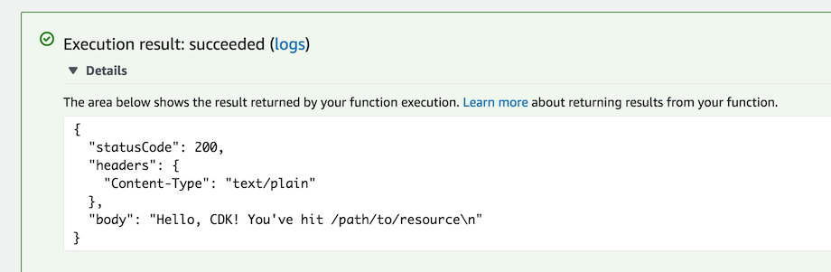

+++
title = "Hola Lambda"
weight = 200
+++

## Código del Lambda handler

Empezaremos con el código de la función handler en AWS Lambda

1. Crea un directorio `lambda` en la raíz del árbol del proyecto (Junto al directorio de `src`)
2. Agrega un archivo llamado `lambda/hello.js` con el siguiente contenido:

---
```js
exports.handler = async function(event) {
  console.log("request:", JSON.stringify(event, undefined, 2));
  return {
    statusCode: 200,
    headers: { "Content-Type": "text/plain" },
    body: `Hello, CDK! You've hit ${event.path}\n`
  };
};
```

Esta es una simple función lambda que retorna el texto __"Hello, CDK! You’ve hit [url path]"__. La salida de la función también incluye el código de estado HTTP y los encabezados HTTP. Estos son usados por API Gateway para formular la respuesta HTTP al usuario.

{} Esta función lambda está desarrollada en Javascript. Para mayor información sobre escribir funciones lambdas en tu lenguaje de elección, por favor referirse la documentación de AWS Lambda [aquí](https://docs.aws.amazon.com/es_es/lambda/latest/dg/welcome.html).
{}

## Instalar la librería de constructos de AWS Lambda

El CDK de AWS es empaquetado con una extensa librería de constructos llamada __AWS Construct Library__. La librería de constructos es dividida en __módulos__, uno por cada servicio de AWS. Por ejemplo, si quieres definir una función de AWS Lambda, necesitaremos usar la librería de constructos de AWS Lambda.

Para descubrir y aprender acerca de los constructos de AWS, puedes buscar en el [AWS Construct Library reference](https://docs.aws.amazon.com/cdk/api/v2/docs/aws-construct-library.html).


## Agregar una función AWS Lambda a tu pila

Agrega una sentencia `import` al principio de `cdk-workshop.go`, y una 
`awslambda.NewFunction` a tu pila.



package main

import (
	"github.com/aws/aws-cdk-go/awscdk/v2"
	"github.com/aws/aws-cdk-go/awscdk/v2/awslambda"
	"github.com/aws/constructs-go/constructs/v10"
	"github.com/aws/jsii-runtime-go"
)

type CdkWorkshopStackProps struct {
	awscdk.StackProps
}

func NewCdkWorkshopStack(scope constructs.Construct, id string, props *CdkWorkshopStackProps) awscdk.Stack {
	var sprops awscdk.StackProps
	if props != nil {
		sprops = props.StackProps
	}
	stack := awscdk.NewStack(scope, &id, &sprops)

	awslambda.NewFunction(stack, jsii.String("HelloHandler"), &awslambda.FunctionProps{
		Code:    awslambda.Code_FromAsset(jsii.String("lambda"), nil),
		Runtime: awslambda.Runtime_NODEJS_16_X(),
		Handler: jsii.String("hello.handler"),
	})

	return stack
}

func main() {
	defer jsii.Close()

	app := awscdk.NewApp(nil)

	NewCdkWorkshopStack(app, "CdkWorkshopStack", &CdkWorkshopStackProps{})

	app.Synth(nil)
}


Algunas cosas a tener en cuenta:

- Nuestra función usa el runtime de NodeJS (`NODEJS_16_X`)
- El código del handler es cargado desde el directorio `lambda` el cual fue creado anteriormente. La ruta es relativa al lugar dónde ejecutas el `cdk`. La cual es la raíz del directorio del proyecto.
- El nombre de la función handler es `hello.handler` (“hello” es el nombre del archivo y “handler” es el nombre de la función)

## Unas palabras acerca de constructos y constructores

Como puedes notar, la clase de contructores de `awscdk.NewStack` y `awslambda.NewFunction` (Y muchas otras clases en el CDK) tienen la firma `(scope, id, props)`. Esto debido a que todas estas clases son __constructos__. Los constructos son el bloque de construcción básico de las aplicaciones de CDK. Estos son representaciones abstractas “de componentes de la nube” los cuales pueden componerse juntos en abstracciones de alto nivel a través de los scopes. Los scopes pueden incluir constructos, que a su vez pueden incluir otros constructos, etc.

Los constructos siempre son creados en el scope de otro constructo y deben siempre tener un identificador que debe ser único al crearse. Por lo tanto, Los inicializadores de constructos (constructores) tendrán siempre la siguiente firma:

1. __`scope`__: El primer argumento es siempre el scope en el cuál es constructo es creado. En casi todos los casos, estarás definiendo constructos con el scope del constructo _actual_. Lo que usualmente significa solo pasar el `this` como el primer argumento. Crea un hábito de ello.
2. __`id`__: El segundo argumento es la __identidad local__ del constructo. Este es un ID que tiene que ser unico entre los constructos en el mismo scope. El CDK usa la identidad para calcular el [identificador lógico - Logical ID](https://docs.aws.amazon.com/es_es/AWSCloudFormation/latest/UserGuide/resources-section-structure.html) de CloudFormation para cada recurso definido en ese scope. *Para conocer más acerca IDs en el CDK, mira el [manual de usuario de CDK](https://docs.aws.amazon.com/es_es/cdk/v2/guide/identifiers.html#identifiers_logical_ids).*
3. __`props`__: El último argumento (Algunas veces opcional) es siempre un conjunto de argumentos de inicialización. Estos son especificos para cada constructo. Por ejemplo, el constructo `awslambda.NewFunction` acepta argumentos como `runtime`, `code`, y `handler`. Puedes explorar las diversas opciones usando el autocompletado de tu IDE o en la [documentación en línea](https://docs.aws.amazon.com/cdk/api/v1/docs/aws-lambda-readme.html).

## Diff

Guarda tu código, y demos una mirada rápida al diff antes que despleguemos:

```
cdk diff
```

La salida debería verse así:

```text
Stack CdkWorkshopStack
IAM Statement Changes
┌───┬─────────────────────────────────┬────────┬────────────────┬──────────────────────────────┬───────────┐
│   │ Resource                        │ Effect │ Action         │ Principal                    │ Condition │
├───┼─────────────────────────────────┼────────┼────────────────┼──────────────────────────────┼───────────┤
│ + │ ${HelloHandler/ServiceRole.Arn} │ Allow  │ sts:AssumeRole │ Service:lambda.amazonaws.com │           │
└───┴─────────────────────────────────┴────────┴────────────────┴──────────────────────────────┴───────────┘
IAM Policy Changes
┌───┬─────────────────────────────┬────────────────────────────────────────────────────────────────────────────────┐
│   │ Resource                    │ Managed Policy ARN                                                             │
├───┼─────────────────────────────┼────────────────────────────────────────────────────────────────────────────────┤
│ + │ ${HelloHandler/ServiceRole} │ arn:${AWS::Partition}:iam::aws:policy/service-role/AWSLambdaBasicExecutionRole │
└───┴─────────────────────────────┴────────────────────────────────────────────────────────────────────────────────┘
(NOTE: There may be security-related changes not in this list. See https://github.com/aws/aws-cdk/issues/1299)

Parameters
[+] Parameter AssetParameters/3342065582ab8a3599385f447c9f5d5b141c726eb5dc468594ec8450a97f3cb7/S3Bucket AssetParameters3342065582ab8a3599385f447c9f5d5b141c726eb5dc468594ec8450a97f3cb7S3BucketEB5CA0D6: {"Type":"String","Description":"S3 bucket for asset \"3342065582ab8a3599385f447c9f5d5b141c726eb5dc468594ec8450a97f3cb7\""}
[+] Parameter AssetParameters/3342065582ab8a3599385f447c9f5d5b141c726eb5dc468594ec8450a97f3cb7/S3VersionKey AssetParameters3342065582ab8a3599385f447c9f5d5b141c726eb5dc468594ec8450a97f3cb7S3VersionKeyC5F120D1: {"Type":"String","Description":"S3 key for asset version \"3342065582ab8a3599385f447c9f5d5b141c726eb5dc468594ec8450a97f3cb7\""}
[+] Parameter AssetParameters/3342065582ab8a3599385f447c9f5d5b141c726eb5dc468594ec8450a97f3cb7/ArtifactHash AssetParameters3342065582ab8a3599385f447c9f5d5b141c726eb5dc468594ec8450a97f3cb7ArtifactHashBAACCCD2: {"Type":"String","Description":"Artifact hash for asset \"3342065582ab8a3599385f447c9f5d5b141c726eb5dc468594ec8450a97f3cb7\""}

Resources
[+] AWS::IAM::Role HelloHandler/ServiceRole HelloHandlerServiceRole11EF7C63
[+] AWS::Lambda::Function HelloHandler HelloHandler2E4FBA4D
```

Como puedes ver, este código sintetiza un recurso de tipo __AWS::Lambda::Function__. Además sintetiza un par de [parámetros de CloudFormation](https://docs.aws.amazon.com/es_es/cdk/v2/guide/get_cfn_param.html) que son usados por el toolkit para propagar la ubicación del código del handler.

## Deploy

Despleguemos:

```
cdk deploy
```

Notarás que `cdk deploy` no solo desplegó su pila de CloudFormation, sino que además guardó y cargó el directorio de `lambda` desde su disco al bucket de arranque.

## Probando nuestra función

Vayamos a la consola de AWS Lambda y probemos nuestra función.

1. Abre la [consola de AWS Lambda](https://console.aws.amazon.com/lambda/home#/functions) (Asegúrate de estar en la región correcta)

Deberías ver nuestra función:


2. Clic en el nombre de la función para ir a la consola.
3. Clic en el botón de __Test__ para abrir la ventana de __Configurar un evento de prueba__:

    

4. Marca __Crear un nuevo evento__ en la sección __Acción de evento de prueba__, luego selecciona __API Gateway AWS Proxy__ desde el listado de __Plantillas de eventos__
5. Escribe `test` como el nombre del evento
6. Clic en __Guardar__

    
7. Clic de nuevo en __Test__ y espera a que se complete la ejecución.
8. Expande los __Detalles__ en __Execution results__ y deberías ver nuestra salida esperada:

    

# 👏
